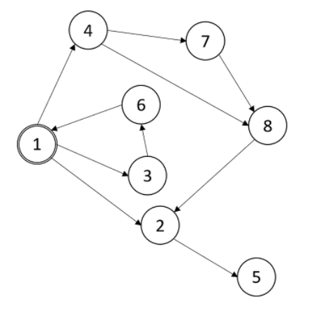
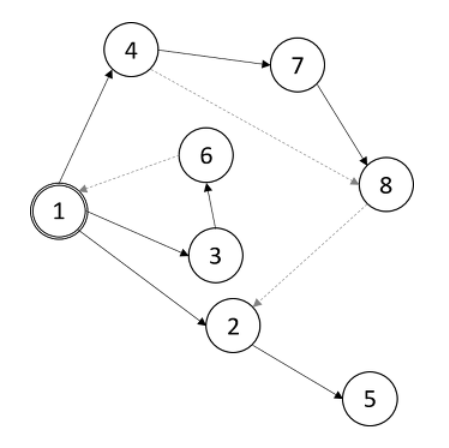

# DFS Spanning Tree

## 참고 사이트

- https://sonsh0824.tistory.com/entry/%EC%95%8C%EA%B3%A0%EB%A6%AC%EC%A6%98-%EA%B3%B5%EB%B6%805-%EA%B0%84%EC%84%A0%EC%9D%98-%EB%B6%84%EB%A5%98%EC%99%80-%EC%8B%B8%EC%9D%B4%ED%81%B4-%EA%B2%80%EC%B6%9C
- https://jason9319.tistory.com/119

## DFS Spanning Tree란?

- DFS를 수행할 때 방문하는 간선들을 모아 만든 Tree



- DFS를 1번 정점으로부터 정점 번호가 작은 순으로 선택한다고 하면 아래의 실선에 해당하는 트리가 완성이 된다.



- 여기에서 실선으로 이루어져 있으먀, DFS spanning tree를 이루는 간선을 tree edge(트리 간선)이라고 합니다.
- forward edge (순방향 간선) : 트리간선은 아니지만 부모에서 자식으로 이어진 간선 ex) 4 -> 8
- back edge (역방향 간선) : 순방향 간선과 반대인 방향, 자식에서 부모로 이어진 간선 ex) 6 -> 1
  > 역방향 간선은 싸이클을 구분할 때 검출이 된다.
  
  
- 간선 구분 방법
  - tree edge : DFS Spanning tree를 만들면서 구분
  - forward edge : 정점의 방문 순서를 저장하여 구분
  - back edge : DFS 종료 여부를 이용하여 구분
  
## 흔히 아는 DFS

```C

#include<iostream>
#include<vector>
using namespace std;
 
int V_size;                     //주어진 그래프의 Vertex개수(|V|)
vector< vector<int> > adjacent; //인접 행렬의 표현(|V|x|V|)
vector<bool> visited(V_size, false);
 
void dfs(int here) {
    cout << "VISIT : " << here << '\n';
    visited[here] = true;         //방문 표시
    for (int i = 0; i < V_size; i++) {
        if (adjacent[here][i] != 0 && !visited[i])
            dfs(i);
    }
}
 
void dfsAll(){ //모든 정점에 대해서 dfs수행을 합니다.
/*
그래프가 여러개 일 수 있으므로 모든 정점에 대해 수행하여야 합니다.
*/
    visited = vector<bool>(V_size,false);
    for(int i = 0; i < V_size; i++){
        if(!visited[i])
            dfs(i);
    }
}

```

- 코드를 보면 here라는 현재 정점 기준으로 만들어진 DFS Spanning tree의 모든 depth를 살펴본 후 dfs(here)는 종료된다.
- 그런데 dfs(here)가 종료되기 전에 모든 depth를 살펴보던 도중에 here라는 정점에 도달하게 되면 이는 역방향 간선을 의미하는 것이다
- 즉, **dfs(here) 종료되기 전에 here에 재방문 하는 일이 싸이클이 존재하는 것이다**


## 싸이클 존재하는 지 확인하는 코드 (DFS로 구현)

```C

#include<iostream>
#include<vector>
using namespace std;
 
int V_size;
vector< vector<int> > adjacent;
vector<bool> visited(V_size, false);
vector<bool> finished(V_size, false);
bool haveCycle = false;
 
void dfs(int here) {
    visited[here] = true;         //방문 표시
    for (int i = 0; i < V_size; i++) {
        if (adjacent[here][i] != 0){
            if(!visited[i])
                dfs(i);
            else if(!finished[i])
                haveCycle = true;
        }
    }
    finished[here] = true;
}
```


