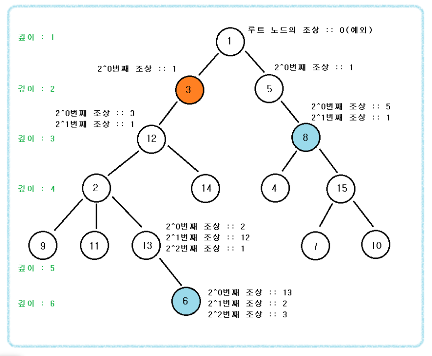

# LCA 알고리즘 (Lowest Common Ancestor)

## 참고 사이트

- https://www.crocus.co.kr/660

## LCA 알고리즘이란?

- 최소 공통 조상을 찾는 알고리즘
- 두 정점 u,v에서 가장 가까운 공통 조상을 찾는 과정

- LCA(14,7)은 무엇일까? 1


- LCA(9,13)은 무엇일까? 2


## LCA 알고리즘 시간 복잡도

- O(log N)
- M개의 쿼리문에 대해서 O(M*log N)

## LCA (Lowest Common Ancestor) 알고리즘 동작 과정 (DP)

- 입력받은 정점과 간선을 이용하여 양방향 그래프를 생성
- depth와 조상을 가지는 트리를 생성 
  > 조상은 2^0, 2^1, 2^2의 조상이 누구인지 알 수 있도록 한다.


  - LCA(6,8)의 값 = 6과 8의 최소 공통 조상을 찾아보자
  
  
  - 깊이가 더 깊은 노드를 깊이가 더 낮은 노드까지 노드를 올려준다.
  즉, 6 (깊이 : 6)이 현재 8 (깊이 : 3)보다 더 깊다.
  - 따라서, 6을 깊이 3까지 끌어올려주어야 한다. (= 두 노드의 깊이를 맞춰야한다.)
  - 여기서 6이 가지고 있는 조상들을 이용하게 되는데, 6은 현재 다음과 같은 조상을 가지고 있게 된다.
  > 2^0번째 조상 : 13
  > 2^1번째 조상 : 2
  > 2^2번째 조상 : 3
  > 2^3번째 조상 : 루트 노드를 넘어가버림(이 때는 조상이 0이라고 가정한다.)
  
  - 결국 6의 2^K번째 조상 중 가장 큰 조상부터 조사하여 8의 깊이보다 더 낮아지는 경우는 넘어가고,
  그 외의 경우에는 6의 노드를 업데이트 해준다. 
  
  
  
  - 6이 8과 깊이를 맞추기 위해 처음으로 2^2번째 조상을 확인하게 된다. 
  2^2번째 조상은 3이고 3의 깊이는 2인데, 8보다 더 낮은 깊이가 되었으므로 업데이트하지 않는다.
  
  
  
  
  - 이번에 6의 2^1번째 조상인 2를 본다. 이것은 깊이가 4이고 8보다 깊이가 아직 더 깊으므로 6을 2로 업데이트해준다.
  
  
  
  
  
  - 이번에 2의 2^0번째 조상인 12를 본다. (2의 2^2, 2^1번째 조상이 있더라도 6에서 이미 확인하였기 때문에 PASS)
  - 12는 8과 깊이가 같으니 2를 12로 업데이트
  
  
  
  - 이렇게 서로 다른 깊이를 가지는 노드를 같은 깊이를 가지는 노드로 만들어준다.
  - 이후에는 a,b가 서로 깊이가 같아졌으므로 2^k만큼씩 조상을 올려다보며 조상이 같아질때까지 노드를 타고 올라가면 된다.
  
  
  
  - 만약 12와 8이 2^2만큼 조상을 올려다본다면 둘다 0을 가르키고 있게된다. 이를 방지하기 위해 각각 갈 수 있는 조상 노드로 간 후에 이동한다.
  
  
  
## LCA 알고리즘 코드

```c

#include <iostream>
#include <cstdio>
#include <vector>
#include <cmath>
 
#define swap(a,b){int t = a; a = b; b = t;}
#define MAX_NODE 100001
 
using namespace std;
 
// depth :: 노드의 깊이(레벨)
// ac[x][y] :: x의 2^y번째 조상을 의미
int depth[MAX_NODE];
int ac[MAX_NODE][20];
 
typedef pair<int, int> pii;
vector<int> graph[MAX_NODE];
 
int max_level;
 
// DP(ac)배열 만드는 과정
void getTree(int here, int parent)
{
    // here의 깊이는 부모노드깊이 + 1
    depth[here] = depth[parent] + 1;
 
    // here의 1번째 조상은 부모노드
    ac[here][0] = parent;
    
    // MAX_NODE에 log2를 씌어 내림을 해준다.
    max_level = (int)floor(log2(MAX_NODE));
 
    for (int i = 1; i <= max_level; i++)
    {
        // tmp :: here의 2^(i-1)번째 조상
        /* 
            즉, ac[here][i] = ac[tmp][i-1]은
            here의 2^i번째 조상은 tmp의 2^(i-1)번째 조상의 2^(i-1)번째 조상과 같다는 의미
            예를들어 i = 3일때
            here의 8번째 조상은 tmp(here의 4번째 조상)의 4번째 조상과 같다.
            i =  4일때 here의 16번째 조상은 here의 8번째 조상(tmp)의 8번째와 같다.
        */
        int tmp = ac[here][i - 1];
        ac[here][i] = ac[tmp][i - 1];
    }
 
    // dfs 알고리즘
    int len = graph[here].size();
    for (int i = 0; i < len; i++)
    {
        int there = graph[here][i];
        if (there != parent)
            getTree(there, here);
    }
}
 
int main()
{
    int n, m;
 
    scanf("%d", &n);
 
    // 양방향 그래프 형성
    for (int i = 1; i < n; i++)
    {
        int from, to;
        scanf("%d %d", &from, &to);
        graph[from].push_back(to);
        graph[to].push_back(from);
    }
 
    // make_tree에 1,0이 들어가기때문에 0은 -1로 지정
    depth[0] = -1;
 
    // 루트 노드인 1번 노드부터 트리 형성
    getTree(1, 0);
 
    // 쿼리문 시작
    scanf("%d", &m);
 
    while (m--)
    {
        int a, b;
        scanf("%d %d", &a, &b);
 
        if (depth[a] != depth[b])
        {
            // depth[b] >= depth[a]가 되도록 swap
            if (depth[a] > depth[b])
                swap(a, b);
 
            // b를 올려서 depth를 맞춰준다.
            /* 
                이렇게하면 만약 max_level이 4라면
                2^4 -> 2^3 -> 2^2 -> 2^1 -> 2^0방식으로 찾아갈텐데
                결국 1, 2, 3, 4, 5 ..., 31까지 모두 찾는 방식과 같아진다.
                예를들어, i가 4일때와 1일때 만족했다 치면
                depth[a] <= depth[ac[b][4]]에 의해
                b = ac[b][4];가 되어 b는 b의 16번째 조상을 보고 있을 것이고
                depth[a] <= depth[ac[b][1]]에 의해(현재 b는 처음 b의 16번째 조상인 b로 바뀌었다.)
                b = ac[b][1];이 되어 b는 b의 2번째 조상을 보게 된다.
                즉, b의 16번째 조상의 2번째 조상을 보는 것이니 b의 18번째 조상을 보게 된다.
                (하고자 하는 말은 3번째, 7번째, 11번째 이런 조상들도 모두 볼 수 있다는 의미이다.)
            */
            for (int i = max_level; i >= 0; i--)
            {
                // b의 2^i번째 조상이 a의 depth보다 크거나 같으면 계속 조상을 타고간다.
                if (depth[a] <= depth[ac[b][i]])
                    b = ac[b][i];
            }
        }
 
        int lca = a;
 
        // a와 b가 다르다면 현재 깊이가 같으니
        // 깊이를 계속 올려 서로 다른 노드의 조상이 같아질 때까지 반복한다.
        // 즉, 서로 다른 노드(2,3)의 조상이 1로 같다면 lca = ac[2][0]에 의해 2의 조상이 1임을 알 수 있고
        // 마찬가지로 ac[3][0] 또한 3의 조상이 1임을 알게되며 알고리즘이 끝이난다.
        if (a != b)
        {
            for (int i = max_level; i >= 0; i--)
            {
                if (ac[a][i] != ac[b][i])
                {
                    a = ac[a][i];
                    b = ac[b][i];
                }
                lca = ac[a][i];
            }
        }
 
        printf("%d\n", lca);
    }
    return 0;
}


```
  
  
  
  
  
## 풀 수 있는 문제

- https://www.acmicpc.net/problem/11438
  
  
  
  
  
  
  
  
  
  
  
  
  
  
  
  
  
  
  
  
