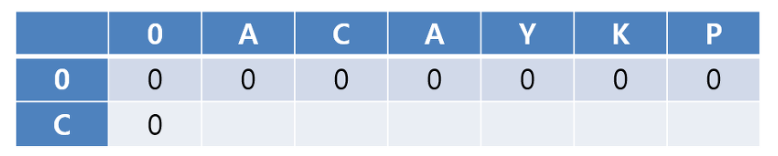
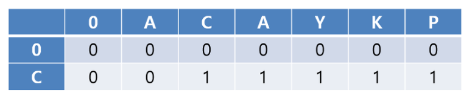
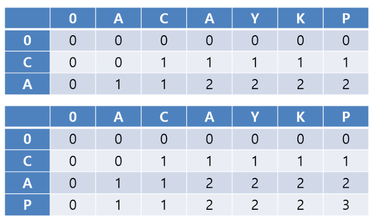
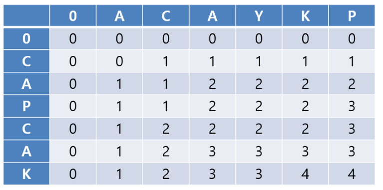
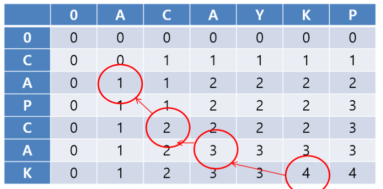

# LCS (Longest Common Subsequence) 알고리즘

## 참고 사이트

- https://twinw.tistory.com/126


## LCS란?

- LCS : 최장 공통 부분 문자열

	> substring / subsequence
	
	> substring : 연속된 부분 문자열
	
	> subsequence : 연속적이지 않은 부분 문자열

	ex) lamhungry
	- substring : mhun
	- subsequence : mugy


## LCS 용도

- 염기서열 유사성 분석에 사용된다.
- 이외에도 음파 단어 검색 및 교정 등에 사용


## LCS 시간복잡도

- 문자열의 길이가 n, m일 때 시간복잡도는 O(nm)


## LCS 알고리즘 접근 방법

- DP(Dynamic Programming)으로 특정 범위까지의 값을 구하고 다른 범위까지의 값을 구할 때 이전에 구해 둔 값을 이용하여 효율적으로 문제를 해결


- ex) 문자열'ACAYKP'와 'CAPCAK'
	- 우선 하나의 String을 기준 String, 다른 String을 비교 String으로 둔다.

  	- 
	
	- 위 표를 보면 문자열 맨 앞에 0을 추가해 첫번째 행과 열이 모두 0이다.
	- 각 위치의 값는 LCS의 길이의 값이 들어간다. 
	
	- 
	
	
	- C에 대해서 값을 다 넣으면 위 표와 같이 된다. 표를 읽는 법을 다음과 같다.
	- "C"와 "AC"의 LCS의 길이는 1이기 때문에 1을 넣고, 그 이후로도 1인 이유는 "C"와 "ACAYKP"까지 모두 LCS가 1이기 때문이다.
	
	- 
	
	- 위 두 표를 알 수 있듯이 행은 이전 행의 값을 기반으로 계산된다.
	- 첫 번째는 "CA"와 "ACAYKP"의 subsequence를 구한 것이며,
	- 두 번째는 "CAP"와 "ACAYKP"의 subsequence를 구한 것이다.
	- 표에서의 변화를 확인할 수 있듯이 **같은 문자가 나오면** 이전까지의 LCS의 길이가 **+1**을 하는 것을 알 수 있다.
	- 여기에서 이전까지의 LCS 길이는 왼쪽 값이 아닌 대각선 왼쪽 위값을 의미한다.
	


	- 즉 표의 값을 구하는 규칙은 다음과 같다.
	
		- A[n]과 B[k]가 **같다면** : **[n,k] == [n-1,k-1]+1**
		- A[n]과 B[k]가 **다르면** : **[n,k] == [n-1, k]와 [n, k-1] 중 큰 값**
		
		
	- 
	
	- 우선 가장 큰 숫자가 시작된 곳을 체크한다.
	- 각가의 행과 열에는 하나의 체크만이 있어야 한다.
	- substring을 구하는 것과 다르게 연속적이지 않아도 되기 때문에 같은 길이의 다른 해가 나타날 수 있다.
	
		
	- 	
	
	- 문자열 "ACAYKP"와 "CAPCAK"의 LCS : "ACAK"
	
	
```C

#include <iostream>
#include <string>
 
using namespace std;
 
int main() {
    int LCS_length = 0, max; //LCS length
    int **table; //LCS saved in this table
 
    string str1, str2;
 
    //set String
    cin >> str1;
    cin >> str2;
 
    str1 = "0" + str1;
    str2 = "0" + str2;
 
    //set Table
    int len1, len2;
    len1 = str1.length();
    len2 = str2.length();
 
    table = new int*[len2];
    for (int i = 0; i < len2; i++) {
        table[i] = new int[len1];
    }
 
    for (int i = 0; i < len1; i++) {
        table[0][i] = 0;
    }
 
    //Calculation Table Index and LCS Length
    for (int i = 1; i < len2; i++) {
        max = 0;
        table[i][0] = 0;
        for (int j = 1;j < len1; j++) {
            if (str2[i]== str1[j]){
                max = table[i-1][j - 1] + 1;
                table[i][j] = max;
            }
            else {
                if(table[i][j - 1] > table[i - 1][j])
                    table[i][j] = table[i][j-1];
                else
                    table[i ][j] = table[i-1][j];
            }
        }
        if (LCS_length < max)
            LCS_length = max;
    }
    cout << LCS_length;
 
    int temp0, temp1, for_j;
    temp1 = LCS_length;
    temp0 = temp1 - 1;
    for_j = len1 - 1;
    string LCS = "";
 
    //Calculation LCS
    for (int i = len2-1; i >0; i--) {
        for (int j = for_j; j > 0; j--) {
            if (table[i][j] == temp1 && table[i][j - 1] == temp0 && table[i - 1][j - 1] == temp0 && table[i - 1][j] == temp0) {
                temp0--;
                temp1--;
                LCS = str2[i] + LCS;
                for_j = j;
                break;
            }
        }
    }
 
    cout << LCS << endl;
    return 0;
}

```
		

## 관련 문제

- https://www.acmicpc.net/problem/9251
- https://www.acmicpc.net/problem/9252
- https://www.acmicpc.net/problem/5582
