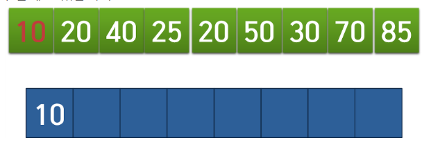
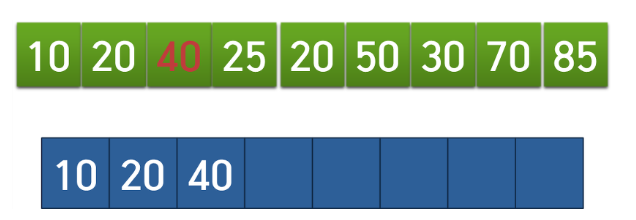
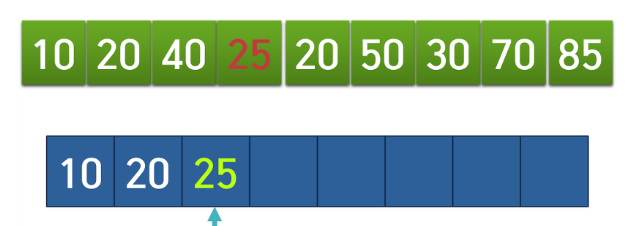
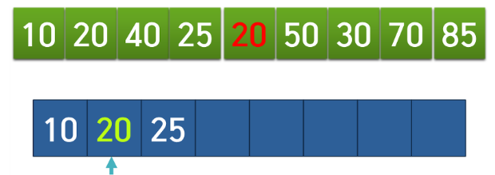
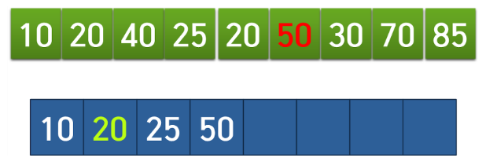
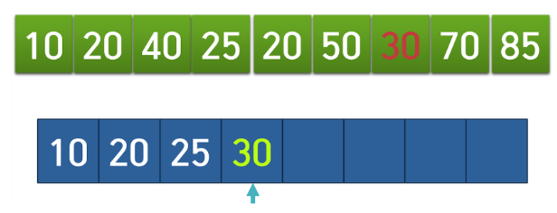
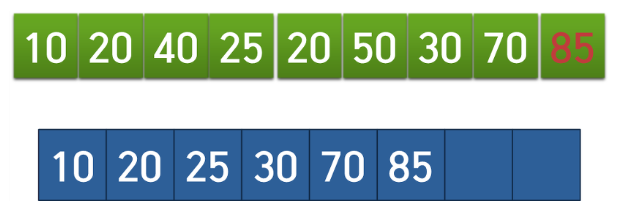

# LIS (Longest Increasing Subsequence) 알고리즘


## 참고 사이트

- https://jason9319.tistory.com/113
- https://seungkwan.tistory.com/8

## LIS란?

- 가장 긴 증가하는 부분 수열
- ex) 

  - 
  - 다음과 같은 수열이 존재한다면, 빨간 부분으로 색칠한 부분이 LIS가 된다.
  
  - 

- 앞에서부터 뒤로 숫자를 선택하며 부분 수열을 구성해 나갈때 증가하는 순서대로 숫자를 고르면서 고른 부분 수열의 길이가 최대 길이가 되도록 숫자를 선택하는 경우

- 구현 방법은 3가지가 있다 : DP 2차원 배열, 세그먼트 트리, 이분탐색


## LIS 시간복잡도

- DP 2차원 배열 : O(N^2)
- 이분탐색 : O(NlogN)


## LIS 접근 방법 (DP 2차원 배열)

- **dP[i]=i번째 원소를 마지막으로 하는 LIS의 길이**
- **dp[i]**=1~i-1까지의 원소들에서 **i번째 원소보다 값이 작은 것들 중에서 가장 큰 dp값 + 1**

```C

#include <iostream>
#include <vector>
#include <algorithm>

using namespace std;

vector<int> v(1001);
vector<int> dp(1001);

int main() {

	int n;
	cin >> n;

	for (int i = 1; i <= n; i++)
		cin >> v[i];

	dp[1] = 1;
	for (int i = 1; i <= n; i++) {
		int max_value = 0;
		for (int j = 1; j < i; j++) {
			if (v[j] < v[i]) {
				max_value = max(max_value, dp[j]);
			}
		}
		dp[i] = max_value+1;
	}

	int max_result = 0;
	for (int i = 1; i <= n; i++)
		if (dp[i] > max_result)
			max_result = dp[i];
	cout << max_result << "\n";
	return 0;
}

```

## LIS 접근 방법 (세그먼트 트리) O(N log N)

- arr[x]의 위치에 x번째 수를 마지막 원소로 가지는 lis의 길이를 업데이트
- 매 순간마다 자기보다 작은 구간에 최대값을 찾는 쿼리를 날려 최대값+1을 업데이트 하는 방식
- N번을 확인하는 데 최대값을 찾는 데 O(log N)이 걸리니 총 O(N log N)


## LIS 접근 방법 (이분 탐색) O (N log N)

- O(N)의 방법으로 수열 확인, 이분탐색을 이용하여 최적의 위치에 수를 삽입하는 방식
- 자리를 찾는데 lower_bound 사용 - O(log N)

	- 최적의 위치 찾는 방법
		- 벡터를 하나 생성한 뒤 -INF (나올 수 없는 값) 삽입
		- 이후 매번 수열을 볼 때마다 벡터의 맨 뒤 원소와 현재 보고있는 수열의 원소를 비교하여 수열의 원소가 더 클 경우 벡터에 push_back 해준 뒤 LIS의 크기를 1증가 시킨다.
		- 만약 수열의 원소가 벡터의 맨 뒤 원소보다 작을 경우 lower_bound를 이용하여 최적의 자리를 찾은 뒤 그자리의 값을 해당 수열의 원소로 교체한다.
		

	- ex) 벡터에 현재 10 40 70 값이 있다. 
	50이 들어갈 위치를 찾기 위해 lower_bound로 50을 찾는다면 iterator 는 70의 위치를 가르키게 되어 70을 50으로 갱신할 것이다.
	- 즉, 벡터에는 10 40 50이 들어갈 것이다.
	
	
## LIS 접근 방법 (이분 탐색) (예시)




- 빨간 부분은 지금 보는 위치이고, 파란칸은 벡터
- 10의 경우 첫번째 수 이기 때문에 우선 벡터에 넣는다.



- 3번째 인덱스가지 벡터의 끝값이 항상 수열의 값보다 작기 때문에 40까지 전부 삽입



- 이후 4번째 인덱스의 값이 25가 벡터의 끝값이 40보다 작기 때문에 lower_bound로 탐색한 뒤 40을 25로 갱신



- 5번째 인덱스값 또한 작기 때문에 lower_bound로 탐색한 뒤 20을 20으로 갱신





- lower_bound로 탐색한 뒤 50을 30으로 갱신



- 벡터에 남아있는 6개가 LIS이다. 즉, LIS의 길이는 6


## 한 가지 주의

- 벡터에 있는 값이 LIS를 이루는 요소와 무관하다는 것
- 해당 부분이 이해가 안될 수 있지만 말 그래도이다.
- 해당 알고리즘을 통해서 **LIS의 길이를 파악은 가능하다! 하지만 LIS의 정확한 배열은 확인할 수 없다**
- 실제로 원하는 정확한 배열값과 다른 결과값이 나올 수 있다는 것이다!
- **LIS의 정확한 값은 확인할 수 없다**

## LIS 구현

```c

vt.push_back(-INF);
for (int i = 0; i < n; i++) {
    scanf("%d", &x);
    if (vt.back() < x) {
        vt.push_back(x);
           ans++;
    }
    else {
        auto it = lower_bound(vt.begin(), vt.end(), x);
        *it = x;
    }
}


출처: https://jason9319.tistory.com/113 [ACM-ICPC 상 탈 사람]

```

## 관련 문제

https://www.acmicpc.net/problem/13711


