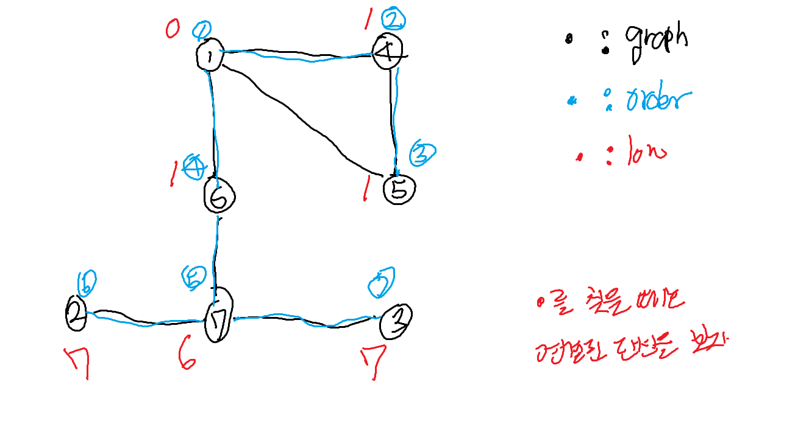

# 단절점 (=그래프 절단점)

## 선행 학습 필요

- DFS Spanning Tree

## 참고 사이트

- https://sonsh0824.tistory.com/entry/%EC%95%8C%EA%B3%A0%EB%A6%AC%EC%A6%98-%EA%B3%B5%EB%B6%806-%EA%B7%B8%EB%9E%98%ED%94%84-%EC%A0%88%EB%8B%A8%EC%A0%90%EA%B3%BC-SCC?category=736965

- https://jason9319.tistory.com/119


## 그래프 절단점이란?

- 해당 정점을 삭제했을 때 그래프가 두 개 이상의 그래프로 나누어 지는 점
- 때문에, 그래프는 항상 undirected graph


## 구현 방법

- 직관적으로 DFS 혹은 BFS로 몇 번만에 전체 그래프를 cover할 수 있는 지를 보면 될 것 같다. 
하지만 해당 방식은 각 정점마다 알고리즘을 돌려야 하니 정점이 많을 수록 매우 불리

- 무향그래프의 DFS Spanning tree를 보면 교차간선이 없다는 사실을 알 수 있다.


## 생각

- 한 정점 u를 기준으로 생각해보면 u를 지웠을 때 절단점이 되지 않는 경우는 언제일까?
- DFS Spanning tree에서 u의 자식 정점을 root로 하는 sub tree에서 u의 선조로 역방향 간선이 모두 존재하게 된다. 그렇게 되면 u를 지워도 u의 자식들이 root로 있는 sub tree는
모두 연결이 되어 그래프가 하나로 유지되기 때문이다.

- 즉, **u의 자식들이 root인 sub tree로부터 u의 선조로 가는 역방향 간선이 하나라도 없으면 u가 절단점 **
- DFS 한번에 모든 절단점을 찾을 수 있으니 매우 효율적인 방법


## 같은 내용 (다시 정리)


- 어떤 정점 A와 A에 연결된 정점 B에 대해서

- **order : 정점 V의 방문 순서**
- **low : V 이후에 방문하는 정점들 중 V를 거치지 않고 방문 가능한 가장 작은 값이며, 초기값은 자기 자신의 order**
- **child : 정점 V의 자식 트리 수**


## 단절점을 어떻게 찾을건가?
- order를 볼건데 지금 현재 노드의 order가 이전 노드와 번호가 같으면 얘한테서 온거잖아 (단절점이 될 수 있지)
- order를 볼건데 지금 현재 노도의 order가 이전 노드의 번호보다 낮으면 다른 루트노드로부터 온거임 (단절점이 될 수 없음)
- 

## 단절점 알고리즘

- A가 시작점이 아닌 경우 order(A) <= low(B) => A는 단절점
- A가 시작점이 아닌 경우 order(A) > low(B) => A는 단절점이 아님

- A가 시작점인 경우 2 <= child => A는 단절점
- A가 시작점인 경우 2 > child => A는 단절점이 아님





- child_num 구현하다보니까 느낀 점 : 초기에 주어진 그래프에서 주어진 노드의 연결된 개수가 아니라 DFS Spanning Tree에서 child로 연결된 개수인거 

## 구현


```c

#include <iostream>
#include <vector>
#include <algorithm>

using namespace std;

int n, m;
vector<int> graph[10001];
vector<int> order(10001);
bool isCheckCut[10001];

int number = 0;

int dfs(int here, bool isRoot) {
	order[here] = ++number; // dfs 탐색 순서
	int ret = order[here];
	int child_num = 0;
	for (int i = 0; i < graph[here].size(); i++) {
		int next = graph[here][i];
		
		// 이미 방문을 했음
		// 현재 정점의 방문순서와 탐색된 정점의 방문 순서 중 min값을 찾는다.
		// POINT

		if (order[next]) {
			ret = min(ret, order[next]);
			continue;
		}

		child_num++;
		int prev = dfs(next, false); // 자식으로 들어가기

		if (!isRoot && prev >= order[here])
			isCheckCut[here] = true;
		ret = min(ret, prev);
	}

	if (isRoot == true && child_num >= 2)
		isCheckCut[here] = true;
	return ret;
}
int main() {

	cin.tie(0);
	ios::sync_with_stdio(false);

	cin >> n >> m;

	for (int i = 0; i < m; i++) {
		int left, right;
		cin >> left >> right;
		graph[left].push_back(right);
		graph[right].push_back(left);
	}

	for (int i = 1; i <= n; i++)
		if(!order[i])
			dfs(i, true);

	int result_num = 0;
	for (int i = 1; i <= n; i++)
		if (isCheckCut[i] == true)
			result_num++;

	cout << result_num << "\n";
	for (int i = 1; i <= n; i++)
		if(isCheckCut[i]==true)
			cout << i << " ";
	cout << "\n";
	return 0;
}

```


