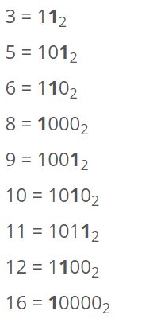
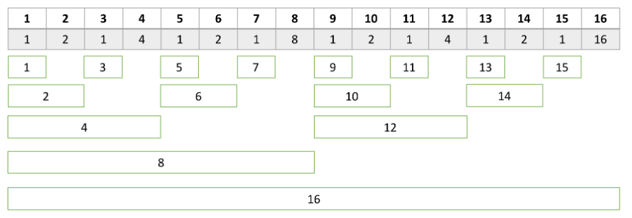

# 바이너리 인덱스 트리 (펜윅 트리) (=Binary Index Tree, BIT, Fenwick Tree)

## 참고사이트

- https://www.acmicpc.net/blog/view/21

## Fenwick Tree사용하는 경우

- 명확히는 잘 모르지만, 세그먼트 트리를 통해서 풀 수 있는 문제를 Fenwick Tree를 이용해서 풀 수 있는 것 같다.

## Fenwick Tree에 대한 설명

- Fenwick Tree를 구현하려면, 어떤 수 X를 이진수로 나타냈을 때, 마지막 1의 위치를 알아야 한다.



  - 마지막 1이 나타내는 값을 L[i]라고 표현하겠습니다.
  L[3]=1, L[10]=2, L[12]=4가 된다.
  
  - 수 N개를 A[1]~A[N]이라고 했을 때, Tree[i]는 A[i]부터 앞으로 L[i]개의 합이 저장되어 있다.
  - 아래 그림은 각각의 i에 대해서 L[i]를 나타낸 표이다. 아래 초록 네모는 i부터 앞으로 L[i]개가 나타내는 구간
  
  
  
  - 그림을 보면 알듯이 L[i]=i&~i가 된다.
  - 이유는 아래와 같습니다.
  ```c
  
  num = ~num + 1
  num = 100110101110101100000000000
  ~num = 011001010001010011111111111
  -num = 011001010001010100000000000
  num & -num = 000000000000000100000000000
  
  ```
  
  
  
  정리 진행 해야함!! 정리 예쩡
