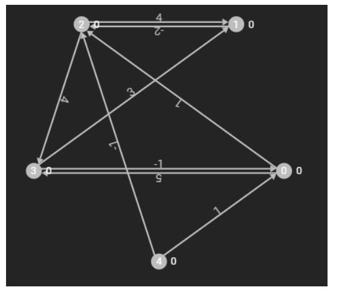
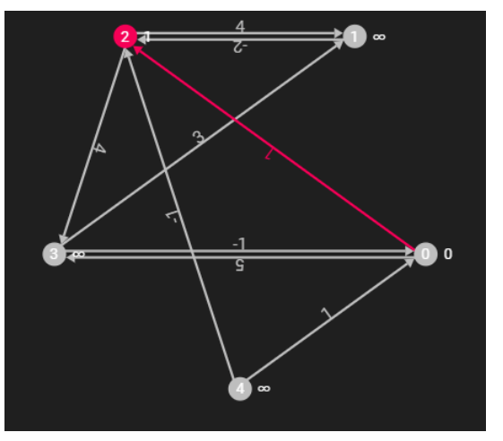
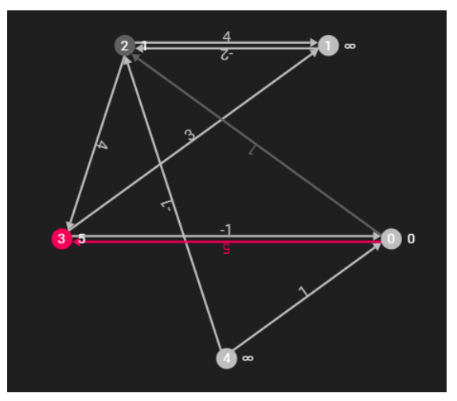
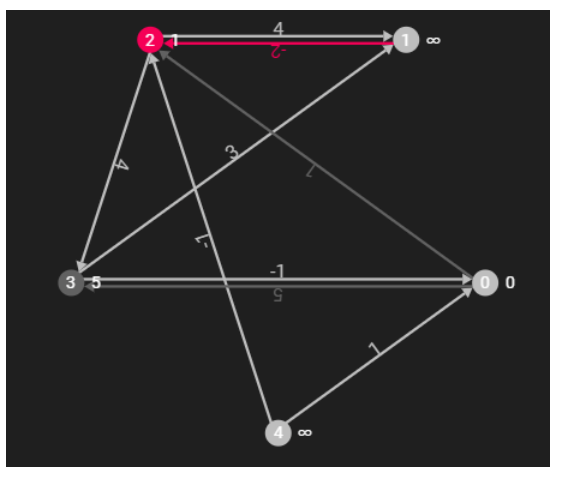
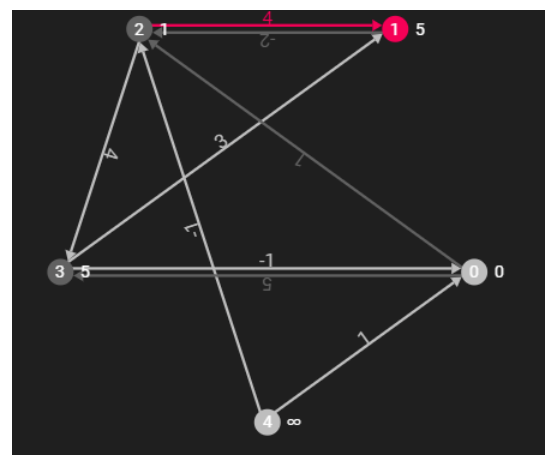
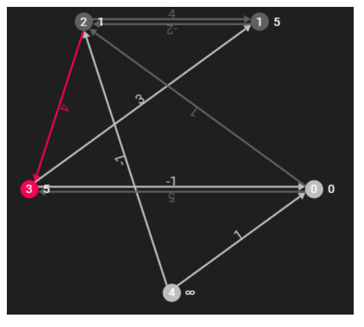

# 벨만포드 알고리즘 (Bellman-Ford Algorithm)


## 참고 사이트

- https://www.crocus.co.kr/534

## 벨만포드 알고리즘이란?

- 그래프 상에 존재하는 두 노드 간의 최단 거리를 구하고 싶을 때 사용 가능
- 다익스트라에서 할 수 없었던 음의 가중치도 계산할 수 있는 방식
- 다익스트라보다 시간복잡도가 더 높기에 어떤 상황에서 이용해야 할지 잘생각해야하는 주의점이 존재

## 벨만포드 알고리즘 시간복잡도

- O(VE) (E는 최대 V^2) 


## 다익스트라 알고리즘 시간복잡도

- O (E log V)


## 벨만포드 알고리즘 전제조건

- 최단 경로는 사이클을 포함할 수 없기 때문에, 최대 V-1개의 간선만 사용할 수 있다
  > 즉, 3개의 노드가 있을 때 2개까지 간선만 허용
  
- 최단 거리가 업데이트되는 노드가 없어질 때까지 계속해서 반복하여 구해주고, 음의 가중치로 인해 업데이트를 무한히하게 되는 경우
탈출 시켜주어야 한다. (무한히 반복하는 경우는 최단거리가 없다고 한다!)


## 벨만포드 알고리즘 설명



- 다음과 같이 방향이 존재하는 정점 5개, 간선 9개의 그래프가 주어져 있을 때 0에서 2로 가는 최단 거리를 구해보자
- 벨만 포드 알고리즘을 통해 최단 거리를 구하는 방식은 계속해서 모든 간선을 이용하여 A정점에서 B정점으로 갈 때, 거리가
짧아지는 경우가 생긴다면 계속 업데이트를 해주는 방식이다.
- 즉 V(정점) * E(간선)번 반복 후 종료



- 처음에는 모든 정점에 대해 최단 거리를 무한대로 설정
- 0번 정점에서 봐보자 -> 자기 자신인 0번 정점에 대해서 최단 거리 0, 1번 정점에 대해서 연결안되어 있으니 패스, 2번
정점에 대해서 최단 거리를 1로 업데이트



- 0번 정점에서 계속 봐보자 -> 3번 정점을 확인하고 최단 거리를 5로 업데이트 -> 4번 노드로 가는 경우 없으니 PASS



- 1번 정점에서 봐보자 -> 2번 정점이 무한대-2 이므로 업데이트 하지 않는다 -> 볼 수 있는 정점 없으니 PASS



- 2번 정점에서 봐보자 -> 1번 정점은 간선의 가중치가 4이니, 2번까지의 최단 거리 합(1)+가중치(4)=5를 1번 노드에 업데이트



- 2번 정점에서 봐보자 -> 3번 정점은 간선의 가중치는 4이니, 1+4=5를 3번 노드에 업데이트 -> 방문 끝났으니 PASS


- 3번 정점에서 봐보자 -> 0번 노드에 대해서 5-1이니 4이지만, 0번에는 0이 저장되어 있다. 4 > 0 이므로 업데이트 하지 않는다

- 4번 정점을 보고 업데이트 할게 있으면 업데이트를 할거다.
- 이렇게 한 번 Itreration(반복)이 돈 것이다. 이러한 반복을 N번 더하는 것이 벨만 포드 알고리즘이다.
- 이후에 수정이 없더라도 반복은 계속 된다.


## 음의 사이클 검증하기

- 벨만 포드 알고리즘에서는 V-1번 Edge들을 거치고 나면 최단거리가 완성이 되는데, 한번 더 돌리게 되면 음의 사이클이 있는 지 없는 지 
검증 가능하다.
  > 음의 사이클이란? 한 노드에서 시작해 한 노드로 끝나는 경로중에 경로의 가중치를 모두 합한 값이 음수가 되는 경로
- 즉, V-1번째 갱신 거리와 V번째 갱신 거리를 비교했을 때 값이 달라진다면 음의 사이클이 있다고 판단할 수 있다.


## 벨만포드 소스코드

```C

#include <iostream>
#include <vector>
#define INF 987654321

using namespace std;

int dist[501];
vector<pair<int, int>> city[501];

int main() {

	cin.tie(0);
	ios::sync_with_stdio(false);

	int n, m;
	cin >> n >> m;
	for (int i = 0; i <= n; i++)
		dist[i] = INF;
	
	dist[1] = 0;

	for (int i = 0; i < m; i++) {
		int from, to, val;
		cin >> from >> to >> val;
		city[from].push_back({ to, val });
	}

	bool impossible = false;
	for (int N = 1; N <= n; N++) {
		for (int i = 1; i <= n; i++) {
			for (int j = 0; j < city[i].size(); j++) {
				int to_node = city[i][j].first;
				int to_value = city[i][j].second;
				if (dist[i] == INF)
					continue;
				if (dist[to_node] > dist[i] + to_value) {
					if (N == n) {
						impossible = true;
					}
					dist[to_node] = dist[i] + to_value;
				}
			}
		}
	}

	if (impossible == true)
		cout << "-1\n";
	else {
		for (int i = 2; i <= n; i++) {
			if (dist[i] == INF)
				cout << "-1\n";
			else
				cout << dist[i] << "\n";
		}
	}
	return 0;
}

```


- 추가설명 : 한번 수정한 곳인데 다시 수정을 해? 뭐 그럴 수 있어 그런데 n-1번째 방문해서 수정이 이제 끝나야 하는데 n번째에서 또 수정을 해? 너는 음수 
