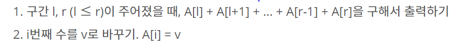
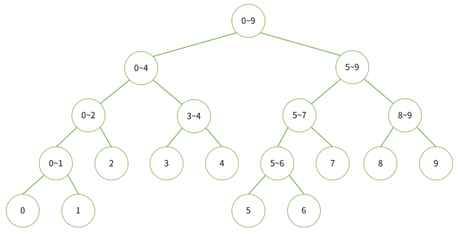
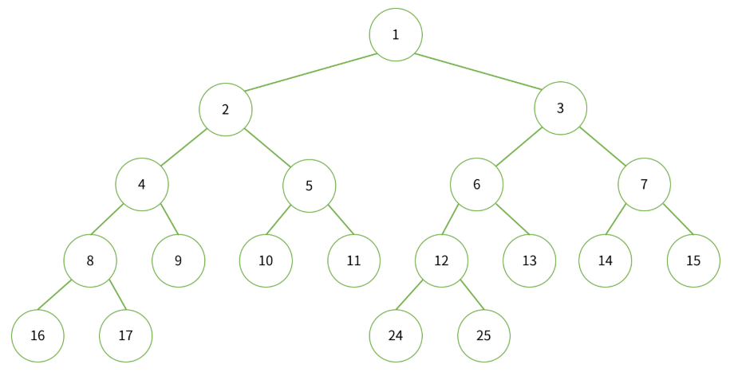
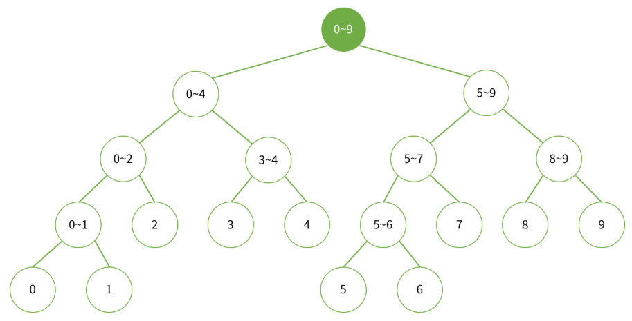
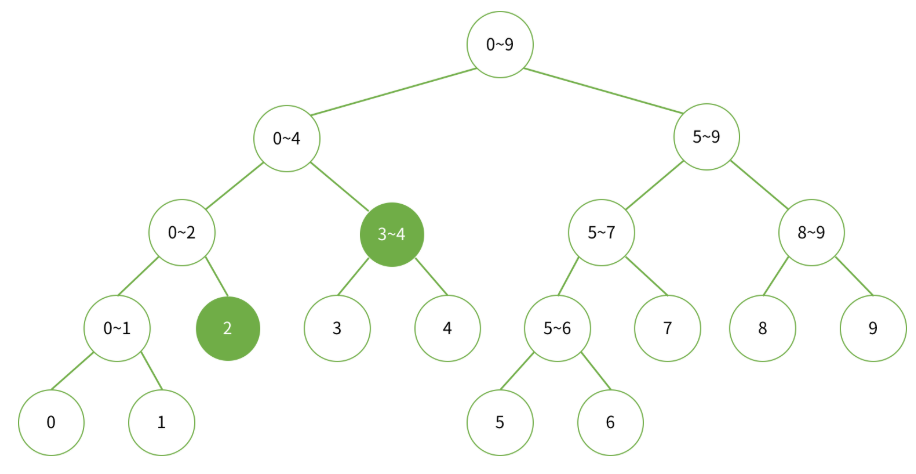
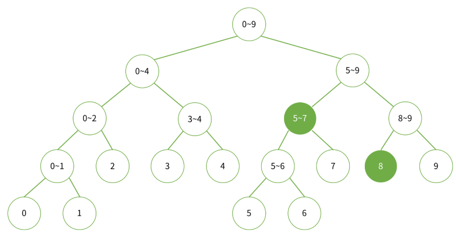
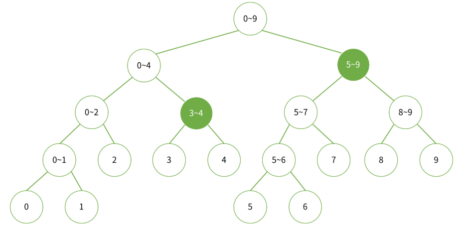
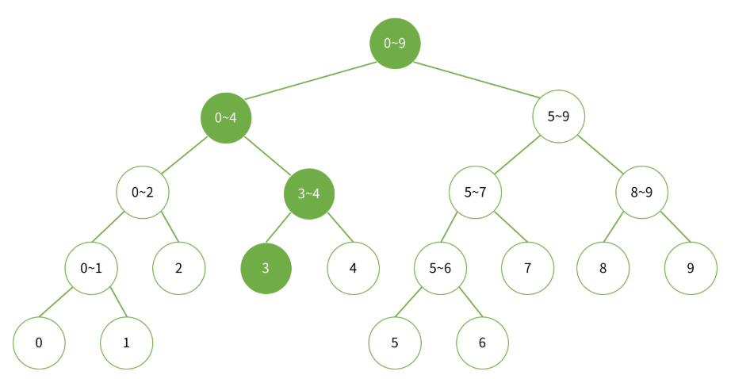
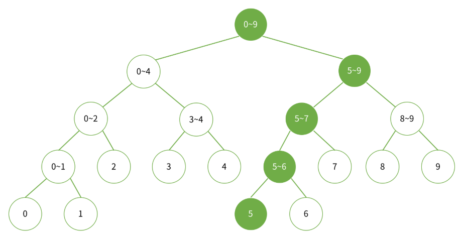

# 세그먼트 트리 (Segment Tree)


## 참고 사이트

- https://www.acmicpc.net/blog/view/9


## 세그먼트 트리 필요한 경우 (예시)

- 배열 A가 있고, 여기서 다음과 같은 두 연산을 수행해야하는 문제를 생각해보자.



- 수행해야하는 연산은 최대 M번입니다.


  - 세그먼트 트리나 다른 방법을 사용하지 않고 문제를 푼다면 1번째 연산을 수행하는 데 O(N), 2번째 연산은 O(1)
  - 총 시간복잡도는 O(N)*M = O(NM)
  ```c
  
  // 1번째 연산 풀이방법
  S[0] = A[0];
  for (int i=1; i<n; i++) {
      S[i] = S[i-1] + A[i];
  }
  
  ```
  
  - 위의 방법은 N,M이 매우 큰 경우에는 시간복잡도가 커져서 문제가 발생
  
  
## 세그먼트 트리의 시간복잡도

- 세그먼트 트리를 이용하면 위의 1번 연산을 O(logN)
- 위의 2번 연산을 O(logN)
- 전체 시간복잡도 : O(logN * logN * M)

## 세그먼트 트리 개념

- 세그먼트 트리의 리프 노드와 리프 노드가 아닌 다른 노드는 다음과 같은 의미를 가진다.
  - 리프 노드 : 배열의 그 수 자체
  - 다른 노드 : 왼쪽 자식과 오른쪽 자식의 합을 저장
  
- 어떤 노드의 번호가 X일 때, 왼쪽 자식의 번호는 2*X, 오른쪽 자식의 번호는 2*X+1이 된다.
- ex) N=10인 경우의 세그먼트 트리



- 위의 그림은 각 노드가 저장하고 있는 합의 범위를 나타낸 그림
- 아래의 그림은 각 노드의 번호를 나타낸 그림




## 세그먼트 트리 만들기

- 만약, N이 2의 제곱꼴인 경우에는 Full Binary Tree, 이 때의 높이는 logN
- 추가로, 리프노드가 N개인 Full Binary Tree가 필요한 노드의 개수는 2*N-1

- N이 2의 제곱꼴이 아닌 경우에는 옾이가 logN이고, 
- 총 세그먼트 트리를 만드는데 필요한 배열의 크기는 2^(H+1)-1  (H : 0 1 2 3 이라고 생각)


```C

// a: 배열 a
// tree: 세그먼트 트리
// node: 세그먼트 트리 노드 번호
// node가 담당하는 합의 범위가 start ~ end

long long init(vector<long long> &a, vector<long long> &tree, int node, int start, int end) {
    if (start == end) {
        return tree[node] = a[start];
    } else {
        return tree[node] = init(a, tree, node*2, start, (start+end)/2) + init(a, tree, node*2+1, (start+end)/2+1, end);
    }
}

```

  - start==end 인 경우는 node가 리프 노드인 경우이다. 리프 노드는 배열의 그 원소를 가져야하기 때문에 tree[node]=a[start]가 된다.
  - node의 왼쪽 자식은 node*2, 오른쪽 자식은 node*2+1
  - node가 담당하는 구간이 [start,end]라면, 왼쪽 자식은 [start, (start+end)/2], 오른쪽 자식은 [(start+end)/2+1, end]
  - 재귀함수를 이용하여 왼쪽 자식과 오른쪽 자식트리를 만들고, 그 합을 저장
  

## 합 찾기 


- 구간 left, right이 주어졌을 때, 합을 찾으려면 루트부터 트리를 순회하면서 각 노드가 담당하는 구간과 left, right사이의 관계파악 필수
- 예를 들어, 0~9까지 합을 구하는 경우 루트 노드 하나만으로 합을 알 수 있다.



- 2~4까지 합을 구하는 경우는 다음과 같다.



- 5~8까지 합을 구하는 경우는 다음과 같다.



- 3~9까지 합을 구한느 경우는 다음과 같다.




  - node가 담당하고 있는 구간이 [start,end] 이고, 합을 구해야하는 구간이 [left, right] 라면 다음과 같이 4가지 경우로 나뉜다.
    - [left,right]와 [start,end]가 겹치지 않는 경우
    - [left,right]가 [start,end]를 완전히 포함하는 경우
    - [start,end]가 [left,right]를 완전히 포함하는 경우
    - [left,right]와 [start,end]가 겹쳐져있는 경우 (1,2,3번째를 제외한 나머지 경우)
    
  - 1번째 경우에는 if(left>end || right<start)로 나타낼 수 있다. left>end인 경우 [start,end] 뒤에 [left,right]가 있는 경우이며 
  right<start는 [start,end] 앞에 [left,right]가 있는 경우이다.
  이 경우에는 겹치지 않기 때문에 더 이상 탐색을 이어나갈 필요가 없으므로 0을 리턴해 탐색 종료
  
  - 2번째 경우에는 if(left<=start && end <= right)로 나타낼 수 있다. 이 경우도 더 이상 탐색을 이어나갈 필요가 없다.
  구해야하는 합의 범위는 [left,right]인데, [start,end]는 그 범위에 모두 포함되고, 그 node 자식도 모두 포함되기 때문에 더 이상 호출은 비효율적이므로 tree[node]를 리턴해서 탐색 종료
  
  - 3번째와 4번째의 경우에는 왼쪽 자식과 오른쪽 자식을 루트로 하는 트리에서 다시 탐색을 시작해야 한다.
  
  
  ```c
  
  // node가 담당하는 구간이 start~end이고, 구해야하는 합의 범위는 left~right
  
long long sum(vector<long long> &tree, int node, int start, int end, int left, int right) {
    if (left > end || right < start) {
        return 0;
    }
    if (left <= start && end <= right) {
        return tree[node];
    }
    return sum(tree, node*2, start, (start+end)/2, left, right) + sum(tree, node*2+1, (start+end)/2+1, end, left, right);
}
  
  ```


## 수 변경하기

- 중간에 어떤 수를 변경한다면, 그 숫자가 포함된 구간을 담당하는 모든 노드를 변경해야한다.

- 3번째 수를 변경할 때, 변경해야 하는 구간을 나타내는 그림



- 5번째 수를 변경할 때, 변경해야하는 구간을 나타내는 그림




  - index 번째 수를 val로 변경한다면, 그 수가 얼마만큼 변했는지를 알아야 한다. 이 수를 diff 라고 하면, diff=val-a[indx]
  - 수 변경에는 2가지의 경우가 있다.
    - [start,end]에 index가 포함되는 경우
    - [start,end]에 index가 포함되지 않는 경우
    
  - node의 구간에 포함되는 경우 diff만큼 증가시켜 합을 변경시켜주어야 한다.
  tree[node]=tree[node]+diff
  
  - node의 구간에 포함되지 않는 경우에는 그 자식도 index가 포함되지 않기 때문에 탐색 중단
  
  ```c
  
  void update(vector<long long> &tree, int node, int start, int end, int index, long long diff) {
    if (index < start || index > end) return;
    tree[node] = tree[node] + diff;
    if (start != end) {
        update(tree,node*2, start, (start+end)/2, index, diff);
        update(tree,node*2+1, (start+end)/2+1, end, index, diff);
    }
  }
  
  ```

  - 리프노드가 아닌경우에는 자식도 변경해줘야 하기 때문에 start!=end로 리프노드인지 검사를 하면서 내려가는 방식
  
  
## 세그먼트 트리 구현

```c

#include <iostream>
#include <vector>
#include <math.h>

using namespace std;

int n, m, k;

long long init(vector<long long>& input, vector<long long> &tree, int node, int start, int end) {
	if (start == end)
		return tree[node] = input[start];
	else
		return tree[node] = init(input, tree, node * 2, start, (start + end) / 2) + init(input, tree, node * 2 + 1, (start + end) / 2 + 1, end);
}

long long sum(vector<long long>& tree, int node, int start, int end, int left, int right) {
	if (right<start || left>end)
		return 0;
	if (left <= start && end <= right)
		return tree[node];
	return sum(tree, node * 2, start, (start + end) / 2, left, right) + sum(tree, node * 2 + 1, (start + end) / 2 + 1, end, left, right);
}

void update(vector<long long>& tree, int node, int start, int end, int index, long long diff) {
	if (index<start || index>end)
		return;
	tree[node] = tree[node] + diff;
	if (start != end) {
		update(tree, node * 2, start, (start + end) / 2, index, diff);
		update(tree, node * 2 + 1, (start + end) / 2 + 1, end, index, diff);
	}
}


int main() {

	cin.tie(0);
	ios::sync_with_stdio(false);

	cin >> n >> m >> k;
	vector<long long> input;

	for (int i = 0; i < n; i++) {
		long long temp_input;
		cin >> temp_input;
		input.push_back(temp_input);
	}
	int h = (int)ceil(log2(n));
	int tree_size = (1 << (h + 1));
	vector<long long> tree(tree_size+1);

	init(input, tree, 1, 0, n - 1);

	for (int tk = 0; tk < m + k; tk++) {
		int op_num;
		cin >> op_num;
		if (op_num == 1) {
			int idx;
			long long change_value;
			cin >> idx >> change_value;

			idx = idx - 1;

			long long diff = change_value - input[idx];
			input[idx] = change_value;
			update(tree, 1, 0, n - 1, idx, diff);
		}
		else {
			int left, right;
			cin >> left >> right;

			cout << sum(tree, 1, 0, n - 1, left - 1, right - 1) << "\n";


		}
	}

	return 0;
}

```
  
## 세그먼트 트리 응용 문제

- https://www.acmicpc.net/problem/2042
- https://www.acmicpc.net/problem/10868
- https://www.acmicpc.net/problem/2357


