# 위상 정렬

## 참고 사이트

- https://m.blog.naver.com/PostView.nhn?blogId=ndb796&logNo=221236874984&proxyReferer=https%3A%2F%2Fwww.google.com%2F

## 위상 정렬의 개념

- **순서가 정해져있는 작업**을 수차례 수행해야할 때 그 순서를 결정해주기 위해 사용하는 알고리즘

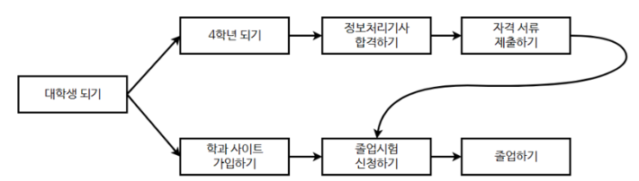

- 그래프의 흐름은 **조건**으로 해석할 수 있다. 지금껏을 수행하기 위해서는 이전껏을 수행해야한다고 해석하면 된다.
- 위상정렬은 여러 개의 답이 존재할 수 있다.
- 위상정렬은 DAG(Directed Acyclic Graph)에만 적용이 가능하다.
  > DAG : 사이클이 발생하지 않는 방향 그래프
  
- 사이클이 발생하는 경우 위상 정렬을 수행할 수 없다.

## 위상 정렬 알고리즘 시간복잡도

- O(V+E)

## 위상 정렬 알고리즘 (Queue를 사용한 방법)

- 진입차수가 0인 정점을 Queue에 삽입
- 큐에서 원소를 꺼내 연결된 모든 간선 제거
- 간선 제거 이후에 진입차수가 0이 된 정점을 큐에 삽입
- 큐가 비어질 때까지 반복. 모든 원소를 방문하기 전에 큐가 빈다면 사이클이 존재한다는 것
- 모든 원소를 방문했다면 큐에서 꺼낸 순서가 위상 정렬의 결과

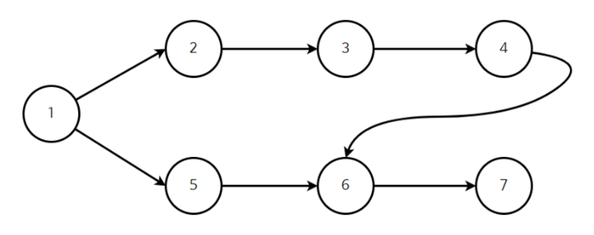
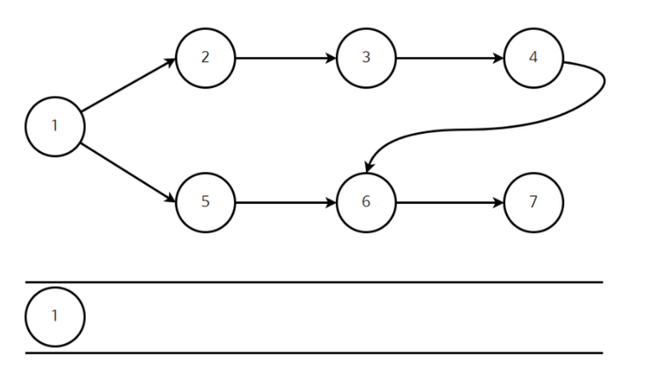
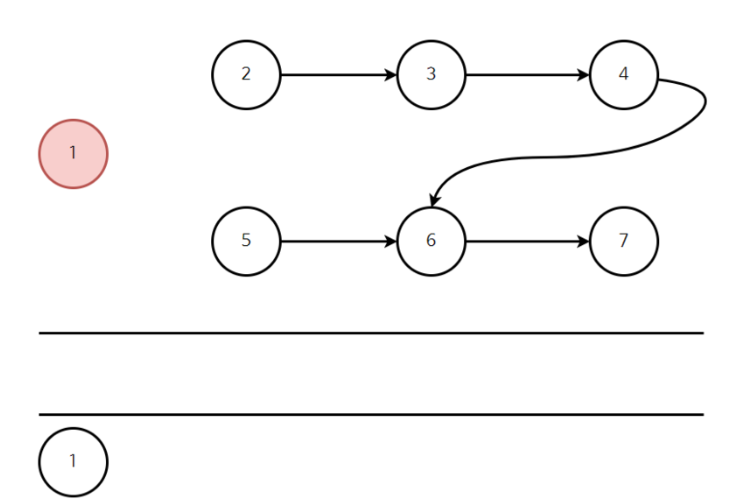
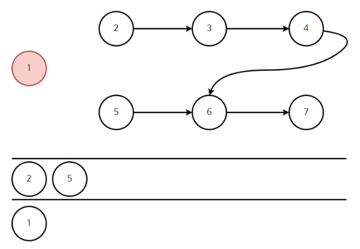
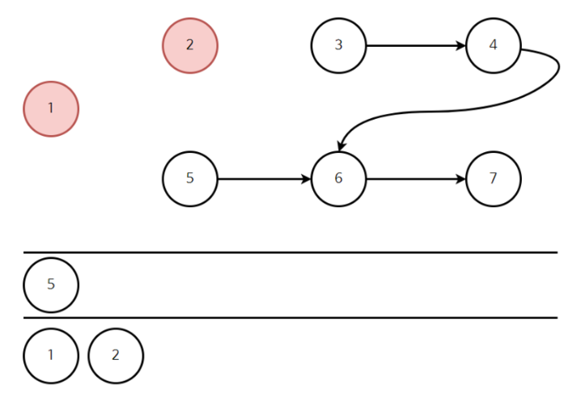
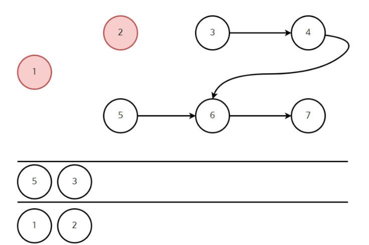
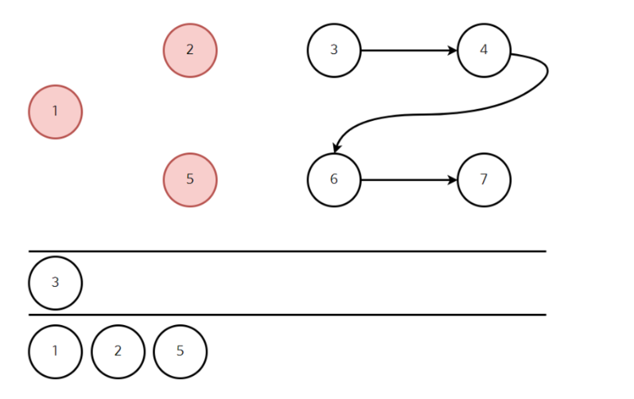
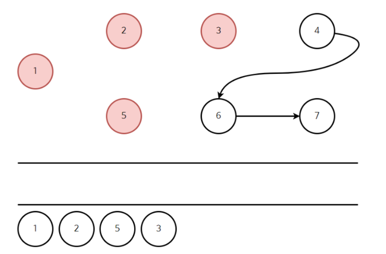
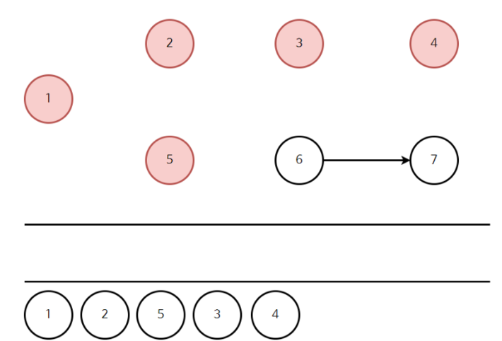
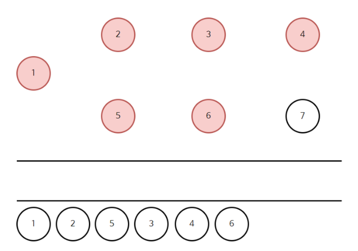
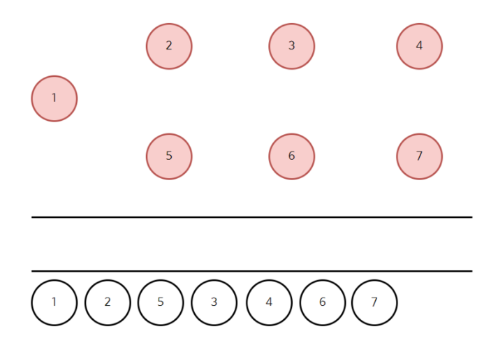
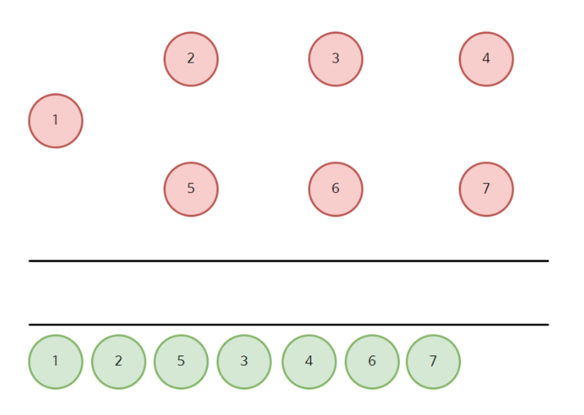


## 위상정렬 구현

```c
#include <iostream>
#include <queue>

using namespace std;

int n, m;
vector<int> v[32001];
int inDegree[32001];

void topologySort() {
	queue<int> q;

	for (int i = 1; i <= n; i++)
		if (inDegree[i] == 0)
			q.push(i);

	for (int i = 1; i <= n; i++) {
		
		if (q.empty())
			return;
		int front_q = q.front();
		cout << front_q << " ";
		q.pop();

		for (int j = 0; j < v[front_q].size(); j++) {
			int data = v[front_q][j];
			--inDegree[data];
			if (inDegree[data] == 0)
				q.push(data);
		}
	}
	cout << "\n";
}
int main() {

	cin.tie(0);
	ios::sync_with_stdio(false);

	cin >> n >> m;

	for (int i = 0; i < m; i++) {
		int left, right;
		cin >> left >> right;
		v[left].push_back(right);
		inDegree[right]++;
	}

	topologySort();


	return 0;
}

```
