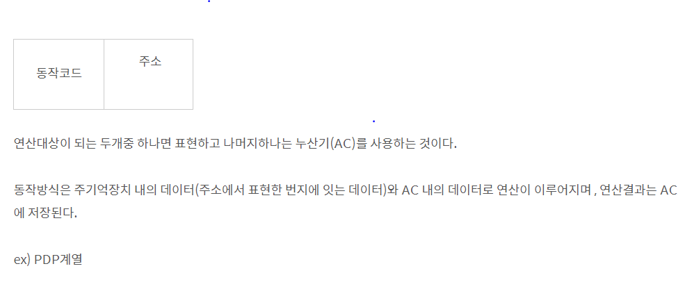
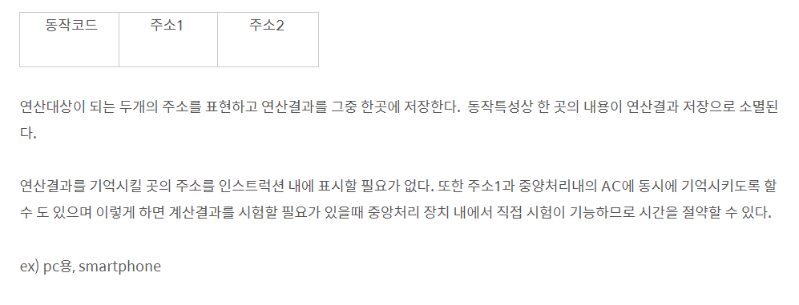
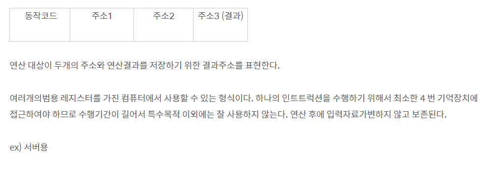
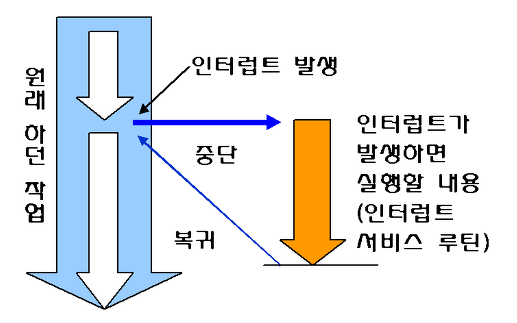
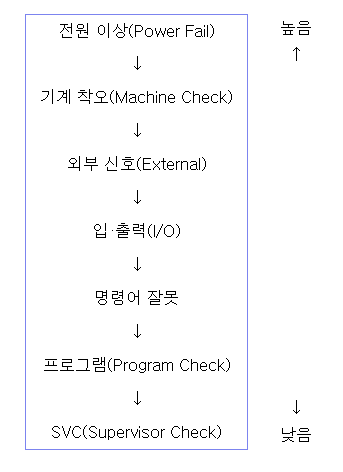
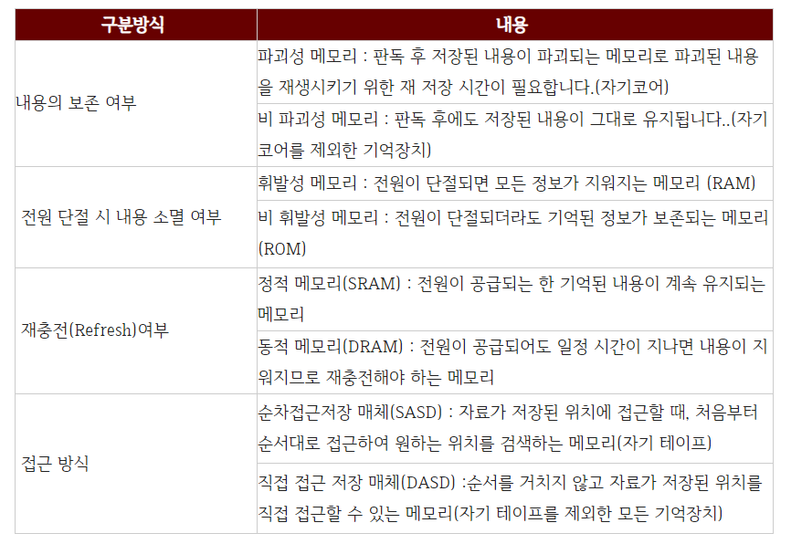

# 컴퓨터 구조

## 목차
- [논리회로](#논리회로)
- [순서논리회로](#순서논리회로)
- [소수점방식](#소수점방식)
- [프로세서](#프로세서)
- [명령어](#명령어)
- [인터럽트](#인터럽트)
- [기억장치](#기억장치)
- [컴퓨터연산](#컴퓨터연산)

<br><br><br><br><br><br>

<div id="논리회로"></div>

## 논리회로

## 불 대수

### 불 대수란?

- 하나의 명제가 참 또는 거짓인가를 판단하는 데 이용하는 수학적인 방법


### 연습문제


## 카르노 맵

### 카르노 맵이란?

- 설계된 논리식을 도표로 표현하여  최소화하는 방법
- 카르노 맵은 변수의 개수에 따라 표의 크기가 달라지며 칸의 위치에 따라 각 칸의 불 함수가 정해진다.
- 칸의 위치역시 표의 크기에 따라 다르다


### 3변수


- F=A'B+AC


### 4변수


- F=A'B'C'D'+ABC'+CD


### 5변수


<div id="순서논리회로"></div>

## 순서 논리회로

### 순서 논리회로란?
- 외부로부터의 입력과 현재 상태에 따라 출력이 결정되는 회로
- 플립플롭과 논리 게이트로 구성
- 신호의 타이밍에 따라 동기식과 비동기식으로 나누어진다.
- EX) 플립플롭, 카운터, 레지스터, RAM, CPU 등


### 조합 논리회로란?
- 임의의 시간에서의 출력이 이전의 입력에는 관계없이 현재의 입력조합(0 또는 1)으로부터 직접 결정되는 논리회로
- EX) 반가산기, 전가산기, 병렬가산기, 디코더, 인코더 등


### 동기식과 비동기식 

- 비동기식 동작 : 논리회로가 규칙적인 시간에 관계없이 입력 신호가 입력되면 곧바로 동작하는 것
- 동기식 동작 : 컴퓨터의 모든 구성 요소들이 서로 타이밍을 맞추어 정보를 주고받기 위하여 일정한 시간 간격을 두고 클럭 펄스(CP; Clock Pulse)를 발생시켜서 클럭 펄스에 동기화되어 동작하는 것

  > 동기식 동작을 하는 시스템에서는 클럭 펄스가 발생하기 전에 어떤 값이 입력되어도 동작하지 않는다.
  
  
  
<div id="소수점방식"></div>

## 고정 소수점 방식 vs 부정 소수점 

- 컴퓨터에는 실수를 표현하는 방법이 정수에 비해 훨씬 복잡
- 컴퓨터에서는 실수를 정수와 마찬가지로 2진수로만 표현해야 하기 때문
- 실수 표현 방식에는 크게 2가지 있다. (고정 소수점 방식, 부동 소수점 방식)


### 고정 소수점 방식 (fixed point)

- 소수부의 자릿수를 미리 정하고, 고정된 자릿수의 소수를 표현하는 것

- 32비트 실수를 고정 소수점 방식으로 표현하면 다음과 같다
  
  
  
- 이 방식은 정수부와 소수브의 자릿수가 크지 않으므로, 표현할 수 있는 범위가 매우 적다는 단점이 있다


### 부동 소수점 방식 (floating point)

- 가수부와 지수부로 나누어 표현할 수 있다
- 부동 소수점 방식은 다음 수식을 이용하여 매우 큰 실수까지도 표현할 수 있다


  - C++ 부동 소수점 표현 방식
  
    - 3.14, -45.6 과 같이 소수 부분을 가지는 아라비아 숫자료 표현
    - e 또는 E를 사용하여 지수 표기법으로 표현
    
    
    
    
    
    
    
    

- 부동 소수점 방식을 사용하면 고정 소수점 방식보다 훨씬 더 많은 범위까지 표현가능
- 하지만, 이 공식을 사용하면 표현할 수 있는 범위는 늘어나지만, 10진수를 정확하게 표현할 수 없게 된다.
- 컴퓨터에서 실수를 표현하는 방법은 정확한 표현이 아닌 언제나 근사치를 표현할 뿐임을 명심


```
#include <iostream>
using namespace std;

int main()
{
	int i;
	float sum = 0;
	
	for (i = 0; i < 1000; i++)
	{
		sum += 0.1;
	}
		
	cout << "0.1을 1000번 더한 합계는 " << sum <<"입니다.";
	return 0;
}

// 결과 : 0.1을 1000번 더한 합계는 99.999입니다.

// (+)이상하게 double로 하면 100이 나옴...float가 100이 나올줄알았는데ㅠ
```


<div id="중앙처리장치"></div>

## 중앙처리장치

### 중앙처리장치란?

- CPU (Central Processing Unit = 중앙처리장치)는 사람의 두뇌와 같이 컴퓨터 시스템에 부착된 모든 장치의 동작을 제어하고 명령을 실행하는 장치
- 중앙처리장치는 제어장치, 연산장치, 레지스터 그리고 이들을 연결하여 데이터를 전달하는 버스로 구성되어 있다.


### 제어장치란?

- 제어장치는 컴퓨터에 있는 모든 장치들의 동작을 지시하고 제어하는 장치
- ex) 제어장치는 명령 레지스터에서 읽어 들인 명령어를 해독하여 해당하는 장치에게 제어 신호를 보내 정확하게 수행하도록 지시한다.


### 연산장치란?

- 연산장치(ALU)는 제어장치의 명령에 따라 실제로 연산을 수행하는 장치
- 연산장치가 수행하는 연산에는 산술 연산, 논리 연산, 관계 연산, 이동(Shift) 등이 있다.


### 레지스터란?

- 레지스터는 CPU 내부에서 처리할 명령어나 연산의 중간 결과값 등을 일시적으로 기억하는 임시 기억장소
- 레지스터는 플립플롭(Flip-Flop)이나 래치(Latch)들을 병렬로 연결하여 구성
- 레지스터는 메모리 중에서 속도가 가장 빠르다


### 레지스터의 종류 및 기능

- 프로그램 카운터 (PC)
	- 다음 번에 실행할 번지를 기억하는 레지스터
	- 분기 명령이 실행되는 경우 그 목적지 주소로 갱신됨
	
- 명령 레지스터 (IR)
	- 현재 실행 중인 명령의 내용을 기억하는 레지스터
	
- 누산기 (AC)
	- 연산된 결과를 일시적으로 저장하는 레지스터로 연산의 중심
	
- 상태 레지스터 (SR)
	- 오버플로, 언더플로, 자리올림, 계산상태(0, +, -), 인터럽트 등의 시스템 내부의 순간순간 상태가 기록된 정보를 저장하고 있는 레지스터
	- 프로그램 제어와 밀접한 관계를 가짐
	
- 데이터 레지스터
	- 연산에 사용될 데이터를 기억하는 레지스터


### 버스란?

- 버스는 CPU, 메모리, I/O 장치 등과 상호 필요한 정보를 교환하기 위해 연결하는 공동의 전송선


<div id="명령어"></div>


## 명령어

### 명령어 구성

- 컴퓨터에서 실행되는 명령어는 크게 연산자가 표시되는 연산자(Operation)와 자료부(Operand)로 구성
	- 연산자 : 수행해야 할 동작에 맞는 연산자를 표시
		- ex) ADD, SUB, MUL, DIV, Shift, NOT, AND, OR, XOR 등
		
	- 자료부 : 실제 데이터에 대한 정보를 표시하는 부분
		- ex) 가상장소의 주소, 레지스터 번호, 사용할 데이터 등
		
### 연산자의 기능

- 자료 전달 기능 : CPU와 기억장치 사이에서 정보를 교환하는 기능
	- Load : 기억장치에 있는 정보를 CPU로 꺼내오는 명령
	- Store : CPU에 있는 정보를 기억장치에 기억시키는 명령
	- Move : 레지스터 간에 자료를 전달하는 명령
	- Push : 스택에 자료를 저장하는 명령
	- Pop : 스택에서 자료를 꺼내오는 명령
	
- 제어 기능 : 명령의 실행 순서를 변경시킬 때 사용하는 명령
	- 무조건 분기 명령
		- GOTO, Jump
	- 조건 분기 명령
		- IF
	- Call : 부 프로그램 호출
	- Return : 부 프로그램에서 주 프로그램으로 복귀
	
- 입출력기능 : CPU와 I/O장치, 또는 메모리와 I/O장치 사이에서 자료를 전달하는 기능
	- INPUT : 입출력장치의 자료를 주기억장치로 입력하는 명령
	- OUTPUT : 주기억장치의 자료를 입출력장치로 출력하는 명령
	

### 명령어 형식

- 0주소 명령어


- 1주소 명령어




- 2주소 명령어




- 3주소 명령어




<div id="인터럽트"></div>

## 인터럽트

### 인터럽트란?

- 프로그램을 실행하는 도중에 예기치 않은 상황이 발생할 경우, 현재 실행중인 작업을 즉시 중단하고 발생된 상황을 우선 처리한 후 실행 중이던 작업으로 복귀하려 계속 처리하는 것


### 인터럽트의 종류 및 발생 원인

- 외부 인터럽트 
	- 전원 이상 인터럽트 : 정전이 되거나 전원 이상이 있는 경우
	- 기계 착오 인터럽트 : CPU의 기능적인 오류 동작이 발생한 경우
	- 외부 신호 인터럽트 : 키보드로 인터럽트 키를 누른 경우
	- 입출력 인터럽트 : 입출력장치가 데이터의 전송을 요구하거나 전송이 끝났음을 알리는 경우
	


- 내부 인터럽트
	- 프로그램 검사 인터럽트
		- 0으로 나누기가 발생한 경우
		- Overflow, Underflow 발생한 경우
		- 프로그램에서 명령어를 잘못 사용한 경우
		- 부당한 기억장소의 참조와 같은 프로그램 상의 오류
		

- 소프트웨어 인터럽트
	- SVC(SuperVisor Call) 인터럽트
		- 사용자가 SVC명령을 써서 의도적으로 호출한 경우
		- 복잡한 입출력 처리를 해야 하는 경우
		
### 인터럽트 동작 원리




1. 인터럽트 요청 신호가 발생한다.

2. 현재 실행중이던 명령어는 끝까지 실행하고, 끝나면 중단한다.

3. 다음에 실행할 명령의 번지를 저장하고 있는 PC의 값을 메모리의 0번지에 보관한다.

4. 인터럽트 처리 루틴을 실행하여 인터럽트를 요청한 장치를 식별한다.

5. 실질적인 인터럽트를 처리한다. 인터럽트 서비스 프로그램이 실행중이어도 현재 처리하는 인터럽트보다 우선 순위가 높은 인터럽트가 발생하면 그 인터럽트를 먼저 처리해야 한다.

6. 메모리의 0번지에 기억된 값을 PC에 기억시킨다.

7. PC의 값을 이용하여 인터럽트 발생 이전에 수행중이던 프로그램을 계속 실행한다.


### 인터럽트 우선순위





### 인터럽트 우선순위 체제의 목적

- CPU에 연결되어 있는 여러 장치에서 동시에 하나 이상의 인터럽트가 발생하였을 때 먼저 서비스할 장치를 결정하기 위해서
	- 각 장치에 우선순위를 부여하는 기능
	- 인터럽트를 요청한 장치의 우선순위를 판별하는 기능
	- 우선순위가 높은 것을 먼저 처리할 수 있는 기능
	
### 소프트웨어적 인터럽트 우선순위 판별 방법 : Polling

- 인터럽트 발생 시 우선순위가 가장 높은 인터럽트 자원부터 인터럽트 요청 플래그를 차례로 검사하여 찾고 이에 해당하는 인터럽스 서비스 루틴을 수행하는 방식

- 자기디스크와 같이 속도가 빠른 장치에 높은 등급을 부여
- 회로가 간단하고, 우선순위 변경이 쉬우며, 별도의 하드웨어가 필요 없으므로 경제적
- 많은 인터럽트가 있을 때 그들을 모두 조사하는 데 많은 시간이 걸려 반응시간이 느리다는 단점이 존재


### 하드웨어적 인터럽트 우선순위 판별 방법 : Vectored Interrupt

- CPU와 Interrupt를 요청할 수 있는 장치 사이에 장치 번호에 해당하는 버스를 병렬이나 직렬로 요청하여 요청 장치의 번호를 CPU에 알리는 방식

- 별도의 프로그램 루틴이 없어서 응답 속도가 빠르다
- 회로가 복잡하고 융통성이 없으며 추가적인 하드웨어가 필요하므로 비경제적
	- 직렬 우선순위 부여 방식( = 데이지 체인 방식 ) : 인터럽트가 발생하는 모든 장치를 한 개의 회선에 직렬로 연결
	- 병렬 우선순위 부여 방식 : 인터럽트가 발생하는 각 장치를 개별적인 회선으로 연결
	
	

<div id="기억장치"></div>

## 기억장치


### 메모리의 계층 구조

- CPU 레지스터 / 캐시 메모리 / 메인 메모리 / 하드 디스크
	- 하드 디스크 : 프로그램과 데이터를 영구히 저장하는 장치, CPU의 필요에 따라 저장되어 있는 프로그램과 데이터는 메인 메모리로 전송
	- DRAM : 데이터를 일시적으로 저장하는 장치, 전원을 끄면 모두 지워지는 휘발성 메모리
	- 캐시 메모리 : 매우 빠른 속도의 캐시 메모리를 두어 현재 CPU가 자주 사용하는 프로그램 일부와 데이터 일부를 저장하여 동작하면서 처리 속도의 향상을 가져오게 된다. SRAM으로 구현
	- 메인 메모리 : 현재 실행 중인 프로그램과 프로그램에 필요한 데이터를 일시적으로 저장하는 장치, byte 또는 word 단위로 분할해서 어드레스를 할당, 주요 기능은 데이터 저장하는 "쓰기"와 데이터를 읽는 "읽기"
	- 캐시 메모리 : SRAM으로 구성, DRAM으로 구현된 메인 메모리에 비해 속도가 5~10배 정도 


### 기억장치의 계층 구조


### 기억장치의 구분




### 주기억장치

- CPU가 직접 접근하여 처리할 수 있는 고속의 기억장치
- 현재 수행되는 프로그램과 데이터를 저장
- 종류로 ROM, RAM이 있다


### ROM (Read Only Memory)

- 기억된 내용을 읽을 수만 있는 기억장치로 일반적으로 쓰기는 불가능
- 전원이 꺼져도 기억된 내용이 지워지지 않는 비휘발성 메모리
- 주기억장치로 사용하기보다는 주로 기본 입출력시스템(BIOS), 자가 진단 프로그램(POST) 같이 변경 가능성이 희박한 시스템 소프트웨어를 기억시키는 데 이용


### RAM (Random Access Memory)

- 자유롭게 읽고 쓸 수 있는 기억장치
- 현재 사용중인 프로그램이나 데이터가 저장
- 전원이 꺼지면 기억된 내용이 모두 사라지는 휘발성 메모리
- 정보가 저장된 위치는 주소로 구분


### 보조기억장치란?

- 보조기억장치는 주기억장치의 단점을 보완하기 위한 기억장치
- 보조기억장치는 주기억장치에 비해 속도는 느리지만 전원이 차단되어도 내용이 그대로 유지되고, 저장 용량이 크다는 장점이 있다
- 중앙처리장치(CPU)와 직접 자료 교환이 불가능하다
- 접근 시간이 오래 걸린다
- 일반적으로 주기억장치는 데이터를 저장할 때 DMA방식을 사용한다


### 연관기억장치란?

- 연관기억장치는 기억장치에서 자료를 찾을 때 주소에 의해 접근하지 않고, 기억된 내용의 일부를 이용하여 Access할 수 있는 기억장치

- 주소에 의해서만 접근이 가능한 기억장치보다 정보 검색이 신속하다
- 캐시 메모리나 가상 메모리 관리 기법에서 사용하는 Mapping Table이 사용된다


### 캐시 메모리란?

- CPU의 처리 속도와 주기억장치의 접근 속도 차이를 줄이기 위해 사용하는 메모리


### 캐시 메모리의 특징

- 캐시는 주기억장치와 CPU 사이에 위치하며, 자주 사용하는 프로그램과 데이터를 기억
- 메모리 계층 구조에서 가장 빠른 소자이며, 처리속도가 거의 CPU의 속도와 비슷할 정도
- 캐시를 사용하면 주기억장치를 접근(Access)하는 횟수가 줄어듦으로써 컴퓨터의 처리 속도가 향상


### 캐시 설계 시 고려할 사항

- 캐시의 크기
- 전송 Block Size
- 교체 알고리즘


### 캐시 메모리 쓰기 정책

- 캐시에 저장되어 있는 데이터에 수정이 발생했을 때 그 수정된 내용을 주기억장치에 갱신하기 위해 시기와 방법을 결정하는 것으로 다음의 3가지가 있다.

	- Write-Through : 캐시에 쓰기 동작이 이루어질 때마다 캐시 메모리와 주기억장치의 내용을 동시에 갱신, 쓰기 동작에 걸리는 시간이 가장 길다
	- Write-Back : 캐시에 쓰기 동작이 이루어지는 동안은 캐시의 내용만이 갱신되고, 캐시의 내용이 캐시로부터 제거될 때 주기억장치에 복사
	- Write-Once : 캐시에 쓰기 동작이 이루어질 때 한 번만 기록하고 이후의 기록은 모두 무시
	

### 가상기억장치란?

- 가상기억장치는 기억 용량이 작은 주기억장치를 마치 큰 용량을 가진 것처럼 사용할 수 있도록 하는 운영체제의 메모리 운영 기법

- 사용자는 프로그램의 크기에 제한 받지 않고 프로그램 실행이 가능하다


### 가상기억장치의 특징

- 보조기억장치를 이용하여 주기억장치의 용량 확보
- 사용자 프로그램을 여러 개의 작은 블록으로 나누어서 보조기억장치 상에 보관해 놓고 프로그램 실행 시 필요한 부분들만 주기억장치에 적재
- 주기억장치의 이용률과 다중 프로그래밍의 효율을 높일 수 있다


### 가상기억장치에서 주소

- 가상주소(논리주소) : 보조기억장치 상의 주소
- 실기억주소(물리적 주소) : 주기억장치 상의 주소, 이들 주소의 집합을 메모리 공간이라고 한다


### 가상기억장치의 관리 기법

- 페이징기법 : OS가 보조기억장치에 있는 프로그램을 동일한 크기의 블록으로 나누어서 관리하는 기법
- 세그먼트 기법 : 사용자가 보조기억장치에 있는 프 로그램을 가변적인 크기의 블록으로 나누어서 관리하는 기법


### 기억장치의 관리 전략

- 기억장치의 관리 전략은 보조기억장치에 저장되어 있는 프로그램을 주기억장치에 효율적으로 적재하기 위한 방법
	- 반입 전략
		- 보조 기억장치에 보관중인 프로그램이나 데이터를 언제 주기억장치에 적재할 것인지를 결정하는 전략
			- 요구 반입 : 실행 프로그램이 요구할 때 적재
			- 예상 반입 : 실행 프로그램에 의해 참조될 것을 예상하여 미리 적재
			
	- 배치 전략
		- 새로 반입되는 프로그램이나 데이터를 주기억장치의 어디에 위치시킬 것인지를 결정
			- 최초 적합
			- 최적 적합
			- 최악 적합
			
	- 교체 전략
		- 이미 사용되고 있는 페이지 프레임 중에서 어느 하나를 선택하여 지우고, 새로운 프로그램을 주기억장치에 배치하려고 할 때 결정하는 전략
			- FIFO
			- OPT
			- LRU
			- NUR
			- LFU
			
## 병럴 컴퓨터

### 병렬 처리의 개념

- 다수의 프로세서에서 동시에 여러 작업(Process)을 처리하는 것

### 병럴 컴퓨터의 특징

- 일부 하드웨어 오류가 발생하더라도 전체 시스템은 동작할 수 있다
- 처리 속도가 빠르다
- 프로그램 작성이 어렵다
- 기억장치를 공유한다

- ex) 일기예보, 인공지능 분야에서의 음성, 화상, 자연어 처리 등


### 병렬 컴퓨터의 분류

- SISD (Single Instruction steam Single Data System)
	- 현재의 보통 컴퓨터 구조
	- 명렁 하나가 자료 하나를 처리하는 구조
	- 파이프라인에 의한 시간적 병렬 처리가 가능
	
- SIMD
	- 한 개의 명령으로 여러 Data를 동시에 처리하는 구조
	- 다수의 처리기가 한 개의 제어장치에 의해 제어
	- 모든 처리기는 제어장치로부터 같은 명령을 수행하도록 제어하지만 처리기는 각각 다른 자료를 사용
	
- MISD
	- 다수의 처리기에 의해 각각의 명령들이 하나의 Data를 처리하는 구조
	- 실제로 사용 x
	
- MIMD
	- 다수의 처리가가 각각 다른 명령 흐름과 자료 흐름을 가지고 여러 개의 자료를 처리하는 구조
	- 각 처리기 사이에서 상호작용이 일어나는 데 상호작용이 강하면 다중 처리기, 약하면 분산 처리 시스템이라고 한다
	- 다중 처리기에 의한 비동기적 병렬 처리가 가능하다
	
	
	
	
<div id="컴퓨터연산"></div>

## 컴퓨터 연산


### 기본 개념

- 비트 : 2진 정보를 저장하는 최소의 단위
- 바이트 : 비트 8개가 모여 최소한의 의미를 지니는 단위
- ASCII 코드 : 7비트로 문자를 표현한 것으로 총 128가지의 문자를 표현할 수 있다. 하나의 문자는 기본적으로 8비트로 구성되어 있는데, 남는 1비트는 패리티 비트로 사용

	- ex) 대문자를 소문자로 변경하는 방법
	- ch1='K'
	- ch2=ck1-'A'+'a'  or 'A'가 65이고, 'a'가 97인 것을 이용해서 풀어도 상관x
	
- 유니코드 : 언어와 상관없이 모든 문자를 16비트(2byte)로 표현하므로, 최대 65,536자를 표현
- UTF-8 : 영문, 숫자, 기호를 1byte로 표현하고, 한글(초성, 중성, 종성)과 한자 등은 3bytes로 표현, 전세계의 모든 글자를 한 번에 표현 가능하다


