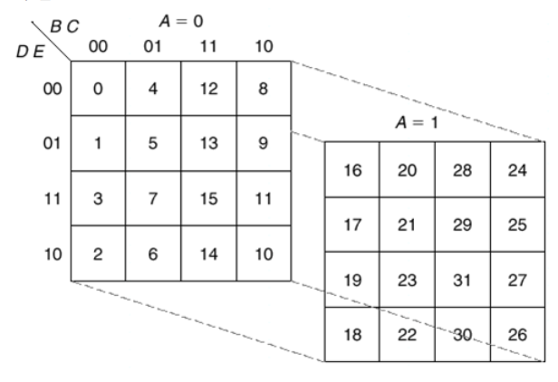

# 컴퓨터 구조

## 목차
- [논리회로](#논리회로)
- [순서논리회로](#순서논리회로)
- [소수점방식](#소수점방식)
- [프로세서](#프로세서)

<br><br><br><br><br><br>

<div id="논리회로"></div>

## 논리회로

## 불 대수

### 불 대수란?

- 하나의 명제가 참 또는 거짓인가를 판단하는 데 이용하는 수학적인 방법


### 연습문제


## 카르노 맵

### 카르노 맵이란?

- 설계된 논리식을 도표로 표현하여  최소화하는 방법
- 카르노 맵은 변수의 개수에 따라 표의 크기가 달라지며 칸의 위치에 따라 각 칸의 불 함수가 정해진다.
- 칸의 위치역시 표의 크기에 따라 다르다


### 3변수


- F=A'B+AC


### 4변수


- F=A'B'C'D'+ABC'+CD


### 5변수




<div id="순서논리회로"></div>

## 순서 논리회로

### 순서 논리회로란?
- 외부로부터의 입력과 현재 상태에 따라 출력이 결정되는 회로
- 플립플롭과 논리 게이트로 구성
- 신호의 타이밍에 따라 동기식과 비동기식으로 나누어진다.
- EX) 플립플롭, 카운터, 레지스터, RAM, CPU 등


### 조합 논리회로란?
- 임의의 시간에서의 출력이 이전의 입력에는 관계없이 현재의 입력조합(0 또는 1)으로부터 직접 결정되는 논리회로
- EX) 반가산기, 전가산기, 병렬가산기, 디코더, 인코더 등


### 동기식과 비동기식 

- 비동기식 동작 : 논리회로가 규칙적인 시간에 관계없이 입력 신호가 입력되면 곧바로 동작하는 것
- 동기식 동작 : 컴퓨터의 모든 구성 요소들이 서로 타이밍을 맞추어 정보를 주고받기 위하여 일정한 시간 간격을 두고 클럭 펄스(CP; Clock Pulse)를 발생시켜서 클럭 펄스에 동기화되어 동작하는 것

  > 동기식 동작을 하는 시스템에서는 클럭 펄스가 발생하기 전에 어떤 값이 입력되어도 동작하지 않는다.
  
  
  
<div id="소수점방식"></div>

## 고정 소수점 방식 vs 부정 소수점 

- 컴퓨터에는 실수를 표현하는 방법이 정수에 비해 훨씬 복잡
- 컴퓨터에서는 실수를 정수와 마찬가지로 2진수로만 표현해야 하기 때문
- 실수 표현 방식에는 크게 2가지 있다. (고정 소수점 방식, 부동 소수점 방식)


### 고정 소수점 방식 (fixed point)

- 소수부의 자릿수를 미리 정하고, 고정된 자릿수의 소수를 표현하는 것

- 32비트 실수를 고정 소수점 방식으로 표현하면 다음과 같다
  
  
  
- 이 방식은 정수부와 소수브의 자릿수가 크지 않으므로, 표현할 수 있는 범위가 매우 적다는 단점이 있다


### 부동 소수점 방식 (floating point)

- 가수부와 지수부로 나누어 표현할 수 있다
- 부동 소수점 방식은 다음 수식을 이용하여 매우 큰 실수까지도 표현할 수 있다


  - C++ 부동 소수점 표현 방식
  
    - 3.14, -45.6 과 같이 소수 부분을 가지는 아라비아 숫자료 표현
    - e 또는 E를 사용하여 지수 표기법으로 표현
    
    
    
    
    
    
    
    

- 부동 소수점 방식을 사용하면 고정 소수점 방식보다 훨씬 더 많은 범위까지 표현가능
- 하지만, 이 공식을 사용하면 표현할 수 있는 범위는 늘어나지만, 10진수를 정확하게 표현할 수 없게 된다.
- 컴퓨터에서 실수를 표현하는 방법은 정확한 표현이 아닌 언제나 근사치를 표현할 뿐임을 명심


```
#include <iostream>
using namespace std;

int main()
{
	int i;
	float sum = 0;
	
	for (i = 0; i < 1000; i++)
	{
		sum += 0.1;
	}
		
	cout << "0.1을 1000번 더한 합계는 " << sum <<"입니다.";
	return 0;
}

// 결과 : 0.1을 1000번 더한 합계는 99.999입니다.

// (+)이상하게 double로 하면 100이 나옴...float가 100이 나올줄알았는데ㅠ
```


