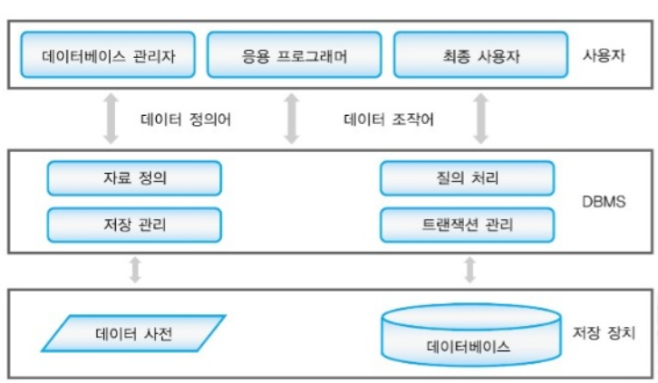
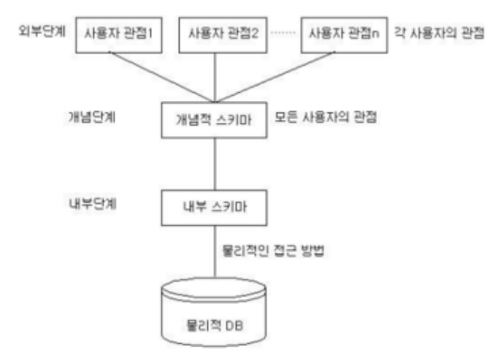
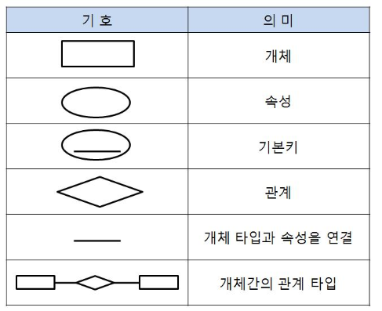
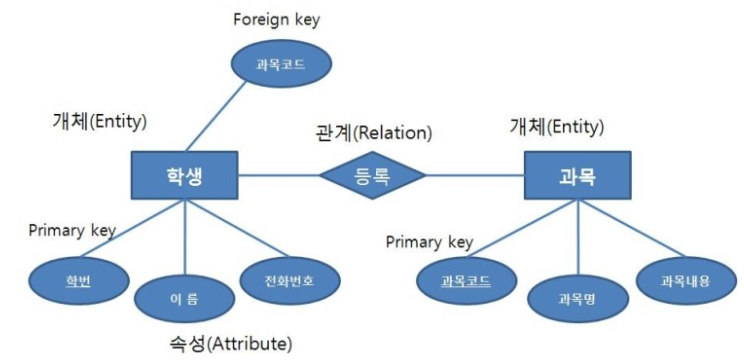
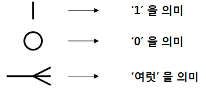
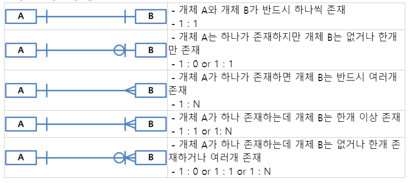
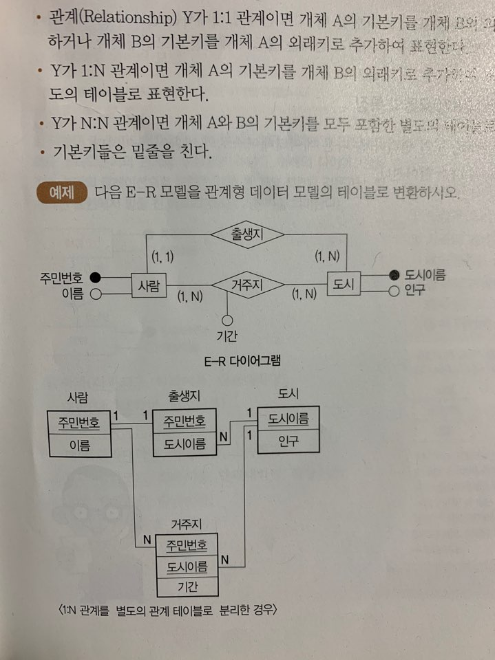

# 데이터베이스

## 목차

- 데이터베이스 개념
- DBMS의 기능
- 스키마(Schema)
- 데이터베이스 언어
- 데이터 모델의 개념
- E-R다이어그램
- 데이터베이스 설계

- 데이터베이스의 성능

## 데이터베이스 개념

### 데이터베이스의 정의

- **데이터베이스**는 **특정 조직의 업무를 수행하는 데 필요한 상호 관련된 데이터들의 모임**
  - 통합된 데이터 : 자료의 중복 배제
  - 저장된 데이터 : 저장 매체에 저장된 자료
  - 운영 데이터 : 조직의 고유한 업무를 수행하는 데 반드시 필요한 자료
  - 공용 데이터 : 여러 시스템들이 공동으로 소유하고 유지하는 자료

### 데이터베이스의 특징

- 실시간 접근성 : 비정형적인 질의(조회)에 대하여 실시간 처리에 의한 응답이 가능해야 한다.
- 계속적인 변화 : 삽입, 삭제, 갱신으로 항상 최신의 데이터를 유지해야 한다.
- 동시 공용 : 데이터베이스는 서로 다른 목적을 가진 여러 응용자들을 위한 것으로 다수의 사용자가 같은 내용의 데이터를 이용할 수 있어야 한다.
- 내용에 의한 참조 : 데이터베이스에 있는 데이터를 참조할 때, 사용자가 요구하는 데이터 내용으로 데이터를 찾는다.

### 데이터베이스 시스템

- **데이터베이스 시스템**이란 **데이터베이스를 이용하여 자료를 저장하고 관리하여 정보를 얻어내는 데 필요한 컴퓨터 중심의 시스템**

- 

## DBMS의 기능

### DBMS의 정의

- **DBMS**는 사용자와 데이터베이스 사이에서 **사용자의 요구에 따라 정보를 생성해주고, 데이터베이스를 관리해주는 소프트웨어**

### DBMS의 발전 배경

- 기존 방식(**파일 시스템**) : **처리 업무 하나하나마다 데이터 파일을 독립적으로 구성**함으로써, 같은 내용의 데이터가 서로 다른 업무의 파일에서 중복저장되어 관리되는 데이터 중복성, 데이터 종속성을 초래하는 단점 존재
- **데이터베이스** 도입 : **각 업무 처리에 필요한 자료들의 중복을 최소화하여 한 곳에 모아서 구성**

### 대표적인 DBMS

- 오라클 / Oracle : PC급에서 메인프레인급까지 모두 설치할 수 있으며, 분산 처리 지원 기능이 우수
- MySQL / MySQL AB : 다양한 플랫폼과 API를 지원하는 비상업용 DBMS

### DBMS의 필수 기능

- 정의(Definiton) 기능
  - 데이터베이스에 저장될 **데이터 형(Type)과 구조에 대한 정의, 이용 방식, 제약 조건 등을 명시
  - 데이터와 데이터의 관계를 명확하게 명세할 수 있어야 하며, 데이터 연산은 무엇이든 명세
  
- 조작(Manipulation) 기능
  - **데이터 검색, 갱신, 삽입, 삭제 등을 체계적으로 처리**하기 위해 사용자와 데이터베이스 사이의 인터페이스 수단을 제공하는 기능
  
- 제어(Control) 기능
  - **데이터의 무결성 유지**
  - 정당한 사용자가 허가된 데이터만 접근할 수 있도록 **보안을 유지하고, 권한을 검사**
  - 여러 사용자가 데이터베이스를 동시에 접근하여 데이터를 처리할 때, 처리결과가 항상 정확성을 유지하도록 병행 제어를 할 수 있어야 한다.
  
  
  
  
### DBMS의 장단점

| 
장점
 |  
단점
 |
|:----------------:|:----------------:|
| 데이터의 논리적, 물리적 독립성이 보장 | 전산화 비용이 증가 |
| 데이터의 중복을 피할 수 있어서 기억공간 절약 | 대용량 디스크로의 집중적인 Access로 과부하(Overhead) |
| 저장된 자료를 공동으로 이용 | 파일의 Backup과 Recovery가 어렵다 |
| 데이터의 일관성, 무결성, 보안 유지 | 시스템이 복잡 |
| 항상 최신의 데이터 유지, 데이터의 실시간 처리 가능 |  |

  - 백업(Back up) : 장비 고장 등의 비상사태에도 데이터베이스가 보존되도록 복사하는 작업

## 스키마(Schema)

### 스키마의 정의

- 데이터베이스의 구조와 제약 조건에 관한 전반적인 명세(Specificaion)을 기술한 메타데이터 집합
- **스키마**는 **데이터베이스를 구성하는 개체(엔티티), 속성, 관계 및 데이터 조작 시 데이터 값들이 갖는 제약 조건 등에 관해 전반적으로 정의**

  

### 스키마의 특징

- 스키마는 **데이터 사전**에 저장되며, 다른 이름으로 **메타데이터**라고도 한다.
- 스키마는 시간에 따라 불변인 특성을 갖는다.
- 스키마는 데이터의 구조적 특성을 의미한다.

### 스키마의 3계층

- 데이터베이스의 관리 시스템은 외부적 스키마에 따라 명시된 사용자의 요구를 개념적 스키마에 적합한 형태로 변경하고 이를 다시 내부적 스키마에 적합한 형태로 변환한다.

  - 외부 스키마 (=사용자 뷰)
    - **외부 스키마**는 **사용자나 응용 프로그래머가 각 개인의 입장**에서 필요로 하는 데이터베이스의 논리적 구조를 정의
    - 일반 사용자는 질의어(SQL)를 이용하여 DB를 쉽게 사용할 수 있다.
    - 응용 프로그래머는 C, COBOL 등의 언어를 사용하여 DB에 접근한다.
    - 하나의 데이터베이스 시스템에는 여러 개의 외부 스키마가 존재할 수 있다.
  
  - 개념 스키마 (=전체적인 뷰)
    - **개념 스키마**는 **데이터베이스의 전체적인 논리적 구조**
    - 조직 전체의 데이터베이스로 하나만 존재
    - 개념 스키마는 **개체 간의 관계와 제약 조건을 나타내고, 접근 권한, 보안 및 무결성 규칙에 관한 명세**를 정의
  - 내부 스키마 (=저장 스키마)
    - **내부 스키마**는 **물리적 저장위치의 입장에서 본 데이터베이스 구조**
    - 내부 스키마는 실제로 데이터베이스에 저장될 레코드의 물리적인 구조를 정의하고, 저장 데이터 항목의 표현 방법, 내부 레코드의 물리적 순서 등을 나타낸다.
    - 시스템 프로그래머나 시스템 설계자가 보는 관점의 스키마
    
    

## 데이터베이스 언어

- 데이터베이스 언어는 데이터베이스를 구축하고 이용하기 위한 데이터베이스 시스템과의 통신 수단
- 데이터베이스 언어는 DBMS를 통해 사용하며, 기능과 사용 목적에 따라 데이터 정의 언어, 데이터 조작 언어, 데이터 제어 언어로 구분된다.

### 데이터 정의 언어 (DDL)

- DB구조, 데이터 형식, 접근 방식 등 DB를 구축하거나 수정할 목적으로 사용하는 언어
- 외부 스키마를 정의

### 데이터 조작 언어 (DML)

- 사용자로 하여금 데이터를 처리할 수 있게 하는 도구로서, 사용자(응용 프로그램)과 DBMS 간의 인터페이스를 제공
- 응용 프로그램을 통해서 사용자가 DB의 데이터를 실질적으로 조작할 수 있도록 하기 위해 COBOL 등의 호스트 언어에 DB 기능을 추가해서 만든 언어

  - 질의어 : 단말 사용자가 쉽게 DB를 액세스할 수 있도록 대화식의 자연어로 만든 비절차적 조작 언어 EX) SQL
  - 비절차적 조작 언어 : 사용자가 어떤 데이터가 필요한지만 명시하고 어떻게 구하는 지 명시하지 않는 언어
  
  
  

### 데이터 제어 언어 (DCL)
    
- 무결성, 보안 및 권한 제어, 회복 등을 하기 위한 언어
- 데이터를 보호하고 데이터를 관리하는 목적으로 사용

## 데이터 모델의 개념

### 데이터 모델의 정의

- **데이터 모델**은 **현실 세계의 정보들을 컴퓨터에 표현하기 위해서 단순화, 추상화**하여 체계적으로 표현한 개념적 모형

### 데이터 모델의 구성 요소

- 개체 : 데이터베이스에 표현하려는 것 ex) 교수
- **속성** : **데이터의 가장 작은 논리적 단위**, 개체를 구성하는 항목 ex) 성명, 전공, 소속
- 관계 : 개체 간의 관계
    - 관계의 형태 : 1대1 관계, 1대N 관계, N대N 관계
    

## E-R다이어그램

### E-R다이어그램 개념

- 조직, 사용자, 프로그램, 데이터 등 시스템 내에서 역할을 가진 모든 개체들을 표현
- E-R 다이어 그램 기호
  - 
  
  
- E-R 다이어 그램 예시
  - 
  
  
- 새발 표기법
  - 관계의 의미나 제약 조건 등을 개체 타입들을 연결하는 몇 가지 기호를 사용하여 표현하는 표기법
  - 
  
  
  - 새발표기법 예시
  - 
  
  
  
  
## 관계형 데이터 모델

### 관계형 데이터 모델의 개념

- 기본키와 이를 참조하는 외래키로 데이터 간의 관계를 표현
- 1:1, 1:N, M:N 관계를 자유롭게 표현

### E-R모델을 관계 모델의 테이블로 변환

- 개체 A,B와 관계 Y로 이루어진 E-R모델을 관계 테이블로 변환하는 방법
  - 
  
  
  - 개체를 독립적인 테이블로 표현
  - 관계 Y가 **1:1관계**이면 **개체 A의 기본키를 개체 B의 외래키로 추가**하거나 **개체 B의 기본키를 개체 A의 외래키로 추가**
  - 관계 Y가 **1:N관계**이면 **개체 A의 기본키를 개체 B의 외래키로 추가**하여 표현하거나 별도의 테이블로 표현
  - 관계 Y가 **M:N관계**이면 **개체 A와 B의 기본키를 모두 포함한 별도의 테이블**로 표현
  
  
  
### 관계형 데이터 모델의 특징

- 장점 : 간결하고, 보기 편리하고, 다른 데이터베이스로의 변환이 용이
- 단점 : 성능이 떨어진다.

## 데이터베이스 설계

### 데이터베이스 설계의 개념

- **데이터베이스 설계**란 **사용자의 요구를 분석**하여 그것들을 컴퓨터에 저장할 수 있는 **데이터베이스의 구조에 맞게 변경한 후 특정 DBMS로 데이터베이스를 구현**하여 일반 사용자들이 사용하게 하는 것

### 데이터베이스 설계 시 고려사항

- 무결성 : 삽입, 삭제, 갱신 등의 연산 후에도 데이터베이스에 저장된 데이터가 정해진 제약 조건을 항상 만족해야 함
- 일관성 : 특정 질의에 대한 응답이 끝까지 변함없이 일정해야 함
- 회복 : 시스템에 장애가 발생했을 때 장애 발생 직전의 상태로 복구할 수 있어야 함
- 보안 : 불법적인 데이터의 노출 또는 변경이나 손실로부터 보호
- 효율성 : 응답시간의 단축, 시스템의 생산성, 저장 공간의 최적화 등이 가능해야 함
- 데이터베이스 확장 : 데이터베이스 운영에 영향을 주지 않으면서 지속적으로 데이터베이스를 추가할 수 있어야 함

### 데이터베이스 설계 순서

- 요구 분석 > 개념적 설게 > 논리적 설계 > 물리적 설계 > 구현

 
    - 요구 조건 분석 : 수집된 정보(데이터의 종류, 용도, 처리 형태, 흐름, 제약 조건)를 바탕으로 요구 조건 명세를 작성
    - 개념적 설계 : 개념 스키마 설계, 요구 분석 단계에서 나온 결과(요구 조건 명세)를 DBMS에 독립적인 E-R다이어그램으로 작성
    - 논리적 설계 : 개념 스키마를 평가 및 정재하고 DBMS에 따라 서로 다른 논리적 스키마를 설계, 테이블을 설계
    - 물리적 설계 : 디스크 등 물리적 저장장치에 저장할 수 있는 물리적 구조의 데이터로 변환, 다양한 데이터베이스 응용에 대해 처리 성능을 얻기 위해 데이터베이스 파일의 저장 구조 및 액세스 경로를 결정
    
    
      - 물리적 설계 옵션 시 고려 사항
        - 반응 시간 : 트랜잭션 수행을 요구한 시점부터 처리 결과를 얻을 때까지의 경과 시간
        - 공간 활용도 : 데이터베이스 파일과 액세스 경로 구조에 의해 사용되는 저장공간의 양
        - 트랜잭션 처리량 : 단위시간 동안 데이터베이스 시스템에 의해 처리될 수 있는 트랜잭션의 평균 개수
        
    - 데이터베이스 구현 : DDL로 데이터베이스 생성, 트랜잭션 

 

## 데이터베이스의 성능

- 데이터베이스의 성능 이슈는 디스크 I/O를 어떻게 줄이느냐에서 시작된다.
  - 디스크 I/O란, 디스크 드라이브의 플래터(원판)을 돌려서 읽어야 할 데이터가 저장된 위치로 디스크 헤더를 이동시킨 다음 데이터를 읽는 것을 의미한다.
  - 디스크의 성능은 디스크 헤더의위치를 이동 없이 얼마나 많은 데이터를 한 번에 기록하느냐에 따라 결정된다.
  
 - 그렇기 때문에 순차 I/O가 랜덤 I/O보다 빠를 수 밖에 없다. 하지만 현실에서는 대부분이 랜덤 I/O이다.
 - 랜덤 I/O를 순차 I/O로 바꿔서 실행할 수는 없을까? 이러한 생각에서부터 시작되는 데이터베이스 쿼리 튜닝은 랜덤 I/O 자체를 줄여주는 것이 목적이라고 할 수 있다.
 
 

