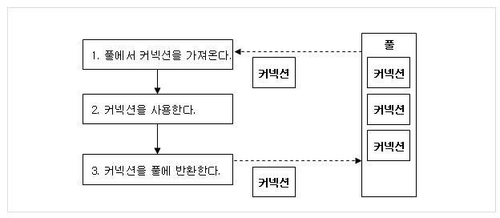

# 데이터베이스

## 목차

- [데이터베이스 개념](#데이터베이스개념)
- [DBMS의 기능](#DBMS의기능)
- [스키마(Schema)](#스키마)
- [데이터베이스 언어](#데이터베이스언어)
- [데이터 모델의 개념](#데이터모델의개념)
- [E-R다이어그램](#E-R다이어그램)
- [관계형 데이터 모델](#관계형데이터모델)
- [데이터베이스설계](#데이터베이스설계)
- [관계형 데이터베이스의 구조](#관계형데이터베이스의구조)
- [관계형 데이터베이스의 제약 조건](#관계형데이터베이스의제약조건)
- [정규화](#정규화)
- [SQL](#SQL)
- [뷰](#뷰)
- [시스템카탈로그](#시스템카탈로그)
- [트랜잭션](#트랜잭션)
- [트랜잭션 격리 수준](#트랜잭션격리수준)
- [데이터베이스 폴](#데이터베이스폴)
- [회복](#회복)
- [병행제어](#병행제어)
- [무결성](#무결성)
- [보안](#보안)
- [분산 데이터베이스](#분산데이터베이스)
- [데이터베이스의 성능](#데이터베이스의성능)
- [인덱스(Index)](#인덱스)
- [조인](#조인)
- [저장 프로시저](#저장프로시저)
- [저장 함수](#저장함수)
- [트리거(Trigger)](#트리거)


<br>
<br>
<br>

<div id="데이터베이스개념"></div>

## 데이터베이스 개념

### 데이터베이스의 정의 (★)

- **데이터베이스**는 **특정 조직의 업무를 수행하는 데 필요한 상호 관련된 데이터들의 모임**
  - 통합된 데이터 : 자료의 중복 배제
  - 저장된 데이터 : 저장 매체에 저장된 자료
  - 운영 데이터 : 조직의 고유한 업무를 수행하는 데 반드시 필요한 자료
  - 공용 데이터 : 여러 시스템들이 공동으로 소유하고 유지하는 자료


### 데이터베이스의 특징

- 실시간 접근성 : 비정형적인 질의(조회)에 대하여 실시간 처리에 의한 응답이 가능해야 한다.
- 계속적인 변화 : 삽입, 삭제, 갱신으로 항상 최신의 데이터를 유지해야 한다.
- 동시 공용 : 데이터베이스는 서로 다른 목적을 가진 여러 응용자들을 위한 것으로 다수의 사용자가 같은 내용의 데이터를 이용할 수 있어야 한다.
- 내용에 의한 참조 : 데이터베이스에 있는 데이터를 참조할 때, 사용자가 요구하는 데이터 내용으로 데이터를 찾는다.


### 데이터베이스 시스템

- **데이터베이스 시스템**이란 **데이터베이스를 이용하여 자료를 저장하고 관리하여 정보를 얻어내는 데 필요한 컴퓨터 중심의 시스템**

- 


### 파일 시스템
- 장점
  - DB에 비해 처리속도가 빠름
  - 구현 간편
  - 비용 저렴
- 단점
  - 자료 중복
  - 데이터 무결성 보장 X


<div id="DBMS의기능"></div>


## DBMS의 기능

### DBMS의 정의 (★★★★)

- **DBMS**는 사용자와 데이터베이스 사이에서 **사용자의 요구에 따라 정보를 생성해주고, 데이터베이스를 관리해주는 소프트웨어**


### DBMS의 발전 배경

- 기존 방식(**파일 시스템**) : **처리 업무 하나하나마다 데이터 파일을 독립적으로 구성**함으로써, 같은 내용의 데이터가 서로 다른 업무의 파일에서 중복저장되어 관리되는 데이터 중복성, 데이터 종속성을 초래하는 단점 존재
- **데이터베이스** 도입 : **각 업무 처리에 필요한 자료들의 중복을 최소화하여 한 곳에 모아서 구성**


### 대표적인 DBMS

- 오라클 / Oracle : PC급에서 메인프레인급까지 모두 설치할 수 있으며, 분산 처리 지원 기능이 우수
- MySQL / MySQL AB : 다양한 플랫폼과 API를 지원하는 비상업용 DBMS


### DBMS의 필수 기능 (★)

- 정의(Definiton) 기능
  - 데이터베이스에 저장될 **데이터 형(Type)과 구조에 대한 정의, 이용 방식, 제약 조건 등을 명시
  - 데이터와 데이터의 관계를 명확하게 명세할 수 있어야 하며, 데이터 연산은 무엇이든 명세
  > 레코드 구조, 데이터 모형, 물리적 구조 등
  
- 조작(Manipulation) 기능
  - **데이터 검색, 갱신, 삽입, 삭제 등을 체계적으로 처리**하기 위해 사용자와 데이터베이스 사이의 인터페이스 수단을 제공하는 기능
  
- 제어(Control) 기능
  - **데이터의 무결성 유지**
  - 정당한 사용자가 허가된 데이터만 접근할 수 있도록 **보안을 유지하고, 권한을 검사**
  - 여러 사용자가 데이터베이스를 동시에 접근하여 데이터를 처리할 때, 처리결과가 항상 정확성을 유지하도록 병행 제어를 할 수 있어야 한다.
  > DB의 내용에 대한 일관성, 중복제거, 접근제어에 대한 기능 지원
  
  
  
### DBMS의 장단점

| <center>장점</center> |  <center>단점</center> |
|:----------------:|:----------------:|
| 데이터의 논리적, 물리적 독립성이 보장 | 전산화 비용이 증가 |
| 데이터의 중복을 피할 수 있어서 기억공간 절약 | 대용량 디스크로의 집중적인 Access로 과부하(Overhead) |
| 저장된 자료를 공동으로 이용 | 파일의 Backup과 Recovery가 어렵다 |
| 데이터의 일관성, 무결성, 보안 유지 | 시스템이 복잡 |
| 항상 최신의 데이터 유지, 데이터의 실시간 처리 가능 |  |

  - 백업(Back up) : 장비 고장 등의 비상사태에도 데이터베이스가 보존되도록 복사하는 작업


### RDBMS (★★★)

- 관계형 데이터베이스 관리 시스템
  > ex) Orable DBMS, MySQL, MS Access 등
- 모든 데이터를 2차원 테이블로 표현
- 상호 관련성을 가진 테이블의 집합
- 확장이 용이하다는 장점을 가짐
- SQL (Structed Query Language)은 데이터베이스와 통신하기 위한 언어


### ORACLE과 MySQL의 차이

- ORACLE : 대규모 트랜잭션 로드를 처리하고 성능을 최적화하기 위해 여러 서버에 대용량 DB 분산, 절차적 언어를 통해 DB내 내장된 프로그램의 작성을 지원 (독립실행, 특정 이벤트에 의해 트리거)

- MySQL : 단일 DB로 제한되어 있어, 매일 수백만번 액세스하는 대용량 DB에는 부적합, DB를 이전상태로 복원하는데 도움이 되는 저장점이 없음 (COMMIT, ROLLBACK만 존재)


<div id="스키마"></div>

## 스키마(Schema)

### 스키마의 정의

- 데이터베이스의 구조와 제약 조건에 관한 전반적인 명세(Specificaion)을 기술한 메타데이터 집합
- **스키마**는 **데이터베이스를 구성하는 개체(엔티티), 속성, 관계 및 데이터 조작 시 데이터 값들이 갖는 제약 조건 등에 관해 전반적으로 정의**


  


### 스키마의 특징

- 스키마는 **데이터 사전**에 저장되며, 다른 이름으로 **메타데이터**라고도 한다.
- 스키마는 시간에 따라 불변인 특성을 갖는다.
- 스키마는 데이터의 구조적 특성을 의미한다.


### 스키마의 3계층

- 데이터베이스의 관리 시스템은 외부적 스키마에 따라 명시된 사용자의 요구를 개념적 스키마에 적합한 형태로 변경하고 이를 다시 내부적 스키마에 적합한 형태로 변환한다.

  - 외부 스키마 (=사용자 뷰)
    - **외부 스키마**는 **사용자나 응용 프로그래머가 각 개인의 입장**에서 필요로 하는 데이터베이스의 논리적 구조를 정의
    - 일반 사용자는 질의어(SQL)를 이용하여 DB를 쉽게 사용할 수 있다.
    - 응용 프로그래머는 C, COBOL 등의 언어를 사용하여 DB에 접근한다.
    - 하나의 데이터베이스 시스템에는 여러 개의 외부 스키마가 존재할 수 있다.
  
  - 개념 스키마 (=전체적인 뷰)
    - **개념 스키마**는 **데이터베이스의 전체적인 논리적 구조**
    - 조직 전체의 데이터베이스로 하나만 존재
    - 개념 스키마는 **개체 간의 관계와 제약 조건을 나타내고, 접근 권한, 보안 및 무결성 규칙에 관한 명세**를 정의
  - 내부 스키마 (=저장 스키마)
    - **내부 스키마**는 **물리적 저장위치의 입장에서 본 데이터베이스 구조**
    - 내부 스키마는 실제로 데이터베이스에 저장될 레코드의 물리적인 구조를 정의하고, 저장 데이터 항목의 표현 방법, 내부 레코드의 물리적 순서 등을 나타낸다.
    - 시스템 프로그래머나 시스템 설계자가 보는 관점의 스키마
    
    


<div id="데이터베이스언어"></div>

## 데이터베이스 언어

- 데이터베이스 언어는 데이터베이스를 구축하고 이용하기 위한 데이터베이스 시스템과의 통신 수단
- 데이터베이스 언어는 DBMS를 통해 사용하며, 기능과 사용 목적에 따라 데이터 정의 언어, 데이터 조작 언어, 데이터 제어 언어로 구분된다.


### 데이터 정의 언어 (DDL)

- DB구조, 데이터 형식, 접근 방식 등 DB를 구축하거나 수정할 목적으로 사용하는 언어
- 외부 스키마를 정의


### 데이터 조작 언어 (DML)

- 사용자로 하여금 데이터를 처리할 수 있게 하는 도구로서, 사용자(응용 프로그램)과 DBMS 간의 인터페이스를 제공
- 응용 프로그램을 통해서 사용자가 DB의 데이터를 실질적으로 조작할 수 있도록 하기 위해 COBOL 등의 호스트 언어에 DB 기능을 추가해서 만든 언어

  - 질의어 : 단말 사용자가 쉽게 DB를 액세스할 수 있도록 대화식의 자연어로 만든 비절차적 조작 언어 EX) SQL
  - 비절차적 조작 언어 : 사용자가 어떤 데이터가 필요한지만 명시하고 어떻게 구하는 지 명시하지 않는 언어
  
  
  

### 데이터 제어 언어 (DCL)
    
- 무결성, 보안 및 권한 제어, 회복 등을 하기 위한 언어
- 데이터를 보호하고 데이터를 관리하는 목적으로 사용


<div id="데이터모델의개념"></div>

## 데이터 모델의 개념

### 데이터 모델의 정의

- **데이터 모델**은 **현실 세계의 정보들을 컴퓨터에 표현하기 위해서 단순화, 추상화**하여 체계적으로 표현한 개념적 모형


### 데이터 모델의 구성 요소

- 개체 : 데이터베이스에 표현하려는 것 ex) 교수
- **속성** : **데이터의 가장 작은 논리적 단위**, 개체를 구성하는 항목 ex) 성명, 전공, 소속
- 관계 : 개체 간의 관계
    - 관계의 형태 : 1대1 관계, 1대N 관계, N대N 관계
    


<div id="E-R다이어그램"></div>

## E-R다이어그램


### E-R다이어그램 개념 (★)

- 조직, 사용자, 프로그램, 데이터 등 시스템 내에서 역할을 가진 모든 개체들을 표현
- E-R 다이어 그램 기호
  - 
  
  
- E-R 다이어 그램 예시
  - 
  
  
- 새발 표기법
  - 관계의 의미나 제약 조건 등을 개체 타입들을 연결하는 몇 가지 기호를 사용하여 표현하는 표기법
  - 
  
  
  - 새발표기법 예시
  - 
  
  
  
  
<div id="관계형데이터모델"></div>

## 관계형 데이터 모델

### 관계형 데이터 모델의 개념

- 기본키와 이를 참조하는 외래키로 데이터 간의 관계를 표현
- 1:1, 1:N, M:N 관계를 자유롭게 표현


### E-R모델을 관계 모델의 테이블로 변환

- 개체 A,B와 관계 Y로 이루어진 E-R모델을 관계 테이블로 변환하는 방법
  - 
  
  
  - 개체를 독립적인 테이블로 표현
  - 관계 Y가 **1:1관계**이면 **개체 A의 기본키를 개체 B의 외래키로 추가**하거나 **개체 B의 기본키를 개체 A의 외래키로 추가**
  - 관계 Y가 **1:N관계**이면 **개체 A의 기본키를 개체 B의 외래키로 추가**하여 표현하거나 별도의 테이블로 표현
  - 관계 Y가 **M:N관계**이면 **개체 A와 B의 기본키를 모두 포함한 별도의 테이블**로 표현
  
  
  
### 관계형 데이터 모델의 특징

- 장점 : 간결하고, 보기 편리하고, 다른 데이터베이스로의 변환이 용이
- 단점 : 성능이 떨어진다.


<div id="데이터베이스설계"></div>

## 데이터베이스 설계

### 데이터베이스 설계의 개념

- **데이터베이스 설계**란 **사용자의 요구를 분석**하여 그것들을 컴퓨터에 저장할 수 있는 **데이터베이스의 구조에 맞게 변경한 후 특정 DBMS로 데이터베이스를 구현**하여 일반 사용자들이 사용하게 하는 것


### 데이터베이스 설계 시 고려사항

- 무결성 : 삽입, 삭제, 갱신 등의 연산 후에도 데이터베이스에 저장된 데이터가 정해진 제약 조건을 항상 만족해야 함
- 일관성 : 특정 질의에 대한 응답이 끝까지 변함없이 일정해야 함
- 회복 : 시스템에 장애가 발생했을 때 장애 발생 직전의 상태로 복구할 수 있어야 함
- 보안 : 불법적인 데이터의 노출 또는 변경이나 손실로부터 보호
- 효율성 : 응답시간의 단축, 시스템의 생산성, 저장 공간의 최적화 등이 가능해야 함
- 데이터베이스 확장 : 데이터베이스 운영에 영향을 주지 않으면서 지속적으로 데이터베이스를 추가할 수 있어야 함


### 데이터베이스 설계 순서

- 요구 분석 > 개념적 설게 > 논리적 설계 > 물리적 설계 > 구현

 
    - 요구 조건 분석 : 수집된 정보(데이터의 종류, 용도, 처리 형태, 흐름, 제약 조건)를 바탕으로 요구 조건 명세를 작성
    - 개념적 설계 : 개념 스키마 설계, 요구 분석 단계에서 나온 결과(요구 조건 명세)를 DBMS에 독립적인 E-R다이어그램으로 작성
    - 논리적 설계 : 개념 스키마를 평가 및 정재하고 DBMS에 따라 서로 다른 논리적 스키마를 설계, 테이블을 설계
    - 물리적 설계 : 디스크 등 물리적 저장장치에 저장할 수 있는 물리적 구조의 데이터로 변환, 다양한 데이터베이스 응용에 대해 처리 성능을 얻기 위해 데이터베이스 파일의 저장 구조 및 액세스 경로를 결정
    
    
      - 물리적 설계 옵션 시 고려 사항
        - 반응 시간 : 트랜잭션 수행을 요구한 시점부터 처리 결과를 얻을 때까지의 경과 시간
        - 공간 활용도 : 데이터베이스 파일과 액세스 경로 구조에 의해 사용되는 저장공간의 양
        - 트랜잭션 처리량 : 단위시간 동안 데이터베이스 시스템에 의해 처리될 수 있는 트랜잭션의 평균 개수
        
    - 데이터베이스 구현 : DDL로 데이터베이스 생성, 트랜잭션 


<div id="관계형데이터베이스의구조"></div>

## 관계형 데이터베이스의 구조

### 관계형 데이터베이스의 릴레이션 구조

- 


- 튜플(Tuple) : 릴레이션을 구성하는 각각의 행, 파일 구조에서 레코드와 같은 의미
  - **튜플의 수** : **카디날리티**
  
- 속성(Attribute) : 데이터베이스를 구성하는 가장 작은 논리적 단위
  - **속성의 수** : 디그리, 차수
  
- 도메인 : 하나의 속성(Attribute)이 취할 수 있는 같은 타입의 원자값들의 집합
  - ex) 성별 애트리뷰트의 도메인은 '남'과 '여'로, 그 외의 값은 입력될 수 없다.
  > 도메인의 역할 : 데이터베이스에 입력되는 자료의 오류를 방지하기 위해 필요
  
  
  
### 릴레이션의 특징

- 한 릴레이션에는 똑같으 튜플이 포함될 수 없다.
- 튜플들의 삽입, 삭제 등의 작업으로 인해 릴레이션은 시간에 따라 변한다.
- 속성의 값은 논리적으로 더 이상 쪼갤 수 없는 원자값만을 지정한다. ex) '학년'에 저장된 1,2,3은 더 이상 세분화 X


<div id="관계형데이터베이스의제약조건"></div>


## 관계형 데이터베이스의 제약 조건

### 제약 조건이란?

- 데이터베이스에 저장되는 데이터의 정확성을 보장하기 위해서 키를 이용하여 입력되는 데이터에 제한을 주는 것
- ex) 개체 무결성 제약, 참조 무결성 제약 등


### 키의 개념 및 종류

- **키(Key)** : 데이터베이스에서 조건에 만족하는 튜플을 찾거나 순서대로 정렬할 때 **튜플들을 서로 구분할 수 있는 기준이 되는 애트리뷰트**

- **유일성** : 하나의 키 값으로 하나의 튜플만을 유일하게 식별할 수 있어야 한다.
- **최소성** : 모든 레코드들을 유일하게 식별하는 데 꼭 필요한 속성으로만 구성되어야 한다.

  - 후보키 : 기본키로 사용할 수 있는 속성들, 모든 튜플에 대해서 유일성과 최소성을 만족시켜야 한다.
  - 기본키 : 특정 튜플을 유일하게 구별할 수 있는 속성, NULL값 가질 수 없음, 동일한 값 중복 X
    - ex) <학생>릴레이션에서는 '학번', '주민번호'가 기본키가 될 수 있다.
  - 대체키 : 후보키가 둘 이상일 때, 기본키를 제외한 후보키
  - 슈퍼키 : 모든 튜플들에 대해서 유일성은 만족시키지만, 최소성은 만족시키지 못한다.
    - ex) <학생>릴레이션에서는 '학번', '주민번호', '학번+주민번호', '주민번호+성명', '학번+주민번호+성명' 등으로 슈퍼키를 구성할 수 있다.
    
  - 외래키 : 참조되는 릴레이션의 기본키와 대응되어 릴레이션 간에 참조 관계를 표현하는 키
 
 
### PK, FK, ER모델 (★★)
- Primary key : 관계형 DB에서 레코드(튜플)의 식별자로 이용하기에 가장 적합한 것을 후보키 중에 하나 선택한 것
- Foreign key : 관계형 DB에서 한 테이블의 키 중 다른 테이블의 튜플을 식별할 수 있는 키
- ER-Model : 관계형 DB와 같은 데이터 관리 시스템 상의 구조적인 데이터를 기술하는 것. 개체(Entity)와 관계(Relationship)을 이용해 현실에서의 데이터 세계를 개념적으로 표현한 것
- RDBMS (Relational database management system) : 관계형 모델을 기반으로 한 데이터베이스 시스템
  
### 무결성 (★★)

- **개체 무결성** : 릴레이션에서 기본키를 구성하는 속성은 NULL 값이나 중복값을 가질 수 없다.
- **참조 무결성** : 외래키 값은 NULL이거나 참조 릴레이션의 기본키 값과 동일해야 한다.


<div id="관계형데이터베이스의제약조건"></div>

## 정규화

### 정규화란 (★)

- **정규화** : 함수적 종속성 등의 종속성 이론을 이용하여 잘못 설계된 관계형 스키마를 좀 더 작은 속성의 세트로 쪼개어 바람직한 스키마로 만들어 가는 과정

- 정규화는 데이터베이스의 논리적 설계 단계에서 수행한다.
- 정규화는 논리적 처리 및 품질에 큰 영향을 미친다.


### 정규화 목적 (★★★★)

- 데이터 구조의 안정성을 최대화한다.
  - 중복을 배제하여 삽입, 삭제, 갱신 이상의 발생을 방지한다.
  - 데이터 삽입 시 릴레이션을 재구성할 필요성을 줄인다.
- 효과적인 검색 알고리즘을 생성할 수 있다.


### 함수적 종속 (★)

- 테이블 속성들간의 관계에 대한 제약조건으로 속성 A가 속성 B를 결정할 때에는 B는 A에 함수적으로 종속된다고 한다.
- X가 Y를 결정한다. X는 Y의 결정자
- X : 결정자, Y : 종속자


- 

- ex) {학번, 과목번호} -> {성적} : 완전 함수 종속
- ex) {학번} -> {학년} : 부분 함수 종속


### 완전함수적 종속이란? (★)

- 완전함수적 종속 : 속성들의 집합 X에 대해 Y가 함수적으로 종속될 때, X의 부분집합에 대해서는 함수적으로 종속되지 않는 경우에는 Y는 X에 대하여 완전 함수적 종속이라고 한다.


### 이상의 개념 및 종류

- **이상** : 정규화를 거치지 않으면 데이터베이스 내에 데이터들이 불필요하게 중복되어 릴레이션 조작 시 예기치 못한 곤란한 현상이 발생
- ex) 삽입 이상, 삭제 이상, 갱신 이상 등


  - 삽입 이상 : 데이터를 삽입할 때 의도와는 상관없이 원하지 않는 값들도 함께 삽입되는 현상
  - 삭제 이상 : 한 튜플을 삭제할 때 의도와는 상과없이 원하지 않는 값들도 함께 삭제되는 현상
  - 갱신 이상 : 튜플에 있는 속성값을 갱신할 때 일부 튜플의 정보만 갱신되어 정보에 모순이 생기는 현상


### 정규화 과정 (★★★★)

- 논리적 데이터베이스 설계에 있어서 테이블을 구조화하는 기법 중 하나
- 자료의 손실이나 불필요한 정보의 도입없이 데이터의 일관성 및 데이터 중복을 최소화하고 최대의 데이터 안정성 확보를 위한 안정적 자료구조로 변환하기 위해 하나의 테이블을 둘 이상으로 분리한느 작업

- 일반적으로 데이터베이스를 설계할 때에는 BCNF까지만 고려
  > 정규화 과정을 거칠수록 join 연산으로 인한 성능저하를 가져올 수 있기 때문에
  > 단계 진행할수록 데이터의 무결성을 우선으로 할 지 데이터베이스 구성의 단순화와 성능을 우선으로 할 지를 결정
  
  
- 


  - 제1정규형 (1NF) : 어떤 릴레이션 R에 속한 모든 도메인이 원자값만으로 되어 있다.
  
  - 
  
  - 제2정규형 (2NF) : 어떤 릴레이션 R이 제 1정규형이고, 키에 속하지 않는 속성 모두가 키에 완전 함수 종속 : 무손실분해
  
  - 
  - 
  
    > 학번은 혼자 스스로 잘할 수 있지만, 과목명은 혼자 스스로 잘할 수 없으니까 학번이랑 같이 있어야함.
    
    
  - 제3정규형 (3NF) : 어떤 릴레이션 R이 2NF이고, 모든 속성들이 기본키에 이행적 함수 종속이 아닌 경우
    - 이행적 함수 종속성 : A->B와 B->C의 함수 종속성이 존재하면 A->C (속성 C가 이행적으로 A에 종속)
    
  - 
  
  - 
  
    > 결정자 X -> 종속자 Y : 결정자 X가 개수가 더 많다고 생각했더니 이해가 되었다. X가 Y에 포함이 되는 경우.
   
  
  - BCNF : 릴레이션 R이 제 3정규형이고, 모든 결정자가 후보키이어야 한다.
  
  - 
  
  - 
  

### 역정규화를 하는 이유는? (★)

- 정규화를 진행할수록 하나의 테이블을 여러 테이블로 나누게 되는데, 만약 데이터 호출 시 여러 테이블을 불러서 JOIN을 해줘야한다면 비용이 크기 때문에 역정규화를 한다.


<div id="SQL"></div>


## SQL (Structed Query Language)

### SQL이란? (★★★)

- 질의어지만 질의 기능만 가지고 있는 것이 아니라 데이터 구조의 정의, 데이터 조작, 데이터 제어 기능을 모두 갖추고 있다.
  > 질의어 : 단말 사용자들이 쉽게 DB를 이용할 수 있도록 되어 있는 비절차어의 일종

- 관계형 데이터베이스 관리 시스템(RDBMS)의 데이터를 관리하기 위해 설계된 특수 목적의 프로그래밍 언어 (CRUD 기능이 탑재)
  
### SQL의 분류

- DDL (데이터 정의어) (★)
  - CREATE
    
    - CREATE SCHEMA (스키마 정의)
    ```sql
    
    // 소유권자의 사용자 ID가 홍길동인 스키마 '대학교' 정의문
    CREATE SCHEMA 대학교 AUTHORIZATION 홍길동;
    
    ```

    - CREATE DOMAIN (도메인 정의)
    ```sql
    
    // '남', '여' 또는 '?'중의 한 문자를 취할 수 있는 도메인 SEX의 정의문
    CREATE DOMAIN SEX CHAR(1) // 정의된 도메인 이름은 'SEX'이며, 크기는 1자 
      DEFAULT '여' // 기본값 '여'
      CONSTRAINT VALID-SEX CHECK(VALUE IN ('남', '여', '?'));   //  3개의 값 중 하나만 취하도록 제한
    
    ```
    
    - CREATE TABLE (테이블 정의)
    
    ```sql
    
    CREATE TABLE 학생
      (이름 VARCHAR(15) NOT NULL,
      학번 VARCHAR(15) NOT NULL,
      전공 VARCHAR(15) NOT NULL,
      성별 SEX,   // 앞에서 정의한 도메인
      생년월일 DATE,
      PRIMARY KEY(학번),
      FOREIGN KEY(전공) REFERENCES 학과(학과코드),  // '전공'은 '학과' 테이블의 '학과코드' 속성을 참조하는 외래키
      CONSTRAINT 성별제약 CHECK (성별='남')         // '성별' 속성의 값으로 '남'만 저장할 수 있게 제약
      );
    
    ```
    
    - CREATE INDEX (인덱스 정의)
    
    ```sql
    
    // '고객' 테이블의 기본키인 '고객번호' 속성에 대해 오름차순 정렬하여 '고객번호_INX'라는 이름으로 인덱스 구성
    
    CREATE UNIQUE INDEX 고객번호_INX
      ON 고객(고객번호 ASC);
    
    ```
    
  - ALTER
  
    - ALTER TABLE (테이블 정의 변경)
    
    ```sql
    
    // '학생' 테이블에 최대 3문자로 구성되는 '학년'속성 추가
    
    ALTER TABLE 학생 ADD 학년 VARCHAR(3);
    
    ```
    
  - DROP
  
    - DROP TABLE (테이블 삭제)
    > CASCADE : 삭제할 요소를 참조하는 다른 모드 개체 함께 삭제
    > RESTRICTED : 삭제할 요소를 다른 개체가 참조중일 때 삭제 취소
    
    ```sql
    
    // '학생' 테이블을 삭제하되, '학생' 테이블을 참조하는 모든 테이블을 함께 삭제
    DROP TABLE 학생 CASCADE;
    
    ```
  

- DML (★★)

  - SELECT
    - 일반 형식
    > ASC : 오름차순
    > DESC : 내림차순
    > 생략시 오름차순
    
    ```sql
    
    SELECT [DISTINCT] 속성명
    FROM 테이블명
    WHERE 조건
    GROUP BY 속성명
    HAVING 조건
    ORDER BY 속성명 [ASC|DESC];
    
    ```
  
    ```sql
    
    // <사원> 테이블에서 주소만 검색하되 같은 주소는 한 번만 출력
    SELECT DISTINCT 주소 FROM 사원;
    
    ```
    
    ```sql
    
    // <사원> 테이블에서 기본급에 특별수당 10을 더한 월급을 "XX부서의 XXX의 월급 XXX"형태로 출력
    SELECT 부서, "부서의", 이름, "의 월급", 기본급+10 FROM 사원
    
    // 신기한 건 "부서의", "의 월급"이 사이 사이에 위치한다. 튜플마다 전부!
    
    ```
    
    ```sql
    
    // <사원> 테이블에서 성이 '김'인 사람의 튜플을 검색
    SELECT * FROM 사원 WHERE 이름 LIKE "김%";
    
    ```
    
    ```sql
    
    // <사원> 테이블에서 생일이 '01/09/69'에서 '10/22/73' 사이인 튜플을 검색
    SELECT * FROM 사원 WHERE 생일 BETWEEN #01/09/69# AND #10/22/73#;
    
    ```
    
    ```sql
    
    // <사원> 테이블에서 주소가 NULL인 튜플을 검색
    SELECT * FROM 사원 WHERE 주소 IS NULL;
    
    ```
    
    ```sql
   
     // <사원> 테이블에서 특정 인덱스 몇명을 검색
     SELECT * FROM 사원 LIMIT [시작할 로우 0부터 시작], [보여줄 개수];
   
     ex) SELECT * FROM 사원 LIMIT 32, 3; // 32번 인덱스부터 3명 보여주기
   
    ```
    
    ```sql
    
    // <사원> 테이블에서 주소를 기준으로 오름차순 정렬시켜서 상위 2개의 튜플만 검색
    SELECT TOP 2 * FROM 사원 ORDER BY 주소 ASC;
    
    ```
    
    ```sql
    
    // <사원> 테이블에서 부서별 기본급의 평균
    SELECT 부서, AVG(기본급) AS 평균
    FROM 사원 GROUP BY 부서;
    
    ```
    
    
    ```sql
    
    // <사원> 테이블에서 기본급이 100 이상인 사원이 2명 이상인 부서의 튜플 수
    SELECT 부서, COUNT(*) AS 사원수
    FROM 사원
    WHERE 기본급 >= 100
    GROUP BY 부서
    HAVING COUNT(*)>=2;
    
    ```
    
    ```sql
    
    // 취미가 '나이트댄스'인 사원의 이름과 주소를 검색
    SELECT 이름, 주소 FROM 사원
    WHERE 이름 = (SELECT 이름 FROM 여가활동 WHERE 취미='나이트댄스');
    
    ```
    
    ```sql
    
    // 취미활동을 하지 않는 사원들을 검색
    SELECT * FROM 사원
    WHERE 이름 NOT IN (SELECT 이름 FROM 여가활동)
    
    ```
    
    ```sql
    
    // 경력이 10년 이상인 사원의 이름, 부서, 취미, 경력을 검색
    SELECT 사원.이름, 사원.부서, 여가활동.취미, 여가활동.경력
    FROM 사원, 여가활동
    WHERE 여가활동.경력>=10 AND 사원.이름=여가활동.이름;
    
    ```
    
    ```sql
    
    // <사원>테이블과 <직원>테이블을 통합하는 질의문
    SELECT * FROM 사원
    UNION
    SELECT * FROM 직원;
    
    ```
    
    
  - INSERT
  
    ```sql
    
    // <사원> 테이블에 (이름-홍승현, 부서-인터넷)을 삽입하시오
    INSERT INTO 사원(이름, 부서) VALUES ('홍승현', '인터넷');
    
    ```
    
    ```sql
    
    // <사원> 테이블에 (장보고, 기획, 05/03/73, 석사동, 90)을 입력하시오
    INSERT INTO 사원 VALUES ('장보고', '기획', #05/03/73#, '석사동', 90);
    
    ```
    
    ```sql
    
    INSERT INTO 편집부원(이름, 생일, 주소, 기본급)
    SELECT 이름, 생일, 주소, 기본급
    FROM 사원
    WHERE 부서='편집';
    
    ```
    
  - UPDATE
  
    ```sql
    
    // <사원> 테이블에서 홍길동의 주소를 퇴계동으로 수정
    UPDATE 사원 SET 주소 = '퇴계동' WHERE 이름 = '홍길동';
    
    ```
    
    ```sql
    
    // <사원> 테이블에서 황진이의 부서를 기획부로 변경하고 기본급을 5만우너 인상
    UPDATE 사원 SET 부서='기획', 기본급=기본급+5
    WHERE 이름='황진이';
    
    ```
    
  - DELETE
    
    ```sql
    
    // <사원> 테이블의 모든 레코드를 삭제
    DELETE FROM 사원;
    
    ```
    
    ```sql
    
    // <사원> 테이블에서 임꺽정에 대한 튜플을 삭제
    DELETE FROM 사원 WHERE 이름 = '임껵정';
    
    ```
    
    
- DCL (★)
  - 계정의 권한과 관계된 명령어, DB 사용자의 권한 정의
  
  - COMMIT : 명령에 의해 수행된 결과를 실제 물리적 디스크로 저장하고, 데이터베이스 조작 작업이 정상적으로 완료되었음을 관리자에게 알린다.
  - ROLLBACK : 데이터베이스 조작 작업이 비정상적으로 종료되었을 때 원래의 상태로 복구한다.
  - GRANT : 데이터베이스 사용자에게 사용 권한을 부여한다.
  - REVOKE : 데이터베이스 사용자의 사용 권한을 취소한다.
 
### UNION과 UNION ALL
- 공통제약조건 : SELECT절의 칼럼 수와 데이터타입이 호환 가능해야 한다.
- UNION : 여러 SQL문의 합집합, 중복된 행은 제거하여 하나의 행만 표시
- UNION ALL : 여러 SQL문의 합집합, 단순히 합쳤기에 중복된 행도 모두 표시

### 서브쿼리
- SQL문 안에 포함되어 있는 또 다른 SQL문
- 서브쿼리는 메인쿼리의 컬럼 사용 가능


### 제약조건 (★)

- NOT NULL : '필수 입력 사항'을 의미
- UNIQUE : 중복성 배제, 즉 '유일한 값'으로 존재함을 의미
- PRIMARY KEY (기본키) : NOT NULL + UNIQUE, '테이블에서 대표되는 칼럼'을 의미
- FOREIGN KEY (외래키) : '참조하는 테이블의 대표 칼럼'에서 존재하는 값만 사용 가능
- CHECK : '주어진 조건에 해당하는 값만 입력 가능'을 의미


### 테이블을 드롭(DROP)하는 것과 자르는 것(Truncate), 그리고 테이블 내 모든 레코드를 삭제(Delete)하는 것의 차이점은 무엇입니까? (★)

- DELETE TABLE 로그에 저장이 되는 작업이기 때문에 삭제되는 각 행은 트랜잭션 로그에 기록이 되고 이것은 작업을 느리게 한다. TRUNCATE TABLE 역시 테이블 내 행들을 삭제하지만 삭제되는 각 행을 기록하지 않고 테이블의 데이터베이스 할당 해제를 기록하여 작업이 빠르다. 즉, TRUNCATE TABLE은 빠르지만 Rollback할 수 없으므로 데이터를 복구할 수 없다

- DELETE 명령어는 데이터는 지워지지만 데이터 용량은 줄어들지 않는다. 원하는 데이터만 지울 수 있으며 Rollback이 가능하다.
- TRUNCATE 명령어는 용량이 줄어들고, 인덱스 등 모두 삭제된다. 데이터만 삭제하며, 삭제 후 절대 되돌릴 수 없다.

- DROP 명령어는 테이블 전체를 삭제하며, 공간과 객체도 삭제한다. 삭제 후 절대 되돌릴 수 없다.


### WHERE과 HAVING 절의 다른 점은 무엇입니까? (★)

- HAVING절은 그룹함수의 그룹의 조건으로 사용되고, WHERE절은 SELECT할 데이터에 조건을 주는 역할을 한다.


### 기본키(Primary key)와 유일키(Unique key)의 차이점은 무엇입니까? (★)

- 기본키는 널을 허용하지 않지만 유일키는 모든 컬럼 중 유일하게 하나에 대한 NULL을 허용한다.
- 그래서 UNIQUE 키는 개체 하나하나를 구분할 기본키가 될 수 없다


### 쿼리 순서 (★)

- SELECT -> FROM -> WHERE -> GROUP BY -> ORDER BY


<div id="뷰"></div>

## 뷰 (View)

### 뷰란? (★)

- 사용자에게 접근이 허용된 자료만을 제한적으로 보여주기 위해 하나 이상의 기본 테이블로부터 유도된, 이름을 가진 가상 테이블

- 저장장치 내에 물리적으로 존재하지 않지만, 사용자에게 있는 것처럼 간주


### 뷰의 장단점

- 장점
  - 사용자의 데이터 관리 간단화
  - 접근 제어를 통한 자동 보안 제공
  - 논리적 데이터 독립성을 제공
  
- 단점
  - 독립적인 인덱스를 가질 수 없다
  - 뷰의 정의를 변경할 수 없다
  - 뷰로 구성된 애용에 대한 삽입, 삭제, 갱신 연산에 제약이 따른다
  
  

### 뷰의 정의 및 삭제문

- 정의

  ```sql
  // 고객테이블에서 주소가 춘천시인 고객들의 성명과 전화번호로 '춘천고객'이라는 뷰 정의
  
  CREATE VIEW 춘천고객(성명, 전화번호)
  AS SELECT 성명, 전화번호
  FROM 고객
  WHERE 주소='춘천시'
  ```
  
  
- 삭제
  ```sql
    
    // 뷰 '춘천고객'을 삭제하시오. 단 다른 곳에서 참고하고 있으면 제거되지 않게 하시오.
    DROP VIEW 춘천고객 RESTRICT;
    
    ```


<div id="시스템카탈로그"></div>

## 시스템 카탈로그

### 시스템 카탈로그란?
- 시스템 그 자체에 관련이 있는 다양한 객체에 관한 정보를 포함하는 시스템 데이터베이스
- 데이터 정의어의 결과로 구성되는 기본 테이블, 뷰, 인덱스, 패키지, 접근 권한 등의 데이터베이스 구조 및 통계 정보를 저장
- 카탈로그에 저장된 정보를 메타 데이터라고 한다.
- 카탈로그는 DBMS가 스스로 생성하고 유지한다.
- 사용자가 SQL문을 실행시켜 변화를 주면 시스템이 자동으로 갱신한다.
  
  
### 트랜잭션 처리기

- DBMS 내의 모듈 시스템
- 복수 사용자 환경에서 평행으로 동시에 일어나는 트랜잭션 문제를 해결하여, 각각의 사용자가 데이터베이스 자원을 배타적으로 이용할 수 있도록 한다.
  


<div id="트랜잭션"></div>


## 트랜잭션

### 트랜잭션의 정의 (★★★)

- **트랜잭션이란**, 데이터베이스의 상태를 변환시키는 **하나의 논리적 기능을 수행하기 위한 작업의 단위**를 의미한다.
- 트랜잭션은 데이터베이스 시스템에서 병행 제어 및 회복 작업 시 처리되는 작업의 논리적 단위이다.
- 하나의 트랜잭션은 Commit되거나 Rollback된다.
- DB의 일관된 상태를 또 다른 일관된 상태로 변환시키는 기능을 수행

- ex) 부모님 계좌에서 10만원을 인출해서 자식 계좌에 10만원을 입금해보자 -> 한꺼번에 모두 수행되엉야 할 일련의 연산들 (트랜잭션)

- 


### 트랜잭션 처리가 필요한 이유 (예시) (★★)

- ex) 계좌 이체 예제
- 철수가 영희에게 1000원을 송금하는 상황은 아래와 같이 요약할 수 있다.
  - 철수의 계좌에서 1000원 출금
  - 영희의 계좌에 1000원 입금
  
- 만약, 철수의 계좌에서 출금이 성공하였지만 영희의 계좌에 입금하는 도중 오류가 발생한다면? 철수의 계좌에서는
이미 천원이 줄었으나, 영희는 받은 돈이 문제가 발생한다.
- (철수 계좌에서 출금, 영희 계좌에 입금)을 하나의 트랜잭션으로 관리해야한다.
- 하나의 트랜잭션으로 관리한다면 입금하는 데에 실패했을 경우, 철수의 계좌에 돈이 다시 입금되어야 한다. (Rollback)


### 트랜잭션의 특징(=성질) (ACID) (★★)

- Atomicity (원자성)
  - 트랜잭션 내의 모든 명령은 반드시 완벽히 수행되어야 한다.
  - 트랜잭션의 모든 연산들은 데이터베이스에 정상적으로 모두 수행되거나, 모두 취소되어야 한다.


- Consistency (일관성)
  - 트랜잭션이 그 실행을 성공적으로 완료하면 언제나 일관성 있는 데이터베이스 상태로 변환한다.


- Isolation (독립성)
  - 둘 이상의 트랜잭션이 동시에 병행 실행되는 경우 어느 하나의 트랜잭션 실행중에 다른 트랜잭션의 연산이 끼어들 수 없다.
  
  
- Durability (지속성, 영속성)
  - 성공적으로 완료된 트랜잭션의 결과는 시스템이 고장나더라도 영구적으로 반영되어야 한다.
  

- 


### 트랜잭션의 연산 (★★★★)

- Commit 연산
  - 한 개의 논리적 단위(트랜잭션)에 대한 자겅비 성공적으로 끝난 상태
  - 트랜잭션이 수행한 내용을 데이터베이스에 반영함 (지속성, 영속성)
  - 


- Rollback 연산
   - 트랜잭션을 성공적으로 처리하지 못하여 트랜잭션이 행한 모든 연산을 취소(Undo)하는 연산
   - 트랜잭션 내에서 수행한 내용이 데이터베이스에 일부 반영이 되었다 하더라도 모두 취소하거나 트랜잭션을 재시작해야 함
   
   - 


### 트랜잭션의 상태 (★)

- 
- 활동 : 트랜잭션이 실행 중인 상태
- 실패 : 트랜잭션 실행에 오류가 발생하여 중단된 상태
- 철회 : 트랜잭션이 비정상적으로 종료되어 Rollback 연산을 수행한 상태
- 부분 완료 : Commit 요청이 들어왔을 때의 상태
- 완료 : 트랜잭션이 성공적으로 종료되어 Commit 연산을 실행한 후의 상태


### 트랜잭션을 사용할 때 주의할 점
- 트랜잭션은 꼭 필요한 최소의 코드에만 적용하는 것이 좋다. 즉, 트랜잭션의 범위를 최소화하라는 의미
- 일반적으로 데이터베이스 커넥션의 개수가 제한적이다. 그런데 각 단위 프로그램이 커넥션을 소유하는 시간이 길어진다면 사용 가능한 여유 커넥션 개수는 줄어들 것이다.
- 어느 순간에는 각 단위 프로그램에서 커넥션을 가져가기 위해 기다려야 하는 상황이 발생할 수 있다.


### 교착상태

  - 교착상태란?
    - 두 개 이상의 트랜잭션이 특정 자원(테이블 또는 행)의 잠금(Lock)을 획득한 채 다른 트랜잭션이 소유하고 있는 잠금을 요구하면 아무리 기다려도 상황이 바뀌지 않는 상태
    
  - 교착 상태의 예(MySQL)
    - MySQL MVCC에 따른 특성 때문에 트랜잭션에서 갱신 연산(INSERT, UPDATE, DELETE)를 실행하면 잠금을 획득한다. (기본은 행에 대한 잠금)
    
    - 
    
    ```sql
    
    // 트랜잭션 1이 테이블 B의 첫번째 행의 잠금을 얻고, 트랜잭션 2도 테이블 A의 첫번째 행의 잠금을 얻었다.
    
    Transaction 1> create table B (i1 int not null primary key) engine=innodb;
    Transcation 2> create table A (i1 int not null primary key) engine=innodb;
    
    Transaction 1> start transaction; insert into B values(1);
    Transcation 2> start transaction; insert into A values(1);
    
    ```
    
    ```sql
    
    // 트랜잭션을 commit 하지 않은 채 서로의 첫번째 행에 대한 잠금을 요청 시 발생하는 에러
    Transaction 1> insert into A values(1);
    Transaction 2> insert into B values(1);
    ERROR 1213 (40001): Deadlock found when trying to get lock; try restarting transaction
    
    ```

    - Deadlock이 발생한다. 일반적인 DBMS는 교착상태를 독자적으로 검출해 보고한다.
    
    
    
<div id="트랜잭션격리수준"></div>
    
## 트랜잭션 격리 수준 (Isolation Level)

### Isolation Level이란?

- 트랜잭션에서 일관성이 없는 데이터를 허용하도록 하는 수준


### Isolation Level의 필요성

- 데이터베이스는 ACID 같이 트랜잭션이 원자적이면서 독립적인 수행을 하도록 한다.
- 그래서 Locking 이라는 개념이 등장한다.
  > Locking : 트랜잭션이 DB를 다루는 동안 다른 트랜잭션이 관여하지 못하게 막는 것
- 하지만 무조건적인 Locking으로 동시에 수행되는 많은 트랜잭션들을 순서대로 처리하는 방식으로 구현되면 DB의 성능이 떨어진다.
- 반대로 응답성을 높이기 위해 Locking 범위를 줄인다면 잘못된 값이 처리될 여지가 있다.
- 그래서 상황에 따라 최대한 효율적인 Locking 방법이 필요하다.


### Isolation Level의 종류

- Read Uncommitted (레벨 0)
  - SELECT문이 수행되는 동안 해당 데이터에 Shared Lock이 걸리지 않는 Level
  - 트랜잭션에 처리중인 혹은 아직 commit 되지 않은 데이터를 다른 트랜잭션이 읽는 것을 허용
  - ex) 어떤 사용자가 A라는 데이터를 B라는 데이터로 변경하는 동안 다른 사용자는 아직 완료되지 않은(Uncommitted) 트랜잭션이지만 변경된 데이터인 B를 읽을 수 있다.
  - 데이터베이스의 일관성을 유지할 수 없다.


- Read Committed (레벨 1)
  - SELECT 문이 수행되는 동안 해당 데이터에 Shared Lock이 걸리는 Level
  - 트랜잭션이 수행되는 동안 다른 트랜잭션이 접근할 수 없어 대기
  - Commit이 이루어진 트랜잭션만 조회할 수 있다.
  - ex) 어떤 사용자가 A라는 데이터를 B라는 데이터로 변경하는 동안 다른 사용자는 해당 데이터에 접근할 수 없다.
  - SQL Server가 Default로 사용하는 Isolation level
  
  
- Repeatable Read (레벨 2)
  - 트랜잭션이 완료될 때까지 다른 사용자는 그 영역에 해당되는 데이터에 대한 수정이 불가능
  - UPDATE는 불가능하지만 INSERT는 가능.
  - 동일 트랜잭션에서 Read되는 데이터 수가 달라질 수 있다.
  
  
- Serializable (레벨 3)
  - 트랜잭션이 완료될 때까지 다른 사용자는 그 영역에 해당되는 데이터에 대한 수정 및 입력이 불가능
  - 해당 레벨에서는 INSERT 작업도 허용하지 않음
  

- **결론** : Isolation level 조정은 동시성이 증가되는 데 반해 데이터 무결성에 문제가 발생할 수 있고, 데이터 무결성을 유지하면 동시성이 떨어질 수 있습니다.


### 낮은 단계의 Isolation Level 이용 시 발생하는 현상


- Dirty Read : 어떤 트랜잭션에서 아직 실행이 끊나지 않은 다른 트랜잭션에 의한 변경사항을 보게 되는 경우 

- Non-Repeatable Read : 한 트랜잭션에서 같은 쿼리를 두 번 수행할 때 그 사이에 다른 트랜잭션의 값을 수정 또는 삭제함으로써 두 쿼리의 결과가 다르게 나타나는 형상 (트랜잭션 도중 새로운 레코드 삽입 및 수정 허용해서 나타나는 현상)

- Phantom Read : 한 트랜잭션 안에서 일정 범위의 레코드를 두 번 이상 읽을 때, 읽은 결과가 다른 현상 (트랜잭션 도중 새로운 레코드 삽입 허용해서 나타나는 현상)


<div id="데이터베이스폴"></div>

## 데이터베이스 풀

### 데이터베이스 풀이란?

- Connection Pool
  - 클라이언트의 요청에 따라 각 어플리케이션의 스레드에서 데이터베이스에 접근하기 위해서는 Connection이 필요하다
  - Connection pool은 이런 Connection을 여러 개 생성해두어 저장해놓은 공간(캐시), 또는 이 공간의 Connection을 필요할 때 꺼내 쓰고 반환하는 기법을 말한다.
  
  - 

- DB에 접근하는 단계
  - 첫째) 웹 컨테이너가 실행되면서 DB와 연결된 Connection 객체들을 미리 생성하여 pool에 저장한다.
  - 둘째) DB에 요청 시, pool에서 Connection 객체를 가져와서 DB에 접근한다.
  - 셋째) 처리가 끝나면 다시 pool에 반환한다.
  
  - 


### Connection이 부족할 경우, 필요한 이유

- Connection이 부족하면?
  - 모든 요청이 DB에 접근하고 남은 Connection이 없다면, 해당 클라이언트는 대기 상태로 전환시키고 pool에 Connection이 반환되면 대기 상태에 있는 클라이언트에게 순차적으로 제공된다.
  
- 왜 사용할까?
  - 매 연결마다 Connection 객체를 생성하고 소멸시키는 비용을 줄일 수 있다.
  - 미리 생성된 Connection 객체를 사용하기 때문에 DB 접근 시간이 단축된다.
  - DB에 접근하는 Connection의 수를 제한하여, 메모리와 DB에 걸리는 부하를 조정할 수 있다.
  

### Thread Pool / Connection Pool

- Thread Pool
  - 매 요청마다 요청할 처리할 Thread를 만드는 것이 아니라 Connection Pool과 마차가지로 미리 생성된 pool 내의 Thread를 소멸시키지 않고 재사용하여 효율적으로 자원을 활용하는 기법
  
- Thread Pool vs Connection Pool
  - WAS 에서 Thread pool과 Connection pool 내의 Thread와 Connection 수는 직접적으로 메모리와 관련이 있기 때문에, 많이 사용하면 할수록 메모리를 많이 점유하게 된다. 그렇다고 반대로 메모리를 위해 적게 지정한다면 서버에서는 많은 요청을 처리하지 못하고 대기할 수 밖에 없다.
  
  - 보통 WAS의 thread 수가 Conncetion 수보다 많은 것이 좋다. 그 이유는 모든 요청이 DB에 접근하는 작업이 아니기 때문이다.
  
  

    
    
<div id=""></div>

## 회복

### 데이터베이스 장애에 대해서 설명하시오. (★)

- 트랜잭션 장애 : 트랜잭션을 정상적으로 완료하지 못함
- 시스템 장애 : 하드웨어, 소프트웨어 고장으로 인한 장애
- 디스크 장애 : 디스크 스토리지 일부 혹은 전체 붕괴로 인한 장애


### 회복의 정의

- 트랜잭션들을 수행하는 도중 장애가 발생하여 데이터베이스가 손상되었을 때 손상되기 이전의 정상 상태로 복구하는 작업
- 회복 관리기 : DBMS의 구성요소, 트랜잭션 실행이 성공적으로 완료되지 못하면 트랜잭션이 데이터베이스에 생성했던 모든 변화를 취소(Undo)시키고, 트랜잭션 수행 이전의 원래 상태로 복구하는 역할을 담당
- 회복 관리기는 메모리 덤프, 로그를 이용하여 회북 수행
  > 덤프 : 주기적으로 데이터베이스 전체를 복사
  > 로그 : 갱신되기 전후의 내용을 기록하는 별도의 파일
  

### 데이터베이스 회복 기법 (★)

- 로그기반 회복 기법
  - 지연 갱신 회복 기법
    - write 연산 지연, 로그에 DB 변경 내역 저장
    - 트랜잭션 완료 시 로그를 보고 write 연산 수행
    - 트랜잭션의 부분완료시점에 로그에 보관한 갱신 내용을 실제 데이터베이스에 기록
    - 트랜잭션이 부분 완료(성공적인 완료 직전)되기 전에 장애가 발생하여 트랜잭션이 Rollback되면 실제 데이터베이스에 영향을 미치지 않았기 때문에 로그 무시하면 된다. 
    - 트랜잭션을 완료하였는데 장애가 발생하면 REDO만 실행한다.
    
  - 즉시 갱신 회복 기법
    - 즉시 DB 변경을 하고 장애가 발생하여 회복 작업할 경우를 대비하여 갱신된 내용을 로그에 보관
    - 장애발생 시 로그에 기반하여 UNDO 실행한다.
    - 회복작업을 할 경우 REDO, UNDO 모두 사용 가능
    
- 체크포인트 회복 기법
  - 체크포인트를 지정하여 장애발생 시 체크포인트까지 UNDO 실행 후 다시 REDO 실행
  - 장애발생 시 트랜잭션 전체를 철회하지 않고 체크포인트부터 회복 작업을 하여 회복시간을 절약하도록하는 기법
  
  
- 그림자 페이징 회복 기법
  - 하드디스크에 그림자 페이지를 만들고 저장해두고 장애발생 시 하드디스크에 있는 페이지로 주메모리 페이지를 대체하여 회복시키는 기법
  - 장애 미발생 시 그림자 페이지 테이블 삭제
  - 로그, UNDO, REDO 알고리즘이 필요 없음


<div id="병행제어"></div>


## 병행제어

### 병행제어의 정의

- 다중 프로그래밍의 이점을 활용하여 동시에 여러 개의 트랜잭션을 병행수행할 때, 동시에 실행되는 트랜잭션들이 데이터베이스의 일관성을 파괴하지 않도록 트랜잭션 간의 상호작용을 제어하는 것


### 병행제어의 목적

- 데이터베이스의 공유 최대화
- 시스템의 활용도 최대화
- 데이터베이스의 일관성 유지
- 사용자에 대한 응답시간 최소화

> 다중 프로그래밍 환경에서 여러 개의 트랜잭션을 병행 수행한다는 것은 같은 시간에 여러 개의 명령을 동시에 실행하는 것이 아니라 **시분할이나 입출력 인터럽트 기법 등을 이용**하여 **일정한 시간 내에 각 트랜잭션에 있는 명령들이 시간적으로 번갈아 실행**되는 것이다.


### 병행제어기법 사용안할 때 생기는 문제점 (=트랜잭션을 병행으로 처리하려고 할 때 발생할 수 있는 문제 설명) (★)

- 갱신 분실
  - 하나의 트랜잭션이 수행한 데이터 변경 연산의 결과를 다른 트랜잭션이 덮어서 변경 연산이 무효화되는 것
  - 여러 트랜잭션이 동시에 수행되더라도 갱신 분실 문제가 발생하지 않고 마치 트랜잭션들을 순차적으로 수행한 것과 같은 결과값을 얻을 수 있어야 한다.
  
  
  
  
  
  
  
  
- 비완료 의존성
  - 하나의 트랜잭션 수행이 실패한 후 회복되기 전에 다른 트랜잭션이 실패한 갱신 결과를 참조하는 현상


- 모순성
  - 하나의 트랜잭션이 여러 개 데이터 변경 연산을 실행할 때 일관성 없는 상태의 데이터베이스에서 데이터를 가져와 연산함으로써 모순된 결과가 발생하는 것
  
  
  
  
  
  
- 연쇄 복귀
  - 트랜잭션이 완료되기 전 장애가 발생하여 rollback 연산을 수행하게 되면 장애 발생 전에 이 트랜잭션이 변경한 데이터를 가져가서 변경 연산을 실행한 다른 트랜잭션에도 rollback 연산을 연쇄적으로 실행해야 한다는 것
  
  
  
  
  


### 병행제어 기법의 종류 (= 트랜잭션을 병행처리할 때 발생하는 문제 방지할 수 있는 방법)

- 로킹 제어 기법 (★)
  - 어떤 트랜잭션이 특정 DB의 데이터를 사용할 때의 DB의 일정부분을 Lock시키고 트랜잭션이 완료될 때 해당부분을 UnLock시키는 방법이다.
    - 공유 로킹 : Lock한 부분을 일기는 가능하지만 쓰기는 불가능한 것
    - 베타 로킹 : 읽기, 쓰기 둘다 불가능한 것
    
  - 로킹의 목적 : 주요 데이터 액세스를 상호 배타적으로 하는 것
  - 로킹 : 트랜잭션들이 어떤 로킹 단위를 액세스하기 전에 Lock(잠금)을 요청해서 Lock이 허락되어야만 그 로킹 단위를 액세스할 수 있도록 하는 기법
  
  > 로킹 단위 : 병행제어에서 한꺼번에 로킹할 수 있는 객체의 크기 ex) 데이터베이스, 파일, 레코드, 필드 등
  > Lock을 나는 이렇게 이해를 하였다. 운영체제에서 자원을 선점한다는 것으로 이해를 하였다. 선점하기 전에 요청을 해야하고 허락받으면 자원을 할당받는 것이다.


- 2단계 로킹 규약
  - 각 트랜잭션의 로크 요청과 해제(Unlock)요청을 2단계로 실시
  - 직렬성을 보장하는 장점이 있지만, 교착상태를 예방할 수 없다는 단점이 있음


### 로킹 단위를 크게 했을 때 vs 작게 했을 때 차이점 (★)

- 로킹 단위가 크면 그만큼 관리가 쉽지만 병행성이 떨어진다.
- 로킹 단위가 작으면 관리가 어렵고, 오버헤드가 증가하지만 병행성이 올라간다.


### 로킹 제어가 일으킬 수 있는 문제점은 무엇인가? (★)

- 로킹 단위에 따라 다르겠지만 트랜잭션의 직렬화 가능성이 높아진다. (병행처리가 아닌 것처럼 느껴질 것이다 = 동시간대에 여러 개 처리가 아닌 하나하나 처리하는 거같은 느낌)

- 데드락이 발생할 수 있다.

### 데드락에 대해서 설명하시오 (★)

- T1 : write(A) read(B)
- T2 : write(B) read(A)

- 위와 같은 트랜잭션이 있다고 하자. T1은 A를 로킹해두고 B의 로킫 해제를 기다려야 하고, T2는 B를 로킹해주고 A를 기다려야 한다. 이 때 두 트랜잭션이 무한정 대기해야하는 상황이 발생하는데 이것을 데드락이라고 한다.

- 해결방법 : T1, T2 중 하나를 Rollback하고 나머지 하나를 완료(Commit)시킨 후 Rollback한 트랜잭션을 다시 실행시킨다.


### 데드락을 안 생기게 하는 방법을 설명하시오. (★)

- 서비스 별로 해결하는 방법이 매우 다르다. 일반적으로 데드락 탐지나 회피를 적용시킨다.
- 데드락 탐지 : 알고리즘을 통해 매번 데드락인지 아닌지 검사를 하는 방법. 비용이 매우 크다.
- 데드락 회피 : 시분할 처리를 하여 T1이 끝나면 T2가 실행시키게 하면 된다.

- Facebook처럼 write보다 read가 월등히 많은 경우 Read용 DB를 Slave로 두고, 로드를 모두 몰아주고 write를 Master로 보내고 DB를 동기화할 수 있다.

- 또 다른 해결방법으로 로킹 제어기법이 아닌 타임스탬프 기법을 사용하면 된다.
- 트랜잭션의 식별자로 타임스탬프를 지정하여 순서를 미리 선택한다. 트랜잭션이 대기하지 않고 바로 실행을 하나 높은 확률로 Rollback이 일어나며 연쇄 복귀를 초래할 수 있다.

  - 타임 스탬프 순서
  - 트랜잭션 간의 처리 순서를 미리 선택하는 기법
  - 트랜잭션과 트랜잭션이 읽거나 갱신한 데이터에 대해 트랜잭션이 실행을 시작하기 전에 시간표를 부여하여 부여된 시간에 따라 트랜잭션 작업을 수행하는 기법
  - 교착 상태가 발생하지 않음
  
  
  
<div id="무결성"></div>

## 무결성 (★★)

### 무결성이란

- 데이터베이스에 저장된 데이터 값과 그것이 표현되는 현실 세계의 실제값이 일치하는 정확성을 의미
- 데이터의 정확성, 일관성, 유효성을 유지하는 것을 말한다.

### 무결성의 종류

- 널 무결성 : 릴레이션의 속성값이 NULL이 될 수 없도록 하는 규정

- 고유 무결성 : 릴레이션의 속성에 대해서 각 튜플이 갖는 값들이 서로 달라야 한다는 규정

- 참조 무결성 : 외래키 값은 NULL이거나 참조 릴레이션의 기본키 값과 동일해야 한다는 규정

- 도메인 무결성 : 특정 속성의 값이 정의된 도메인에 속한 값이어야 한다는 규정

- 키 무결성 : 하나의 테이블에는 적어도 하나의 키가 존재해야 한다는 규정

- 개체 무결성 : 테이블의 기본키를 구성하는 어떤 속성도 NULL값이나 중복값을 가질 수 없다는 규정


### 무결성을 유지하려는 이유가 무엇인가?

- 무결성이 유지가 되어야 DB에 저장된 데이터 값과 해당하는 현실 세계의 실제값이 일치하는 지 신뢰를 할 수 있기 때문이다.


<div id="데이터모델의개념"></div>

## 보안

### 데이터베이스 보안의 의미

- 데이터베이스의 일부분 또는 전체에 대해서 권한이 없는 사용자가 액세스하는 것을 금지하기 위해 사용되는 기술


### 보안 vs 무결성

- 무결성은 권한이 있는 사용자로부터 데이터베이스를 보호하는 것이고, 보안은 권한이 없는 사용자로부터 데이터베이스를 보호하는 것

- 보안은 데이터베이스 사용자들이 데이터베이스를 사용하고자 할 때 언제든지 사용할 수 있도록 보장하는 것이고, 무결성은 정확하게 사용할 수 있도록 보장하는 것이다.


### 권한 부여 기법

- GRANT / REVOKE
- 사용자 등급 지정 및 해제
  - 사용자 등급의 종류
    - DBA : 데이터베이스 관리 책임자
    - RESOURCE : 데이터베이스 및 테이블 생성 가능자
    - CONNECT : 단순 사용자
    
  ```sql
  
  // 사용자 ID가 KORA인 사람에게 데이터베이스 및 테이블을 생성할 수 있는 권한을 부여
  GRANT RESOURCE TO KORA;
  
  ```
  
  ```sql
  
  // 사용자 ID가 STAR인 사람에게 단순히 데이터베이스에 있는 정보를 검색할 수 있는 권한만 부여
  GRANT CONNECT TO STAR;
  
  ```

- 테이블 및 속성에 대한 권한 부여 및 취소

  - 권한 종류 : ALL, SELECT, INSERT, DELETE, UPDATE, INDEX, ALTER 등
  - WITH GRANT OPTION : 다른 사용자에게 다시 부여할 수 있는 권한 부여
  - GRANT OPTION FOR : 다른 사용자에게 권한을 부여할 수 있는 권한을 취소
  - CASCADE : 권한을 부여받았던 사용자가 다른 사용자에게 부여한 권한도 연쇄적으로 제한
  
  ```sql
  
  // 사용자가 ID가 JULIA인 사람에게 고객 테이블에 대한 모든 권한과 다른사람에게 권한을 부여할 수 있는 권한까지 부여
  GRANT ALL ON 고객 TO JULIA WITH GRANT OPTION;
  
  ```
  
  
  ```sql
  
  // 사용자 ID가 JULIA인 사람에게 부여한 권한 중 갱신(UPDATE) 권한을 취소
  REVOKE UPDATE ON 고객 FROM JULIA;
  
  ```
  
  ```sql
  
  // 사용자가 ID가 JULIA인 사람에게 부여한 권한 중 다른사람에게 갱신(UPDATE) 권한을 부여할 수 있는 권한을 취소
  REVOKE GRANT IPTION FOR UPDATE ON 고객 FROM JULIA;
  
  
  ```
  
  
<div id="분산데이터베이스"></div>


## 분산 데이터베이스


### 분산 데이터베이스란?

- 논리적으로는 하나의 시스템에 속하지만 물리적으로는 네트워크를 통해 연결된 여러 개의 컴퓨터 사이트에 분산되어 있는 데이터베이스

- 데이터의 처리나 이용이 많은 지역에 데이터베이스를 위치시킴으로써 데이터의 처리가 가능한 해당 지역에 해결될 수 있도록 한다.


### 분산 데이터베이스 설계 시 고려사항

- 작업부하의 노드별 분산 정책
- 데이터의 일관성 정책
-사이트나 회선의 고장으로부터 회복 기능
- 통신 네트워크를 통한 원격 접근 가능


### 미들웨어

- 분산 환경에서 구성원들을 연결하고 구성원들의 차이를 극복하도록 범용으로 개발된 소프트웨어
- 클라이언트와 서버 사이에 존재하면서 다중 통신, 데이터 액세스 프로토콜과 인터페이스 등을 지원
  - 미들웨어의 종류
  
    - 통신 미들웨어 : NOS (Network Operating System)
    - 데이터베이스 미들웨어 : ODBC
    - 분산 객체 미들웨어 : CORBA, DCOM
    
    

<div id="데이터베이스의성능"></div>

## 데이터베이스의 성능

- 데이터베이스의 성능 이슈는 디스크 I/O를 어떻게 줄이느냐에서 시작된다.
  - 디스크 I/O란, 디스크 드라이브의 플래터(원판)을 돌려서 읽어야 할 데이터가 저장된 위치로 디스크 헤더를 이동시킨 다음 데이터를 읽는 것을 의미한다.
  - 디스크의 성능은 디스크 헤더의위치를 이동 없이 얼마나 많은 데이터를 한 번에 기록하느냐에 따라 결정된다.
  
 - 그렇기 때문에 순차 I/O가 랜덤 I/O보다 빠를 수 밖에 없다. 하지만 현실에서는 대부분이 랜덤 I/O이다.
 - 랜덤 I/O를 순차 I/O로 바꿔서 실행할 수는 없을까? 이러한 생각에서부터 시작되는 데이터베이스 쿼리 튜닝은 랜덤 I/O 자체를 줄여주는 것이 목적이라고 할 수 있다.
 
 
 

<div id="인덱스"></div>


## 인덱스
 
### 인덱스란? (★)
 
 - 대용량의 데이터(레코드)가 있을 때, 특정 데이터를 검색하기 위해서 테이블의 레코드를 full scan하는 것이 아니라, **인덱스가 적용된 컬럼의 테이블(컬럼, 인덱스주소)을 따로 파일로 저장해놓고 그것을 검색해서 검색 효율을 높이는 방법**
 


### 데이터베이스에서 INDEX를 사용하는 이유는? (★)

- 인덱스는 데이터를 논리적으로 정렬하여 **검색과 정렬 작업의 속도**를 높이기위해 사용된다.
  > ex) 책에서 가장 빨리 내용을 찾는 방법은 책의 뒤편의 **색인**을 보는 것
  
- 기본키에 대해서는 항상 DBMS가 내부적으로 정렬된 목록을 관리하기 때문에 특정 행을 가져올 때 빠르게 처리된다.

- 하지만 다른 열의 내용을 검색하거나 정렬시에는 하나하나 대조를 해보기 때문에 시간이 오래걸린다.

- **INDEX 사용 대상** : 데이터 필터링과 정렬에 사용되므로, 데이터를 특정한 순서로 자주 정렬한다면 인덱스를 사용하기에 적합

 
 
### 인덱스의 장단점 (★★)

- 장점
  - 데이터의 빠른 검색, Row의 유일성 유지
- 단점
  - 인덱스를 만들면 그 정보의 유지를 위한 디스크 공간이 필요
  - 인덱스가 걸려있는 테이블은 인덱스가 없을 때보다 데이터 추가나 변경할 때 많은 시간 소요
  
  
### 인덱스의 종류 (★)

- Clustred Index
  - 한 테이블에 단 한개만 존재
  - 범위(Range)를 주어 검색할 때 탁월한 기능 발휘
  - ex) 키순으로 서세요. 나이순으로 서세요. 이름순으로 서세요.
  

- Nonclustered Index
  - 한 테이블에 여러 개 존재
  - 특정한 값으로 찾아갈 때 탁월한 기능 발휘
  - ex) 도서명, 저자명, 분야명
  
  
### 인덱스의 성능과 고려해야할 사항

- 인덱스는 SELECT문의 where, join에서 좋은 성능을 발휘하지만, INSERT, UPDATE, DELETE문에서 성능이 떨어진다.
  > INSERT문의 경우 새로운 데이터를 삽입하면서 테이블뿐만 아니라 인덱스 테이블에도 생성을 해줘야 하며, 만약 인덱스의 leaf block이 꽉찼는데 그 사이에 값이 들어온다면 다른 block으로 밀려나야할 데이터가 생기고, 새로운 블럭에 값을 옮길 때 모든 과정이 redo에 기록되는 일이 생긴다.
  
  > DELETE문은 기존 테이블에서는 그냥 레코드를 삭제하고 그 공간을 다른 레코드가 사용할 수 있지만 인덱스 테이블은 사용 안함 표시만 하고 자리를 그대로 차지하기 때문에 많이 사용하면 메모리가 커진다.
  
  > UPDATE문은 DELETE하고 INSERT하는 방식으로 처리하기 때문에 부하가 더 많아진다.
  
- **결론** : 인덱스는 **검색(SELECT)이 많고, INSERT, UPDATE, DELETE문이 적게 일어나는 테이블**에서 사용하는 것을 추천

- 인덱스를 적용할 컴럼은 분포도가 좋아야 한다. (=골고루 유일성을 갖게 분포)
  - ex) 이름, 나이, 성별 세 가지의 필드를 갖고 있는 테이블을 생각해보자. 어떤 컬럼에 대해서 인덱스를 생성하는 것이 효율적일까?
  - 이름에 대해서만 인덱스를 생성하는 것이 효율적이다.   
  


<div id="NoSQL"></div>

## NoSQL

### NoSQL란? (★★)

- 대량의 분산된 데이터를 저장하고 조회하는 데 특화되었으며 스키마 없이 사용 가능하거나 느슨한 스키마를 제공하는 데이터베이스

- 관계형 데이터베이스보다 **덜 제한적인 일관성 모델을 이용**하는 데이터의 저장 및 검색을 위한 메커니즘을 제공하는 데이터베이스

- 단순 검색 및 추가 작업을 위한 **매우 최적화된 키-값 저장 공간**을 사용한다.
- **많은 양의 데이터를 효율적으로 처리**하기 위해 등장하였다. (분산처리, 빠른 쓰기 및 데이터의 안정성)
- **분산형 구조**를 통해 여러 대의 서버에 분산해 저장하고, 분산 시에는 데이터를 상호 복제에 특정 서버에 장애가 발생했을 때에도 데이터 유실이나 서비스 중지가 없는 형태의 구조를 갖고 있다.


### NoSQL 특징 (CAP)

- 일관성 (Consistency)
 - 일관성 : 다중 클라이언트에서 같은 시간에 조회하는 데이터는 항상 돌이한 데이터임을 보증
 - 각 NoSQL들은 분산 노드 간의 데이터 동기화를 위해서 두 가지 방법을 사용
  - 데이터의 저장 결과를 클라이언트로 응답하기 전에 모든 노드에 데이터를 저장하는 동기식 방법 (시간 오래 걸림, 정확성 보장)
  - 메모리나 임시 파일에 기록하고 클라이언트에 먼저 응답한 다음, 특정 이벤트 또는 프로세스를 사용하여 노드로 데이터를 동기화하는 비동기식 방법 (응답시간 빠름, 데이터 손실 발생할 수 있음)
  
  
- 가용성 (Availability)
  - 가용성 : 모든 클라이언트의 읽기와 쓰기 요청에 대해서 항상 응답이 가능해야 함을 보장
  - NoSQL은 클러스터 내에서 몇 개의 노드가 망가지더라도 정상적인 서비스가 가능
  - 동일한 데이터를 다중 노드에 중복 저장하여 그 중 몇 대의 노드가 고장나더라도 데이터 유실되지 않도록 하는 방법
 

- 네트워크 분할 허용성 (Partition tolerance)
  - 분할 허용성 : 지역적으로 분할된 네트워크 환경에서 동작하는 시스템에서 두 지역 간의 네트워크가 단절되거나 네트워크 데이터의 유실이 일어나더라도 각 지역 내의 시스템은 정상적으로 동작해야 함을 의미


### 저장방식에 따른 NoSQL 분류

- Key-Value Model
  - 하나의 키에 데이터 하나를 저장하고 조회
  - 하나의 서비스 요청에 다수의 데이터 조회 및 수정 연산이 발생하면 트랜잭션 처리가 불가능하여 데이터 정확성을 보장할 수 없다
  - ex) Redis, 사용자의 프로필 정보, 세션 정보, 장바구니 정보, URL 단축 정보 저장 등에 
  
- Document Model
  - 하나의 키에 하나의 구조화된 문서를 저장하고 조회
  - 키는 문서에 대한 ID로 포현되며, 문서 ID에 대한 인덱스 생성이 가능하다.
  - 문서 ID에 대한 인덱스를 사용하여 O(1) 시간안에 문서 조회 가능
  - ex) MongoDB, 중앙 집중식 로그 저장, 타임라인 저장, 통계 정보 저장 등에 사용


- Column Model
  - 하나의 키에 여러 개의 컬럼 이름과 컬럼 값의 쌍으로 이루어진 데이터를 저장하고 조회
  - 모든 컬럼은 항상 타임 스탬프 값과 함께 저장
  - 데이터를 먼저 커밋로그와 메모리에 저장한 후 응답하기 때문에 빠른 응답속도를 제공
  - ex) 채팅 내용 저장, 실시간 분석을 위한 데이터 저장소 등의 서비스 구현

 

### 관계형 데이터베이스와 비 관계형 데이터베이스 차이점에 대해 설명해보세요. (★★)

- 관계형 데이터베이스란 테이블(table)로 이루어져 있으며, 이 테이블은 키(key)와 값(value)의 관계를 나타낸다. 이처럼 데이터의 종속성을 관계(Relationship)로 표현하는 것

- 비 관계형 데이터베이스는 행과 열로 이루어진 테이블 형식 스키마를 사용하지 않는 데이터베이스이다. 저장되는 데이터 형식의 특정 요구사항에 맞게 최적화된 저장소 모델을 사용하는 것이 특징이다. 흔히 noSQL (Not only SQL)이라고 하며, 데이터를 저장할 때 SQL문이 아닌 다른 프로그래밍 언어 및 구문을 사용한다.


### RDBMS와 비교했을 때 NoSQL의 장점을 설명해보세요. (★★)

- 장점
  - 가장 큰 장점이라면 JOIN처리가 없기 때문에 스케일 아웃(Scale out)을 통한 노드 확장이 용이하다 (= 분산처리의 기능을 쉽게 제공한다)
  - 분산처리기능을 목적으로 나왔기 때문에 분산처리 기능을 자체 프레임워크에 포함하고 있다.
  - 가변적인 데이터구조로 다양한 데이터를 저장할 수 있어서 훨씬 더 유연성이 높다

- 단점
  - 다양하고 복잡한 쿼리가 불가능하고, 일관성을 항상 보장할 수 없다
  - 속도적인 측면에서 대표적인 RDBMS인 MySQL이나 Oracle이 워낙 최적화가 잘 되어있어서 주어진 상황에 따라 뭐가 더 좋다고는 하기 어렵다
  - 트랜잭션을 지원하지 않는다.


### 어떤 상황에서 NoSQL을 쓰는 것이 더 작합한 가? (★)

- 비정형 데이터를 저장해야할 때 가장 적합하다.
- 검색기능이 있을 때도 좋다고 생각한다.


<div id="조인"></div>

## 조인 (Join)

### 조인이란?

- 한 데이터베이스 내의 여러 테이블의 레코드를 조합하여 하나의 열로 표현한 것

### 조인의 필요성

- 관계형 데이터베이스의 구조적 특징으로 정규화를 수행하면 의미 있는 데이터의 집합으로 테이블이 구성되고, 각 테이블끼리는 관계를 갖게 된다.

- 이와 같은 특징으로 관계형 데이터베이스는 저장 공간의 효율성과 확장성이 향상되게 한다.
- **서로 관계있는 데이터가 여러 테이블로 나뉘어 저장되므로, 각 테이블에 저장된 데이터를 효과적으로 검색하기 위해 조인이 필요**하다.


### 조인의 종류

- 내부 조인 (INNER JOIN) (★)
  - 2개의 테이블(A,B)의 컬럼 값을 결합함으로써 새로운 결과 테이블을 생성
  - 명시적 조인 표현
  ```sql
  
  SELECT * FROM employeeINNER JOIN deparment 
  ON employee.DepartmentID = department.DepartmentID;
  
  ```
  
  -암시적 조인 표현
  ```sql
  
  SELECT * FROM employee, department
  WHERE employee.DepartmentID = department.DepartmentID;
  
  ```
  
  - 결과
  
  
  
    - 동등 조인 (EQUAL JOIN)
      - 비교자 기반의 조인이며, 조인 구문에서 동등비교만을 사용
      
    - 자연 조인 (NATURAL JOIN)
      - 동등 조인의 한 유형으로 조인된 테이블에서 동일한 컬럼명을 가진 2개의 테이블에서 모든 컬럼들을 비교함으로써 암시적으로 일어나는 구문
      - 결과적으로 나온 조인된 테이블은 동일한 이름을 가진 컬럼의 각 쌍에 대한 단 하나의 컬럼만 포함 (DepartmentID가 겹치는 데 하나의 컬럼으로 표시하였다는 것을 알 수 있음)
      
      
      
      
    - 교차 조인 (CROSS JOIN)
      - 조인되는 두 테이블에서 곱집합을 반환
      - 즉, 두 번째 ㅔ이블로부터 각 행과 첫 번째 테이블에서 각 행이 한 번씩 결합된 열을 만드는 것
      - 명시적 조인 표현
      ```sql
      
      SELECT * FROM employee
      CROSS JOIN department
      
      ```
      
      - 암시적 조인 표현
      
      ```sql
      
      SELECT * FROM employee, departemtn
      
      ```
      
      - 결과
      
      
      
  
- 외부 조인 (OUTER JOIN) (★)
  - 조인 대상 테이블에서 특정 테이블의 데이터가 모두 필요한 상황에서 외부 조인을 활용하여 효과적으로 결과 집합을 생성할 수 있다.
  
  - 왼쪽 외부 조인 (LEFT OUTER JOIN)
    - 좌측 테이블의 모든 데이터를 포함하는 결과 집합을 생성
    
    ```sql
    
    SELECT * FROM employee LEFT OUTER JOIN department
    ON employee.DepartmentID = department.DepartmentID;
    
    ```
    
    - 결과
    
    
    
  - 오른쪽 외부 조인 (RIGHT OUTER JOIN)
    - 우측 테이블의 모든 데이터를 포함하는 결과 집합을 생성
    
    ```sql
    
    SELECT * FROM employee RIGHT OUTER JOIN department
    ON employee.DepartmentID=department.DepartmentID;
    
    ```
  
    - 결과
    
    
    
    
  - 완전 외부 조인 (FULL OUTER JOIN)
    - 양쪽 테이블 모두 OUTER JOIN이 필요할 때 사용
    
    ```sql
    
    SELECT * FROM employee FULL OUTER JOIN department
    ON employee.DepartmentID = department.DepartmentID;
    
    ```

    - 결과
    
    
- 셀프 조인 (SELF JOIN)
  - 한 테이블에서 자기 자신에 조인시키는 것
  
### INNER JOIN과 OUTER JOIN 차이점

- INNER JOIN : 조인이 되는 키값을 기준으로 교집합 (NULL 값 포함 X)
- OUTER JOIN : 조인이 되는 키값을 기준으로 기준 테이블 Key 집합 (기준테이블은 NULL값 포함)


### 조인을 사용할 때 주의사항

- SQL 문장의 의미를 제대로 파악
  - SQL을 어떻게 작성하느냐에 따라 성능이 크게 좌우된다.
  
- 명확한 조인 조건 제공
  - 조인 조건을 명확하게 제공하지 않을 경우, 의도치 않게 CROSS JOIN이 수행될 수 있다.
  
  
### 조인을 사용할 때 고려사항

- 조인할 대상의 집합을 최소화
  - 집합을 최소화할 방법이 있으면, 조건을 먼저 적용하여 관계를 맺을 집합을 최소화한 후, 조인을 맺는 것이 효율적이다.
  
  
- 효과적인 인덱스의 활용
  - 인덱스를 활용하면 조인 연산의 비용을 극적으로 낮출 수 있다.


<div id="저장프로시저"></div>

## 저장 프로시저


### 저장 프로시저란?

- 일련의 절차를 정리해서 저장해놓은 것
- 사전에 준비해 둔 많은 명령을 자동으로 실행가능
- ex) SELECT문 3번이나 입력하는 것이 번거로울 때 CALL 한번이면 가볍게 해결

### 저장 프로시저 구현

- 저장 프로시저 정의

  ```sql
  CREATE PROCEDURE 저장 프로시저이름()
  BEGIN
    SQL 문1;
    SQL 문2;
  END

  ```

  - 각 SQL문의 마지막은 세미클론(;)을 입력해야 하는데 그렇게 되면 저장 프로시저가 완성되지 않은 상태에서 CREATE PROCEDURE 명령이 실행되므로 이 구분 문자를 변경해줘야 한다.

  - 구문문자를 // 로 변경방법

  ```sql

  DELIMITER //

  ```

- 저장 프로시저의 내용 표시

  ```sql
  
  SHOW CREATE PROCEDURE 저장프로시저이름;
  
  ```
  
- 저장 프로시저 호출

```sql

call 저장프로시저이름;

```
  
- 저장 프로시저 삭제
  
  ```sql
 
  DROP PROCEDURE 저장프로시저이름;
  
  ```
  
  
  
ex) 테이블 tb에서 매출 sales가 b이상인 레코드만 표시하는 저장 프로시저 pr2 작성

  ```sql
  
  DELIMITER //
  CREATE PROCEDURE pr2(d INT)
  BEGIN
    SELECT * FROM tb WHERE sales >= d;
  END
  //

  DELIMITER ;
  
  CALL pr2(200);
  
  ```
  

<div id="저장함수"></div>

## 저장 함수

### 저장 함수란?

- 저장 프로시저와 거의 흡사
- 유일하게 다른 점은 실행했을 때 값을 반환한다는 점
- 저장 함수를 사용하면 자신만의 함수를 만들 수가 있다.
- 사용자 정의 함수라고도 한다.

### 저장함수 구현

- 저장함수 만들기

  ```sql
  
  CREATE FUNCTION 저장함수이름(인수 자료형) RETURNS 반환값의 자료형
  BEGIN
    SQL문..
    RETURN 반환값식
  END
  
  ```
  - 괄호안에 인수를 대입할 수 있다. 대입하지 않아도 괄호는 입력해야 함
 
  ex) 레코드의 평균값을 반환하는 저장함수
  
  
  ```sql
  
  CREATE FUNCTION fu1() RETURNS DOUBLE
  BEGIN
    DECLARE r DOUBLE;
    SELECT AVG(sales) INTO R FROM tb;
    RETURN r;
  END
  
  
  ```
  - 평균값은 AVG()함수를 사용
  - 변수를 사용하려면 DECLARE로 정의해야한다.
  > DECLARE 변수이름 자료형;
  
  - AVG(sales)를 r에 대입할 때 **INTO**를 사용
  
  
  - 만들어진 저장함수 실행은 다음과 같이 한다.
  
  ```sql
  
  SELECT fu1();
  
  ```

- 저장함수의 내용 삭제

  ```sql
  
  DROP FUNCTION 저장함수이름;
  
  ```
  
  
- 저장함수의 내용 표시

  ```sql
  
  SHOW CREATE FUNCTION 저장함수이름;
  
  ```
  
ex) 표준 체중을 계산하는 함수

  ```sql
  
  DELIMITER //
  CREATE FUNCTION fu1(height INT) RETURNS DOUBLE
  BEGIN
    RETURN height*height*22/10000;
  END
  //
  
  DELIMITER ;
  ```
  
<div id="데이터모델의개념"></div>
  
## 트리거

### 트리거란?

- 테이블에 대해 어떠한 처리를 실행하면 이에 반응하여 설정해 둔 명령이 자동으로 실행되는 구조
- INSERT, UPDATE, DELETE 등의 명령어가 실행될 때 사전에 트리거로 설정해 놓은 기능도 함게 실행 가능


### 트리거가 호출되는 시점

- BEFORE : 테이블에 어떠한 처리를 하기 직전에 호출
- AFTER : 테이블에 어떠한 처리를 한 직후에 호출

- 또한, 테이블에서 어떠한 처리를 하기 직전과 직후의 값은 다음과 깉이 'OLD.칼럼이름'과 'NEW.칼럼이름'으로 얻는다.

- OLD.칼럼이름 : 테이블에 어떠한 처리가 이루어 지기 직전의 칼럼값
- NEW.칼럼이름 : 테이블에 어떠한 처리가 이루어 진 직후의 칼럼값


### 트리거 구현

- 트리거 만들기

  ```sql
  
  CREATE TRIGGER 트리거이름 BEFORE(또는 AFTER) DELETE(또는 INSERT, UPDATE) ON 테이블이름 FOR EACH ROW
  BEGIN
    변경전(OLD.칼럼이름) 또는 변경후(NEW.칼럼이름)을 이용한 처리
  END

  ```
  
  ex) 테이블 tb1에서 삭제한 레코드를 테이블 tb1M에 삽입하는 트리거를 작성
  
  ```sql
  
  DELIMITER //
  CREATE TRIGGER tr1 BEFORE DELETE ON tb1 FOR EACH ROW ---------- 1
  BEGIN
    INSERT INTO tb1M VALUES (OLD.number, OLD.name, OLD.age); -------2
  END
  //
  DELIMITER ;
  
  ```

  - 먼저 테이블 tb1에 대한 DELETE 명령에 반응하는 트리거 tr1을 설정
  - 삭제하기 직전 BEFORE의 값을 INSERT하기 때문에 1번 문장과 같이 작성
  - 레코드를 삭제하기 전 BEFORE값을 추출하여 tb1M에 삽입
  - INSERT 명령으로 tb1M에 삽입하므로 트리거의 본체는 2번문장과 같다
  - 본체의 시작과 끝부분에 BEGIN, END 입력
  
  
- 설정한 트리거 확인

  ```sql
  
  SHOW TRIGGER;
  
  ```
  
- 트리거 삭제
  ```sql
  
  DROP TRIGGER 트리거이름;
  
  ```
  
- 명령에 따라 컬럼값을 추출할 수 있는 것과 없는 것이 있다.


### 트리거가 적용되는 예시

- 어떤 쇼핑몰에 하루에 수만건의 주문이 들어온다.
- 주문데이터는 주문일자, 주문상품, 수량, 가격이 잇으며, 수천명의 임직원이 일자별, 상품별로 총 판매수량과 총 판매가격으로 구성된 주문 실적으로 실시간으로 온라인상에 조회를 했을 때, 한사람의 임직원이 조회할 때마다 수만건의 데이터를 읽고 계산해야 한다.
- 만약 임직원이 수만영이고 데이터가 수백만건이라면 또 동시다발적으로 실시간 조회가 요청된다면 시스템 포퍼먼스가 떨어질 것이다.


### 프로시저 VS 트리거

- 프로시저
  - 저장 프로시저는 미리 데이터베이스 서버에 일련의 SQL 명령을 해놓고, 프로시저를 실행하여 SQL명령을 간단하게 실행할 수 있도록 할 수 있다. 프로시저 안에는 SQL문장뿐만 아니라 IF문 WHILE문 등의 제어 명령이나 반복 명령을 기술할 수 있기 때문에 일종의 프로그램도 만들 수 있다.
  
- 트리거
  - 트리거는 테이블에 작성한다. 어떤 테이블에 행에 삽입, 행을 변경, 삭제했을 때에 트리거가 설정되어 있다면 트리거의 SQL문장이 자동으로 실행된다.
  


### DB링크

- 원격지에 있는 데이터베이스를 연결하여 한 곳의 서버에서 다른 서버에 있는 데이터를 하나의 SQL문에서 다룰 수 있게 해준다.
- 다른 서버 및 다른 DB인스턴스에 존재하는 데이터를 손쉽게 호출하고자 할 때 사용


### 테이블 복사

- CTAS (Create Table as SELECT)

  - 새로운 테이블을 생성할 때 기존의 테이블의 컬럼 속성과 해당 데이터를 모두 똑같이 복제
  - 조건 ) not null 속성 외에는 복제가 안된다.
  

### 조인수행시 조인기법

- NJ Join : 중첩된 반복문, 렌덤 액세스
- Hash Join : 해쉬값 비교, 인덱스 미존재 사용가능, 동등 조인만 가능
- Sort Merge Join : 인덱스 미존재 사용가능, 동등조인 및 비동등조인 가능

