#데이터베이스

---

## 스키마(schema)

### 스키마(schema)란?

- '베이터베이스구조'와 '제약조건에 관한 전반적인 명세'를 기술한 메타데이터(Meta-Data)의 집합
>cf. 메타데이터(Meta-Data)
> -  대량의 정보 가운데 찾고 있는 정보를 효율적으로 찾아내서 이용하기 위해 일정한 규칙에 따라 콘텐츠에 대하여 부여되는 데이터이다.
>
>   - ex) 디지털카메라: 카메라 자체의 정보와 촬영 당시의 시간, 노출, 플래시 사용여부, 해상도, 사진 크기 등
>  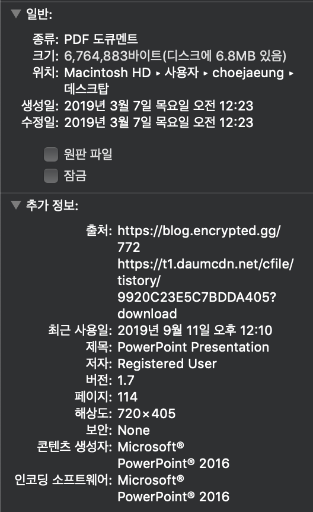
---
### 스키마(schema)의 3계층

- 사용자의 관점에 따라 외부, 개념, 내부 스키마로 나누어짐
  - 외부 스키마 : 실세계에 존재하는 데이터를 어떤 형식,구조,배치로 보여줄 것인가
  - 개념 스키마 : 실제로 '어떤'데이터가 저장되었으며, 어떤 '관계'가 있는가?
  - 내부 스키마 : 디스크에는 어떤식으로 저장될 것인가? 
- 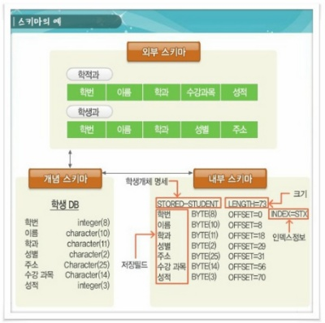 
 >cf. 단순히 스키마라고 하면 대부분 '개념'스키마를 의미 함
---
### 데이터 모델

1. 개념적 데이터 모델
   - 현실 세계에 존재하는 개체를 인간이 이해 가능한 구조로 표현
    >ex. E-R model
2. 논리적 데이터 모델
   - 개념적 데이터 모델링 과정에서 얻은 개념적 구조를 컴퓨터가 이해,처리할 수 있도록 변환
   - 단순히 데이터모델? 하면 논리적 모델을 의미함
    >ex. 관계 모델, 계층 모델, 네트워크 모델
                                                                                                                                                                                                                                                                       
### 데이터베이스 설계

- 사용자 요구 분석을 분석하여 컴퓨터에 저장할 수 있도록 데이터베이스 구조에 맞게 변형한 후 DBMS를 통해 데이터 베이스 구현

- 설계시 고려사항
  1. 무결성 : 삽입, 삭제, 갱신 후에도 정해진 제약조건을 만족해야함
  2. 일관성 : 특정 질의에 대한 응답이 같아야 함
  3. 회복,보안,효율성,데이터베이스확장...
  
- 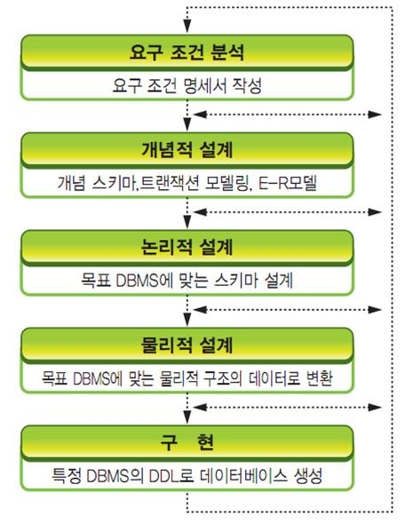
 1. 요구 분석 : 필요 용도 파악 -> 요구 조건 명세서 작성
 2. 개념적 설계
    - 개념 스키마 모델링, 트랜잭션 모델링 수행
    - 요구 작성 명세를 통해 E-R 다이어그램 작성
 3. 논리적 설계
    - 컴퓨터가 이해하도록 DBMS가 지원하는 논리적 자료 구조로 변환
    - 트랜잭션의 인터페이스 설계
    - 관계형 데이터베이스-> 테이블 설계
    - 정규화 수행
 4. 물리적 설계
    - 논리적으로 표현된 데이터 믈리적 저장장치에 저장할수 있는 구조로 변화하는 과정
    - 데이터 베이스파일의 저장 구조 엑세스 경로 등을 결정하며 성능의 중대한 영향을 미침
 5. 구현
    - DDL을 통해 빈 데이터베이스 생성
    - 트랜잭션 작성
---
## 정규화

### 정규화란?

- 관계형 데이터베이스의 설계에서 중복을 최소화할 수 있도록 데이터를 구조화하는 프로세스

### 정규화의 목적

- 정규화를 통해 중복을 배제하여 삽입 / 갱신 / 삭제 이상 발생을 방지한다.
- 데이터 구조의 안정성을 최대화한다.
- 데이터 삽입시 릴레이션 재구성 필요성을 줄인다.
- 이상 제거를 위해 중복성 종속성을 배제시키는 방법으로 사용

### 정규화를 하지 않았을 경우 발생하는 문제점

1. 삽입 이상: 의도치 않은 데이터까지 삽입
2. 삭제 이상: 어떤 정보를 삭제하면 다른 필요한 정보까지 삭제
3. 갱신 이상: 중복된 데이터중 일부만 수정->일관성 파괴

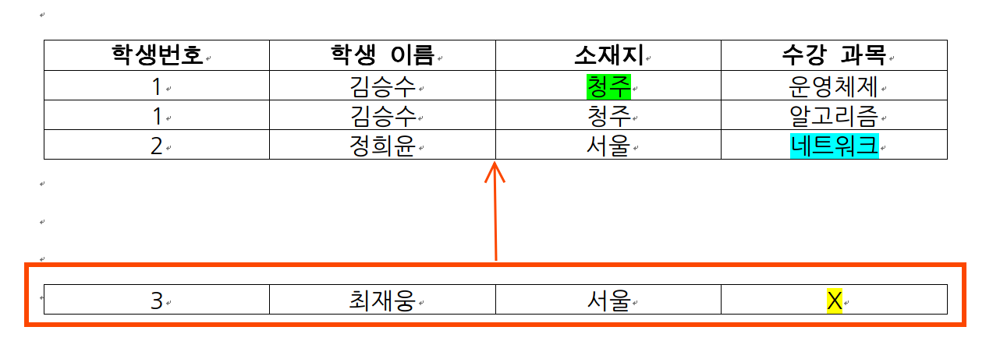

### 정규화 과정

1. 제 1 정규형
   - 릴레이션에 모든 속성의 도메인이 원자값으로 구성되어 있어야한다.
    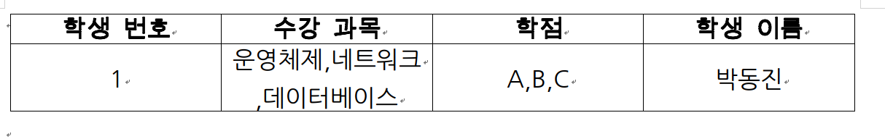
 
   - 수강 과목과 학점 속성의 도메인이 원자값이 아니므로 원자값으로 수정한다.
    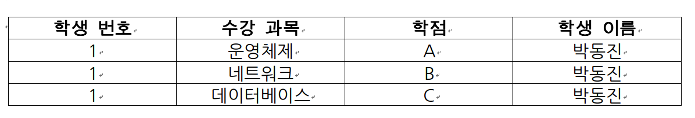
 
 2. 제 2 정규형
    - 제 1 정규형을 만족하고, 부분 함수 종속성을 제거한다.
    - 기본키가 아닌 모든 속성이 기본키에 완전 함수 종속되도록 만들어야함.
   
    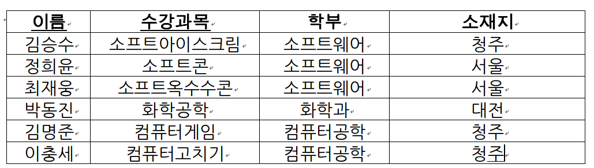
     - 위 릴레이션의 함수 종속성을 나타내면
     - 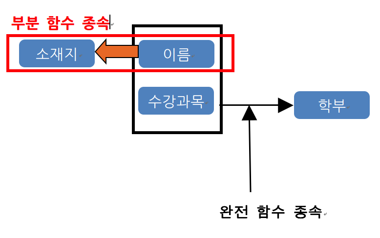
     - 부분 함수 종속을 제거한다.
     - 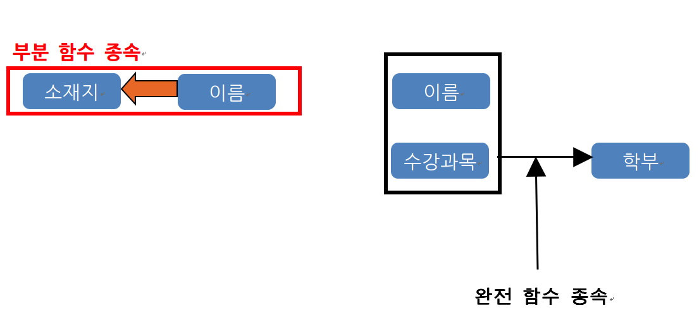
     - 따라서 부분 종속을 제거한 이후에 테이블은 아래와 같다.
     - 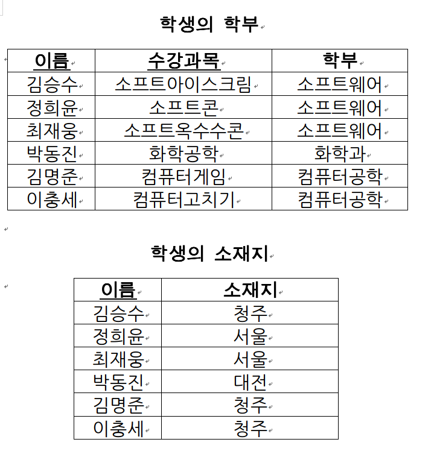
     
 3. 제 3 정규형
 
    - 기본키가 아닌 모든 속성이 기본키에만 의존해야한다.
      (기본키가 아닌 모든 속성이 기본키에 대해 이행적 함수 종속이 아니다.)
      > 이행적 함수 종속: A->B 이고 B->C 일 때 A->C를 만족하는 관계
    - 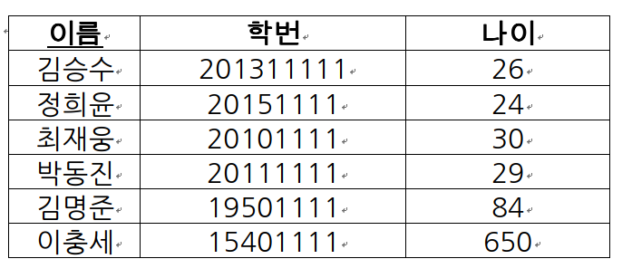
    - 이름을 알면 학번을 알고 학번을 알면 나이를 알 수 있으니 이행적 함수 종속이다.
    - 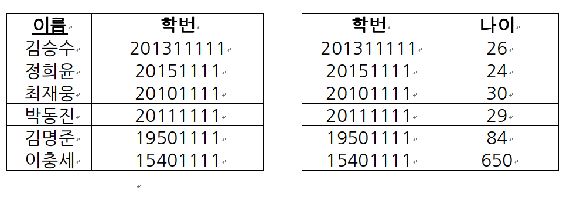
    - 이렇게 처리가 가능하다.
 4. BCNF 정규형
 
    - 결정자이면서 후보키가 아닌경우 제거
    - 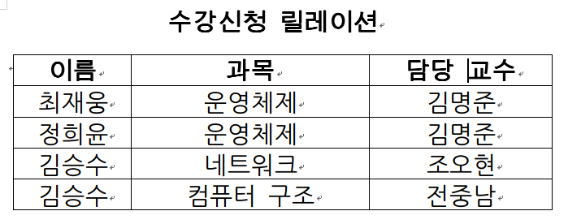
    > 제약 조건: 교수는 한과목의 강좌만 진행한다.
    - {이름,교수}을 기본키라고 가정 
    - 삽입 시 기본키에 null값이 들어가 개체 무결성제약조건 어김
    - 삭제 시 원치 않은 데이터까지 삭제
    - 갱신 시 두과목 맡는 경우 발생 제약조건 어김
    -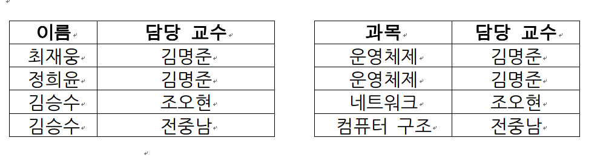
    
    
    
 5. 제 4 정규형
    - 다치 종속 제거
    
 6. 제 5 정규형
    - 조인 종속성 이용
                                                              
     
