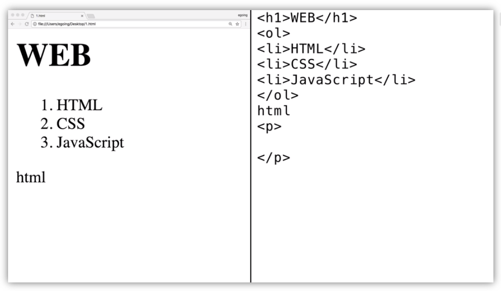

# HTML & Internet

## 목차
- 코딩과 HTML

## 코딩과 HTML

  - 화면이 두 개로 쪼개져 있다. Point는 어떤 쪽이 사람이 하는 일이고, 어떤 쪽이 기계가 하는 것인가를 분리해서 생각해보는 것이다.
  - 
  
  - 오른쪽이 사람이 하는 일이면서 원인이고, 왼쪽은 사람이 하는 일에 대한 결과이면서 기계가 한 일입니다.
  - 오른쪽을 신호라는 의미에서 Code, 원천에서 의미에서 Source, 약속의 의미에서 Language 라고 합니다.
  - 왼쪽은 결과를 부르는 여러 표현들이 있다. (Application, App, Program, Webpage, Website) 
  - **코딩** : **원인인 Code를 통해서 결과인 Website 를 만들어내는 것**
  - ex) HTML 언어를 사용하여 웹 사이트를 만들어내는 것
  
  
## Public Domain

- 저작권이 없는 것 
- ex) 한글을 사용할 때 라이센스 비용 지불하지 않음, HTML
- 덕분에 NAVER, GOOGLE 에서 각각의 브라우저를 만들 수 있음

