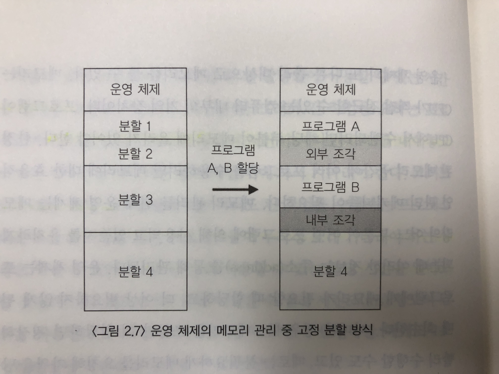
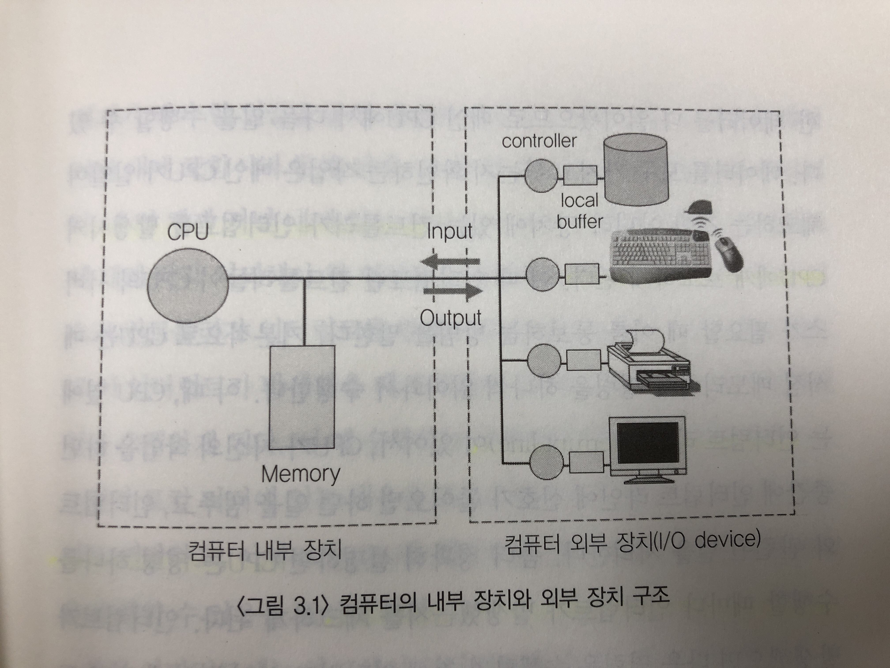
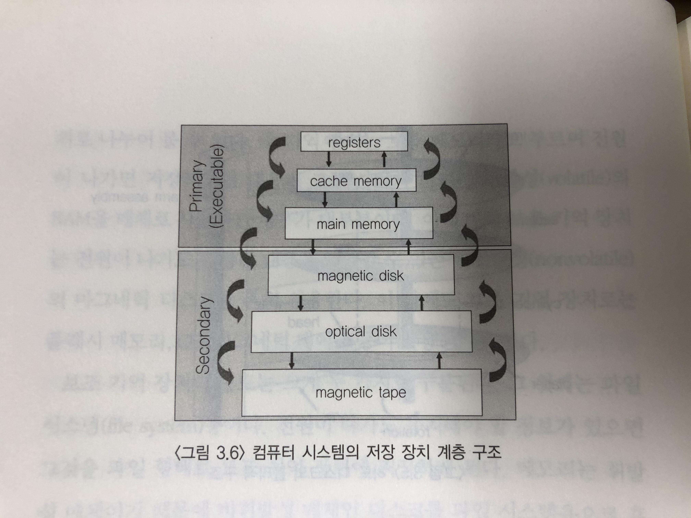
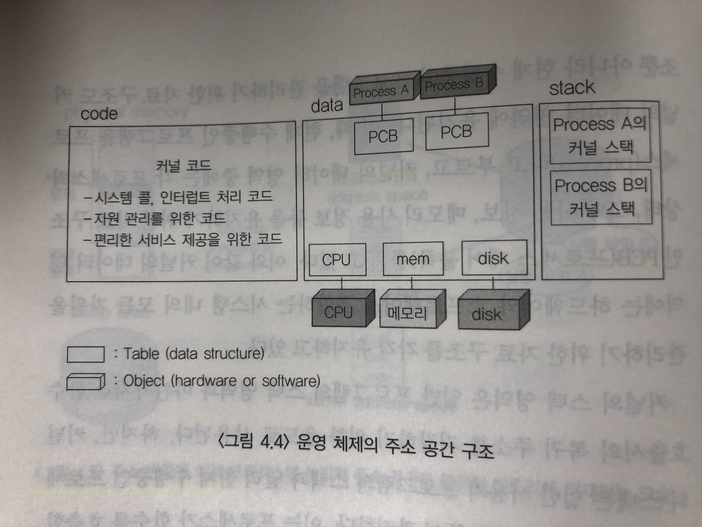
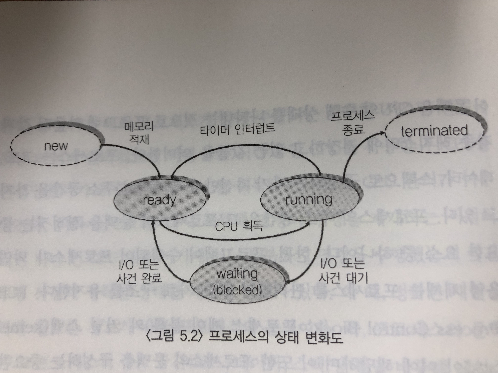

# 운영체제

---

## 운영 체제 개요

### 운영 체제란
- 컴퓨터 하드웨어 바로 윗단에 설치되어 각종 하드웨어 및 소프트웨어를 관리하고 사용자에게 편리한 인터페이스를 제공하는 소프트웨어

 

### 운영 체제의 주요 기능
- 자원을 효율적으로 관리 == 자원관리자
    - CPU, 메모리, 하드 디스크 등의 HW 자원뿐 아니라 SW 자원까지 효율적으로 관리
    - 사용자 및 프로그램들 간에 자원이 형평성이 있게 분배되도록 균형자 역할 수행
- 컴퓨터 시스템을 편리하게 사용할 수 있는 환경 제공
    - 운영 체제가 동시 사용자 및 프로그램들에게 각각 독자적으로 컴퓨터를 사용하는 것과 같은 환상을 제공
    - 사용자 및 프로그램은 하드웨어를 직접 다루는 복잡한 부분을 알 필요없음

 

### 커널(Kernel)이란
- 메모리에 상주하는 운영 체제의 핵심적인 부분
- 좁은 의미의 운영 체제

>cf. 운영체제 자체도 하나의 소프트웨어로 전원이 켜짐과 동시에 메모리에 올라간다. 하지만, 운영체제처럼 규모가 큰 프로그램이 모두 메모리에 올라간다면 메모리 낭비가 심할 것임. 따라서, 운영 체제 중 항상 필요한 부분만 전원이 켜짐과 동시에 메모리에 올려놓고 나머지는 필요할 때 메모리에 올려서 사용

 

### 운영 체제의 분류
1. 동시 작업 지원
    - 단일 작업(Single Tasking)용 OS
        - 한 번에 하나의 프로그램만 수행시킴
        - 하나의 프로그램이 끝나기 전에 다른 프로그램을 수행시키는 것이 불가능
        - ex) DOS
    - 다중 작업(Multi Tasking)용 OS
        - 여러 프로그램이 CPU와 메모리를 공유
        - 하나의 프로그램이 끝나기 전에 다른 프로그램을 수행시키는 것이 가능
        - ex) MS 윈도우, 유닉스

> cf. 
>- 다중 프로그래밍 시스템(Multi-Programming System) : 여러 프로그램들을 동시에 메모리에 올려놓고 처리하는 시스템
>- 다중 처리기 시스템(Multi-Processor System) : 하나의 컴퓨터 안에 여러 개의 CPU가 설치된 시스템

2. 다중 사용자의 동시 지원
    - 단일 사용자용 운영 체제
        - 한 번에 한 명의 사용만이 사용
        - ex) DOS
    - 다중 사용자용 운영 체제
        - 여러 사용자가 동시에 접속해 사용
        - ex) 이메일 서버, 웹 서버

3. 작업 처리 방식
    - 일괄 처리(bathc Processing) 운영 체제
        - 처리할 여러 작업들을 모아 일정량 쌓이면 일괄적으로 처리하여 작업이 완전히 끝난 후 결과를 얻음 >> 긴 응답 시간
    - 시분할(Time Sharig) 운영 체제
        - 처리할 여러 작업들을 일정한 시간 단위로 분할해 사용 >> 짧은 응답 시간
    - 실시간(Real Time) 운영 체제
        - 정해진 시간 안에 어떠한 일이 반드시 종료됨이 보장되어야 하는 시스템
        - 시간 내 작업 완료가 될 경우, 큰 위험을 초래할 가능성이 있음
        - ex) 원자로, 공장 제어, 미사일 제어 시스템

 

### 자원관리자로서의 운영 체제
1. CPU 스케줄링
    - FCFS(First Come First Served)
        - 장시간 CPU를 사용하는 프로세스가 먼저 도착, 단시간 CPU를 사용하는 프로세스들이 뒤이어 도착 >> 오랜 시간 기다림 
    - 라운드 로빈(Round Robin)
        - CPU를 한 번 할당받아 사용할 수 있는 시간을 정함
        - 일반적으로 1회 할당 시간은 수 밀리 세컨드(ms) 사용
    - 우선 순위(Priority)
        - 대기중인 프로세스들에게 우선 순위 부여 후 높은 우선 순위 프로세스를 먼저 실행
        - 중요한 프로세스 우선 실행 방법, 기다린 시간에 비례하여 우선순위를 점차 높여주는 방법 등이 있음 

2. (물리적) 메모리 관리
    - 고정 분할(Fixed Partition) 방식
        - 물리적 메모리를 몇 개의 영구적인 분할로 나눔
        - 분할된 한 영역에 한 프로그램씩 적재되어 사용
        - 분할된 영역이 너무 작아도 문제, 너무 커도 문제 >> 융통성이 없음
        

    - 가변 분할(Variable Partition) 방식
        - 매 시점 프로그램의 크기에 맞게 메모리를 분할해서 사용하는 방식
        - 내부 단편화는 발생 X, 외부 단편화는 여전히 발생
        > cf. 외부 단편화 : 프로그램에게 할당되지 않은 메모리 영역이지만 그 크기가 작아 프로그램을 올리지 못하는 메모리 영역

    - 가상 메모리(Virtual Memory) 방식
        - 프로그램에서 당장 사용될 부분만 메모리에 올리고 나머지 부분은 보조 기억 장치에 저장해두고 필요할 때 적재하는 방식
        - 현재 모든 컴퓨터 시스템에서 사용하는 방식
        - 물리적 메모리보다 더 큰 프로그램이 실행되는 것을 지원
        - 가상 메모리 주소를 물리적 메모리 주소로 매핑하는 기술이 필요

3. 입출력 관리
    - 각종 입출력 장치들과 컴퓨터 사이의 정보를 주고 받기 위해 운영 체제가 필요
    - 입출력 장치는 **인터럽트**를 통해 CPU의 서비스를 요청함
    - ex) 사용자가 키보드에 글자 입력 >> 키보드는 사용자로부터 입력이 들어왔음을 알리기위해 CPU에게 인터럽트 신호를 보냄 >> CPU는 실행중인 프로세스를 멈추고 인터럽트를 처리하기 위한 작업을 수행 >> 인터럽트 처리 완료 후, 아까 실행중이던 프로세스를 재개

4. 파일 관리
    - 전원이 꺼져도 기억해야하는 정보를 보관하기 위해 보조 기억 장치에 파일 형태로 저장
    - 디스크에 파일을 어떻게 보관할 것인가, 파일에 대한 접근 권한에 대해서도 운영체제가 관리

   

---

## 컴퓨터 시스템에서의 입출력 연산

> cf.  
컴퓨터 시스템의 구조 : CPU, 주기억장치(메모리), 입출력장치

### CPU와 I/O 연산
- 입출력 장치들의 I/O 연산은 I/O 컨트롤러가 담당
    - 입출력 장치는 입출력 컨트롤러(Controller)와 로컬 버퍼(Local Buffer)를 가짐
        - 컨트롤러 : 각 하드웨어 장치를 제어하는 작은 CPU
        - 로컬 버퍼 : 장치로부터 들어오고 나가는 데이터를 임시로 저장하기 위한 작은 메모리
- 컴퓨터 내에서 수행되는 연산은 메인 CPU가 담당
- 입출력 장치에서 데이터를 읽어올 때, CPU가 일일이 체크하는 것이 아니라 장치에 있는 컨트롤러가 인터럽트를 발생시켜 CPU에게 보고
- CPU는 명령 하나를 수행할 때마다 인터럽트가 발생했는지 체크
- 

 

### DMA(Direct Memory Access)

#### DMA란?
- 메모리 접근이 가능한 장치

#### DMA의 역할
- 원칙적으로 메모리 접근은 CPU에 의해서만 가능
- CPU가 주변 장치들의 메모리 접근 요청에 의해 자주 인터럽트가 발생하면 CPU 사용의 효율성이 떨어짐
- **장치의 로컬 버퍼에서 메모리로 읽어오는 작업을 CPU 대신 대행** >> CPU를 더 유용하게 사용 및 입출력 연산을 빠르게 수행

   

---

## 하드웨어 보안 기법
- 다중 프로그래밍 환경에서 각 프로그램들이 다른 프로그램의 실행을 방해하거나 프로그램 간에 서로 충돌을 일으키는 문제를 막기 위해 하드웨어에 대한 보안 기법이 필요 >> 두 가지 명령어 실행 모드 지원
- CPU 내부에 모드 비트(Mode bit)를 두어 모드를 설정

    1. 커널 모드
        - 운영 체제가 CPU의 제어권을 가지고 운영 체제 코드를 실행하는 모드
        - 중요한 정보에 접근해 위험한 상황을 초래할 수 있는 연산 수행
        - 모든 종류의 명령 실행 가능
        - 모드 비트가 0
        - ex) 모든 입출력 명령은 커널 모드에서 수행

    2. 사용자 모드
        - 사용자 프로그램이 CPU의 제어권을 가지고 제한된 명령만을 수행하는 모드
        - 일반적인 연산만 사용 가능
        - 모드 비트가 1

   

---

## 저장 장치

### 저장 장치의 종류
1. 주 기억 장치 == 메모리
    - 휘발성
    - RAM

2. 보조 기억 장치
    - 비휘발성
    - 마그네틱 디스크
    - 용도
        - 파일시스템 : 영구적 보관
        - 스왑 영역(Swap Area) : 메모리의 연장선
            - 스왑 인(Swap In)
            - 스왑 아웃(Swap Out)

 

### 저장 장치의 계층 구조
- 접근 속도가 빠른 건 비싸고 용량이 적음
- 접근 속도가 느린 건 싸고 용량이 큼

 

### 캐슁 기법
- 상대적으로 느린 저장 장치에 있는 내용 중에 **당장 사용되거나 빈번히 사용될 정보를 빠른 저장 장치에 선별적으로 저장해 두 저장 장치 사이의 속도를 완충**시키는 기법

   

---

## 인터럽트

### 인터럽트의 정의
- 프로그램을 실행중인 CPU에게 어떤 서비스를 요청하기 위해 발생시키는 신호

 

### 인터럽트의 종류
- 하드웨어 인터럽트 == 인터럽트
    - 하드웨어 장치가 CPU의 인터럽트 라인을 세팅하여 발생시키는 인터럽트
- 소프트웨어 인터럽트 == 트랩(Trap)
    - 예외상황(Exception)
        - 0으로 나누기, 자신의 메모리(프로세스에 할당된 메모리) 영역 바깥 접근 시도
    - 시스템 콜(System Call)
        - 프로그램 수행 도중 프로그래머가 의도적으로 발생시키는 인터럽트
        - 자신이 작성하지 않은 코드를 운영 체제로부터 서비스받기 위해 발생시키는 신호 == 운영 체제(커널)에 정의된 함수를 호출하기 위한 신호
        - ex) printf() -> write()

 

### 인터럽트 관련 용어
- 인터럽트 서비스 루틴
    - 인터럽트 발생 시 실제 처리해야 할 업무
    - 커널에 이미 보관되어 있음
- 인터럽트 벡터
    - 인터럽트마다 실행해야 할 업무가 다르기에 해야할 일을 쉽게 찾아가기 위한 지도
    - 인터럽트 서비스 루틴 시작 주소들을 모아놓은 테이블
- 인터럽트 핸들링(Handling)
    - 인터럽트가 발생 시, 인터럽트 서비스 루틴 실행 전 처리해야 할 일의 절차
    - PCB(Process Control Block)에 Reg 값, CPU 내 하드웨어 상태를 저장

    > cf. PCB?  
    \- OS가 현재 실행중인 프로그램을 관리하기 위한 자료구조   
    \- 프로세스의 상태, PC값, CPU Reg, CPU 스케줄링 정보, 메모리 관리 정보, 자원 사용 정보, 입출력 상태 정보 등 저장

 

### 프로그램의 메모리 구조
- Code
    - 기계어 명령
- Data
    - 전역 변수 등 프로그램이 사용하는 각종 데이터가 저장되는 공간
- Stack
    - 함수 호출 시, 함수 종료 후 돌아올 원래 함수의 복귀 주소 저장
- ex) 커널의 메모리 구조
    

 

### 디스크의 파일 입출력이 이루어지는 과정(예시)
1. 사용자 프로그램 A가 CPU를 보유하고 명령어를 실행 중
2. 디스크에서 파일을 읽어와야하는 경우가 발생
3. 파일을 읽기 위해 시스템 콜로 커널의 함수 호출 & CPU의 인터럽트 라인이 세팅
4. CPU는 다음 명령어를 실행하기 전 인터럽트 라인을 검사
5. 인터럽트가 걸렸음을 확인
6. 수행중인 사용자 프로그램 A를 잠시 멈추고 운영 체제에게 CPU 제어권 이양
7. 입출력 인터럽트를 처리하기 위한 서비스 루틴으로 이동해 입출력 작업 수행
8. CPU는 디스크 컨트롤러에게 파일을 읽어오라고 명령
9. 운영체제는 다른 프로세스에게 CPU 제어권을 넘겨주어 다른 프로그램 B가 실행될 수 있도록 함
10. 디스크 컨트롤러는 입출력 작업이 완료될 경우, 다른 프로그램을 수행중이던 CPU에게 인터럽트로 알림
11. CPU는 B 프로그램 수행을 잠시 멈추고 인터럽트 서비스 루틴을 실행시킴
12. 디스크 로컬 버퍼로부터 메모리로 데이터를 복사해옴
13. 입출력을 요청했던 프로세스(A 프로그램)에게 CPU를 다시 획득할 수 있는 기회를 줌
14. A 프로그램는 CPU를 할당받기 위한 대기 큐에 들어감
15. CPU의 제어권은 B 프로그램에게 돌아가 명령을 계속해서 실행

   

---

### 프로세스의 상태
- 실행(Running)
- 준비(Ready)
    - CPU 할당을 기다림
- 봉쇄(Blocked, Wait, Sleep)
    - CPU 자원을 할당받아도 명령을 수행할 수 없는 상태
    - ex) 요청한 입출력 작업이 완료되길 기다리는 중
- 

#### 문맥 교환 Contect Switch p.124

#### 스케줄러 p.132
    - 장기, 단기, 중기 스케줄러

#### 프로세스 생성 p.136 ~ 143
- fork(), wait(), exec() 
