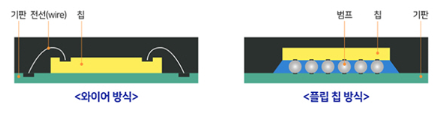

## 파운드리

- 팹리스 회사에서 설계한 칩의 생산을 위탁받아 반도체를 제조하는 회사

- 팹리스 회사들이 제조 기술력과 생산 설비 투자 없이도 각장의 아이디어를 최상의 제품으로 실현할 수 있도록 생산기지 역할 수행

- 한정된 공간인 실리콘 웨이퍼 위에 많은 반도체 칩 생산, 더 나은 성능과 전력 효율을 가진 반도체를 만들기 위해 **공정기술을 끊임없이 발전**시키고 있음

- 트랜지스터 구조

    - MOSFET(Metal Oxide Semiconductor Field Effect Transistor, 금속 산화막 반도체 전계효과 트랜지스터)

        - 가장 많이 사용하는 트랜지스터 구조로 게이트와 채널이 **평면**으로 맞닿는 형태

        - 트랜지스터가 작아짐에 따라 소스와 드레인 사이의 거리가 가까워져 반도체 소자 특성이 나빠지는 한계 有

    - FinFET(핀펫) 공정

        - 평면(2D) 구조인 MOSFET의 한계를 극복하기 위해 개발된 입체 구조의 공정 기술

        - 트랜지스터의 게이트와 채널 간의 접하는 면은 넓을수록 효율이 높아지므로, 핀(Fin, 지느러미) 모양의 3D 구조를 적용해서 접점 면적을 키움 >> 반도체 성능 향상, 누설 전류 줄임, 동작 전압을 낮춤

        - 

    - GAA(Gate All Around) 공정
        
        - 채널의 4면을 감싼 구조 >> 전류의 흐름을 보다 세밀하게 제어 가능

        - 3나노 이하 초미세 회로에 도입되어 인공지능, 빅데이터, 자율주행, 사물인터넷 등 고성능과 저전력을 요구하는 차세대 반도체에 활용될 트랜지스터 구조

    
    

    - MBCFETTM (Multi-Bridge Channel Field Effect Transistor)

        - GAA 구조를 더 개선한 형태

- EUV(Extreme Ultra Violet, 극자외선)

    - 한 자리 수 나노미터 단위까지 미세화됨에 따라 세밀한 회로를 구현하기 위해 새로운 광원 도입이 필요했음

    - 빛의 파장이 기존(ArF, 불화아르곤)의 것보다 짧아(1/14) 보다 **세밀한 회로 패턴을 구현** >> 제한된 웨어퍼 안에 더 많이 집적하고 성능을 높일 수 있음

    - 파장 13.5 nm

    - 7 나노미터 이하의 첨단 반도체 생산에 필요한 차세대 기술

## 반도체 제조 공정

- 반도체 칩이 완성되기까지 웨이퍼(Wafer) 제조, 회로 설계, 웨이퍼 가공, 조립, 검사와 같이 수 백번의 과정을 거치는데 이 과정을 크게 **전공정** 과 **후공정**으로 나눌 수 있음

    - 전공정

        - 웨이퍼 위에 미세한 반도체 회로를 만드는 일련의 과정

        - 반도체 8대 공정

            - 반도체가 만들어지는 과정에서 가장 많이 쓰이는 8개의 대표 공정

            0. 준비 단계

                - 잉곳

                    - 모래에서 추출한 실리콘 원료(**규소**)를 뜨거운 열로 녹여서 고순도의 실리콘 용액을 만들어 굳힌 덩어리

                - 웨이퍼(Wafer)

                    - 잉곳을 얇게 잘라내어 만든 반도체 기판

                    - 지름에 따라 150mm(6인치), 200mm(8인치), 300mm(12인치)의 웨이퍼로 나뉨

                - 엣지 그라인딩(Edge Grinding)

                    - 절단된 웨이퍼의 가장자리를 깎아내는 작업

                - 래핑(Lapping)과 폴리싱(Polishing) == 연마작업

                    - 웨이퍼 절단 후 표면을 매끄럽게 해주는 작업 >> 거친 표면은 회로 정밀도에 영향을 미칠 수 있으므로

                - 세정 과정

                - 회로 설계

                    - 반도체의 종류와 그 제품의 특징에 맞게 회로 패턴을 만드는 일

                - 포토마스크 == 마스크(Mask) == Reticle

                    - 설계된 회로 패턴을 전자빔 설비를 이용해 **유리판(순도 높은 석영)** 위에 그려놓은 틀
                

            1. 산화 공정

                - 800 ~ 1200 사이의 고온에서 산소나 수증기를 통해 **웨이퍼 표면에 얇고 균일한 실리콘 산화막(SiO2)을 형성하는 공정**

                    > 실리콘 산화막(SiO2)
                    > - 절연의 특성을 가짐 == 부도체
                    > - 불순물(전자)이 이동하지 못하도록 차단하거나 표면을 보호하는 역할
                    > - 이후 공정에서 웨이퍼 위의 패턴들이 서로 닿지 않도록 영역을 분리하는 절연막 역할

                - 반도체 웨이퍼 열산화 방법 두 가지

                    - 건식산화

                        - 산소

                    - 습식산화

                        - 산소+수증기

                        - 건식산화보다 같은 온도, 같은 시간 동안 더 두꺼운 산화막 형성 가능

            2. 포토 공정(PhotoLithography)

                - 포토마스크에 빛을 통과시켜서 축소된 형태의 회로를 웨이퍼에 그려넣는 공정 >> 빛이 틀을 통과해서 웨이퍼에 회로를 그려넣음

                    

                1. 도포
                
                    - 웨이퍼 표면에 감광액(Photo-resist)을 골고루 바름

                    - 감광액 막이 얇고 균일, 빛에 대한 감도가 높아야 고품질의 정교한 회로패턴이 만들어짐

                2. 노광
                
                    - 노광 장비를 이용해 회로 패턴이 담긴 마스크에 순간적으로 빛을 쏘아 렌즈를 쏘아 렌즈를 통해 축소된 회로가 웨이퍼에 찍힘

                3. 현상

                    - 현상액으로 빛을 받은 부분과 받지 않은 부분을 선택적으로 제거(감광액 층 부분에서 일어남)

            3. 식각 공정

                - 회로 형성을 위해 **회로 패턴을 제외한 필요없는 부분을 제거 및 깊게 파들어가는** 공정(산화막 층에서 일어남)

                - 포토 공정을 거친 웨이퍼에 식각물질(Etchant)을 반응시켜서 **감광액에 보호받지 않는 부분**을 깎아냄

                - 두 가지 식각 방법

                    - 습식 식각(Wet Etching)

                        - 화학물질을 통해 불필요한 부분(패턴만에 보호되지 않은 표면)을 부식시킴

                        - 속도는 빠르나 건식 식각에 비해 정교하지 X
                    
                    - 건식 식각(Dry Etching) == 플라즈마 식각

                        - 미세하고 정확한 패턴을 만들기 위해 **플라즈마**를 이용함

                        - 반응성 기체, 이온을 이용해 물리/화학적 반응에 의해 특정 부위를 제거

                        

                - 식각 공정이 끝나면, 포토마스크와 같은 패턴이 웨이퍼 위에 형성

            4. 이온 주입 공정(Ion Implant)

                - 붕소(B), 인(P), 비소(As) 같은 물질을 이온화시켜 웨이퍼 내 원하는 위치에 주입하는 공정

                - 안정 상태인 순수한 규소에 불순물을 넣어 전류가 흐르도록 함 >> 전기적 특성을 가진 반도체로 만듦

            5. 증착(Deposition) 공정

                - 화학 반응을 이용해 웨이퍼 위에 **아주 얇은 두께의 다양한 기능성 막(박막)**을 입히는 일련의 과정

                - 박막의 성분에 따라 **회로를 분리(절연막)**하거나 **연결(전도성막)**하게 됨

            6. 연마(Chemical Mechanical Polishing, CMP) 공정 == 공정평탄화 공정

                - 앞선 공정을 거치며 웨이퍼 위에 형성된 다양한 막들로 인해 표면이 울퉁불퉁 해짐. 따라서, 웨이퍼 표면을 화학 반응과 기계적 힘을 이용해 평탄하게 갈아내고 박막의 두께를 조절함

            7. 세정 공정

                - **각 공정 전후에 남아있는 반응 부산물과 오염물을 화학용액이나 초순수 증류수로 씻어**내는 공정

                > 연마 공정과 세정 공정
                > - 연마 공정과 세정 공정은 포토, 식각, 이온주입, 증착 공정과 같은 각 공정 중간중간 계속 해줌

            8. 금속배선 공정

                - 외부에서 들어오는 전기 신호가 잘 전달되도록 **회로 패턴에 따라 전기길**을 내어주는 작업

                - 전기가 잘 통하고, 이후 공정에서 금속의 특성이 변하지않는 열/화학적 안정성이 뛰어난 재료를 증착시킴

                - ex) 알루미늄(Al), 텅스텐(W), 구리(Cu)

    - 후공정

        - 웨이퍼를 낱개의 칩으로 잘라내 포장하는 과정

        - EDS(Electrical Die Sorting) Test 공정

            - 웨이퍼를 각각 하나의 칩으로 잘라내기 전에 불량품이 있는지 파악하는 과정

            - 전기적으로 동작상태를 검사해서 칩들이 원하는 품질 수준에 도달했는지 확인하고 불량품을 자동선별하는 공정

            - 수율을 높이는 데 중요한 공정 >> 수선 가능한 칩을 고치고, 공정 or 설계 문제점 파악

            > 수율
            > - (정상 칩 수 / 설계된 칩 수) X 100
            > - 생산성과 직결 >> 반도체 산업의 경쟁력

        - 패키징
        
            - 다양한 환경에서 발생하는 이물질, 온도, 습도, 물리적 충격으로부터 **보호**

            - 실제 동작을 위해서 외부와 전기 신호를 주고 받도록 전기적인 통로를 만들어줌 >> **연결**

            - 스마트폰 기기 사용 증가로 더 다양한 환경에서, 더 작게, 더 얇게, 더 집적된 공간의 패키징 기술이 요구됨 >> 2D에서 3D로 칩을 쌓는 기술로 발전

            - 패키징 공정

                1. 웨이퍼 소잉(Wafer Sawing) == 다이싱(Dicing)

                    - 웨어퍼 자르기

                2. 칩 접착(Die Attaching)

                    - 절단된 칩들은 리드 프레임(Lead Frame) or PCB(Printed Circuit Board)위에 옮김

                    - 반도체 칩과 외부 회로 간 전기신호를 전달하고 외부 환경으로부터 칩을 보호, 지지해주는 골격 역할

                3. 금속 연결(Wire Bonding)

                    - 반도체 칩과 기판을 금속으로 연결하는 과정
                    
                    - 와이어 본딩(Wire Bonding)

                        - 칩과 PCB 기판을 가는 금선으로 연결

                    - 플립칩(Flip Chip)

                        - 칩의 회로와 기판을 직접 볼 형태의 범프(돌기)로 연결

                        

                4. 성형(Molding)

                    - 화학 수지로 밀봉하는 공정을 거쳐 열, 습기 등의 물리적인 환경으로부터 반도체 IC를 보호하고, 원하는 형태의 패키지로 만드는 과정

            - 칩을 어떻게 쌓을까?

                - 3D-TSV(Through Silicon Via, 3차원 실리콘 관통 전극)

                    - 칩에 전자 이동통로인 터널을 뚫어 직접 연결하는 패키징 기술

                    - 최단 거리로 터널을 뚫고 터널 수(6만개)도 늘려서 데이터 이동속도가 훨씬 빠름

                        
