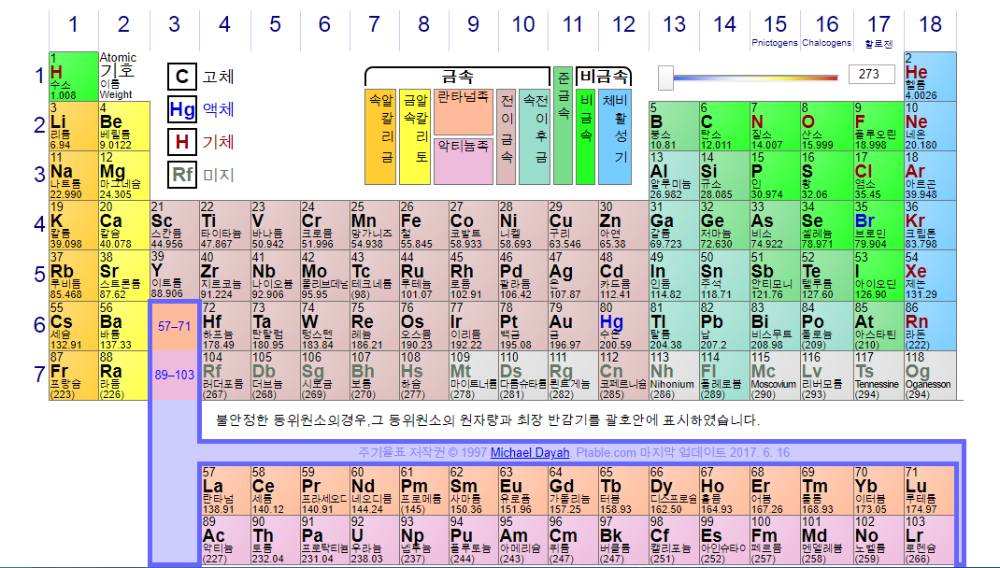

# 반도체 이야기
- 본 글은 삼성반도체이야기에서 연재하고 있는 'NANO' 반도체 웹툰 내용을 정리한 글입니다.

- https://www.samsungsemiconstory.com/2060

## 도체/부도체/반도체란?

1. 도체
    - 전기가 흐르는 물질

    - ex) 금, 구리, 철, 알루미늄

2. 부도체
    - 전기가 흐르지않는 물질 : 부도체

    - ex) 고무, 플라스틱, 나무, 다이아몬드

3. 반도체
    - 도체와 부도체 사이의 성질을 띠고 있는 물질 == 어떤 때는 전기가 통하고, 어떤 때는 안 통하기도 하는 물질

    - ex) 규소(Si), 게르마늄(Ge)

## 집적회로(Integrated Circuit)
- 산업에서 말하는 반도체 == IC == 칩

- 하나의 반도체 기판에 다수의 트랜지스터, 다이오드, 저항, 캐퍼시터 등 많은 소자를 초소형 전자회로로 구성해 하나의 칩 안에 집적한 것

- 작은 반도체 칩에 얼마나 많은 소자를 구현할 수 있는가가 쟁점. 지금은 수십억개의 트랜지스터가 칩에 들어가는 상황임.

    - LSI(large scale integration, 고밀도 집적회로) : 칩 1개에 1,000 ~ 100,000 개의 소자가 집적됨
    
    - VLSI(Very large scale integration, 초고밀도 집적회로) : 칩 1개에 100,000 ~ 1,000,000 개의 소자가 집적됨
    
    - ULSI(Ultra large scale integration, 극초밀도 집적회로) : 칩 1개에 1,000,000 개 이상의 소자가 집적됨

> 다이오드 : 전류를 한 쪽 방향으로만 흐르게 하는 성질을 가진 소자

> 캐퍼시터 : 전하를 모으고 방출해 전압을 조절하는 부품

## 반도체는 어떻게 만들까?
- **안정된 상태인 순수한 반도체(진성 반도체)** 에 **특정 불순물**을 인위적으로 넣어 만듦 >> 불순물 반도체

    - 최외각 전자가 4개인 원소를 반도체 재료로 사용. 규소가 가장 많이 쓰임
        - 
        - 사진 출처 : [Ptable](https://www.ptable.com/?lang=ko)
        
    - 규소는 다른 규소와 공유결합하여 8개의 최외각 전자를 구성 >> 안정적인 상태

    - 안정적인 규소 덩어리에 불순물을 넣어 전류가 통하도록 함

        1. N(Negative -)형 반도체

            - 불순물로 최외각 전자가 5개인 인(P)나 비소(As)같은 물질을 넣음

            - 자유전자 1개가 남아 떠돌아다님
        
        2. P(Positive +)형 반도체
        
            - 불순물로 최외각 전자가 3개인 붕소(B)나 갈륨(Ga)같은 물질을 넣음

            - 자유전자가 총 7개로 하나가 모자람 >> **정공**이라 불리는 빈자리가 생김
            
            - 빈자리 때문에 전자들이 원자들 사이를 잘 옮겨다님
        
    - N형 반도체와 P형 반도체를 결합하여 다이오드나 트랜지스터를 만듦
    
        - P-N 접합 : 다이오드
        
        - NPN, PNP 접합 : 트랜지스터

## 트랜지스터란
- 멀리 떨어진 곳에 전기 신호를 전달하기 위해 증폭시킬 도구가 필요했는데 이를 위해 최초 개발된 진공관은 크기가 너무 컸음.

- 전자공학의 발달로 경박단소(가볍고, 얇고, 짧고, 작고)이면서도 진공관과 같은 역할을 할 수 있는 트랜지스터를 개발하게 됨.

- 1947년 뉴욕 벨 연구소에서 **점접촉 트랜지스터** 개발. 이를 대량생산에 적합하도록 검은색 네모에 밑에 삼발이 모양을 띈 것이 우리가 실생활에서 보는 트랜지스터임.

- 트랜지스터는 상업용 컴퓨터, 전자기기의 대중화에 기여함

- 게이트에 전압이 가해지면 **소스** 와 **드레인** 사이에 전류가 흐르면서 동작

> 진공관
> - 진공 속에서 금속을 가열할 때 방출되는 전자를 전기장으로 제어하여 정류, 증폭 등의 특성을 얻을 수 있는 유리관
> - 진공관의 발명은 전기를 동력으로만 사용하던 시대에서 **신호를 전송하고 처리하는** 본격적인 전자공학 시대를 여는 계기가 됨

## 트랜지스터의 종류
1. 쌍극성 접합 트랜지스터(Bipolar Junction Transistor, BJT)

    - 서로 다른 성질을 가진 N, P형 반도체의 접합을 통해 **전류를 제어** 하는 역할
    
    - 스위치, 증폭 작용

    - 
    
    - **이미터**에서 방출하는 자유전자 또는 정공을 **컬렉터**가 모으고, **베이스**는 이미터의 방출량을 조절해서 스위치 또는 증폭작용을 함.
    
2. 전계 효과 트랜지스터(Field Effect Transistors. FET)

    - 전류의 흐름을 **게이트에 가해진 전압을 통해 조절**하는 방식
    
    - 
    
    - 종류
        
        - N - 채널 트랜지스터
        
            - **게이트**에 전압을 가하면 **드레인(Drain)** 에서 **소스(Source)**로 전류가 흐름
        
        - P - 채널 트랜지스터
    
    
    
## 반도체에서 자주 쓰이는 단위

1. 반도체 용량 단위

    - 비트
    
        - 디지털 세계에서 데이터를 처리하는 가장 작은 단위
        
    - 바이트
    
        - 비트를 일정 단위(8 bits)로 묶어서 **정보를 표현하는 단위**로 삼음

    - b < B < KB < MB < GB < TB < PB(페타) < EB(엑사) < ZB(제타) < YB(요타)

2. 반도체 미세 공정 단위

    - m > cm > mm > um > nm > pm(피코) > fm(펨토) > am(아토)
    
3. 반도체 성능을 나타내는 단위

    - 연산 횟수
    
        - 헤르츠(Hz)
        
        - 진동수의 단위, 1초 동안 파동의 왕복 운동(사이클)이 일어난 횟수
        
        - CPU의 성능을 나타내는 표현으로 사용함
        
        - CPU에서 1 Hz란? 1초 동안 1번의 연산을 수행할 수 있음을 의미

    - 데이터 전송속도

        - bps(bits per second)

        - 1초당 몇 비트를 전송할 수 있는가

        - 데이터 통신에서 데이터가 전송되는 속도 또는 메모리에 데이터를 전송하는 속도의 단위로 사용

4. 이미지 센서의 해상도를 나타내는 단위
    - Pixel
    
        - 디스플레이의 이미지를 구성하는 최소 단위

> 이미지 센서
> - 빛을 디지털 신호로 변환하는 반도체
> - 수광소자로 구성된 픽셀에서 빛을 받아들인 후 이를 디지털 신호로 변환해 디스플레이에 이미지를 구현하는 역할

> 집적도
> - 하나의 집적회로에 몇개의 논리소자가 구성되어 있는가
> - 집적도가 높아진 이유는 **나노미터 단위의 회로 선폭 기술** 때문. ( 1 나노 == 10억분의 1 == 머리카락 굵기의 10만분의 1 )   
> - 집적도를 높이면 고용량, 고성능, 고효율의 제품을 만들 수 있으며 칩의 크기가 작아지므로 칩 생산량이 증가해 가격 경쟁력을 높일 수 있음

## 반도체 산업 구조

1. IP(Intelllectural Property) 회사

    - **셀 라이브러리라고 하는 특정 설계 블록인 반도체 IP**를 팹리스나 종합반도체회사에 제공하고 라이선스를 받는 반도체 설계 전문 회사

2. 팹리스(FABLESS)

    - 생산시설(Fabrication) 없이 **반도체 설계와 개발**만 전문적으로 하는 회사
    
3. 디자인 하우스(Design House)

    - 팹리스 기업이 설계한 제품을 각 **파운드리 생산 공정에 적합하도록 최적화된 디자인 서비스를 제공**하는 회사
    
4. 파운드리(Foundry)

    - 팹리스 회사에서 설계한 칩의 생산을 위탁받아 생산라인과 고도의 생산 기술을 가지고 반도체를 **제조**하는 회사

5. OSAT(Outsourced Semiconductor Assembly and Test)

    - 웨이퍼 가공(전공정)을 마친 반도체를 패키징하고 테스트하는 후공정 전문 회사

6. 종합 반도체 회사(Integrated Device Manufacture, IDM)

    - 반도체 산업에서 설계와 제조를 모두 하는 회사
    
    - 설계에서 제조, 웨이퍼 가공(전공정), 패키징, 테스트(후공정), 판매까지 반도체 제품 생산의 모든 과정을 전부 수행
