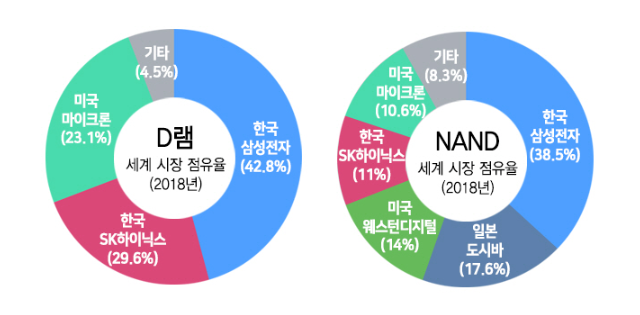
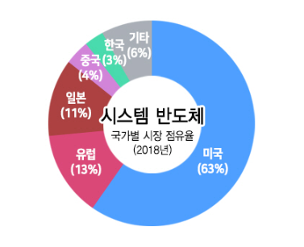
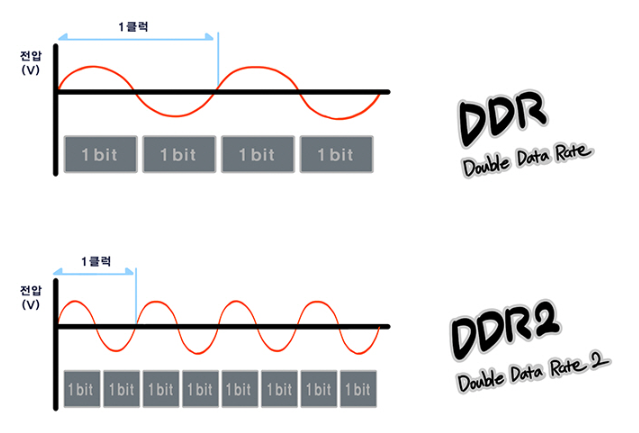

## 반도체의 종류

- 용도에 따라 **메모리 반도체** 와 **시스템 반도체**로 구분

1. 메모리 반도체

    - 데이터를 기억하고 저장하는 역할

    - DRAM, 낸드플래시

    - 기억장치로서 대용량, 고성능(얼마나 빠르게 동작할 수 있는가)가 중요하며, 요즘 휴대용 기기의 사용이 증가하면서 초소/초박형, 저전력(전력 효율) 또한 중요해짐

    - PC, 모바일 기기, 서버, 슈퍼컴퓨터(HPC), 자동차용 메모리, IoT 등 다양한 분야에서 쓰이고 있으며, 빅데이터를 다루게 되면서 수요가 지속 증가하는 추세

    - 미세공정 및 양산능력이 요구됨

    - 소품종 대량 생산

2. 시스템 반도체(Large Scale Integrated Circuit, LSI)

    - 데이터의 연산, 처리(제어, 변환, 가공) 등의 역할

    - AP(Application Processor), CPU, 다양한 센서(이미지, 홍채, 지문 센서), 통신 솔루션(모뎀, RF, SM), 디스플레이 구동칩(Display Driver IC, DDI), 스마트카드 IC(신용카드), 전력관리반도체(Power Management IC, PMIC)

    - 인공지능, 5G 네트워크, 자율주행차 등 다양한 분야에서 사용

    - 처리 능력, 회로 설계 집중 >> 고도의 설계 기술이 요구됨

    - 다품종 소량 생산

 

## 메모리 반도체

- 디지털 신호의 최소 단위인 비트(0, 1)를 저장하는 셀이 있음

- 종류

    1. 휘발성 메모리(Volatile Memory) >> RAM

        - 저장된 자료를 읽거나 쓸 때 순차적이 아니라 임의로(Random) 원하는 데이터 위치에 접근할 수 있는 메모리

        - 속도가 빠름

        - 전원이 차단될 때 정보를 잃어버림

        - 프로그램을 읽고 **임시로 저장하며 중앙처리장치의 연산을 돕는** 역할

        - 게임, 그래픽 작업 등 처리 속도를 높이기 위해서 고성능의 RAM을 사용
        
        - RAM의 종류

            - DRAM

                - D램의 셀은 **1개의 트랜지스터(스위치)** 와 **1개의 커패시터(축전기)**로 구성됨

                - 커패시터의 경우, 전하를 일시적으로 보관(전하의 유무에 따라 0 또는 1의 디지털 정보 저장)할 수 있으나 시간이 지나면서 조금씩 방전되므로 이를 보완하기 위해 **전하를 보충해주는 리프레시(Refresh) 작업이 주기적으로 필요** >> Dynamic RAM

                - 대용량화가 가능

                - CPU의 클럭 주파수에 맞춰 데이터를 읽고 씀

                - 발전 방향

                    1. 집적도 향상을 통한 대용량화

                    2. 대역폭 향상을 통한 동작 속도 가속화(고성능)

                    3. 모바일 시대를 위한 저전력화

                - DDR(Double Data Rate)

                    - DRAM의 속도를 나타냄
                
                    - 빠른 속도의 메모리가 필요하여 한 클럭에 2 비트를 전송하도록 만들어짐

                    - DDR2, DDR3 ... >> 세대가 거듭할수록 주파수 2배

                > SDR(Single Data Rate)
                > - DRAM 초기, 한 클럭에 1 비트의 데이터를 전송했음.
                
                

                - 사용처에 따른 제품
                
                    - 서버, PC : DIMM(Dual Inline Memory Module)

                    - 모바일, 오토모티브 : LPDDR(Low Power Double Data Rate) D램
                    
                    - 그래픽 : GDDR(Graphic Double Rate) D램

                    - 인공지능, 슈퍼컴퓨터 : **HBM(High Bandwidth Memory, 고대역폭 메모리)**

                    > HBM
                    > - 데이터가 이동하는 통로를 늘려 데이터 처리 속도를 획기적으로 올린 메모리로, 인공지능에 활용되는 슈퍼 컴퓨터나 고성능 그래픽 카드와 같이 거대한 정보를 빠른 속도로 다루는데 최적화된 메모리

            - SRAM

                - S램의 셀은 **6개의 트랜지스터**로 구성

                - 리프레시 필요 X, 속도가 빠름. But, 셀 크기가 크고 구조가 복잡하여 비쌈 >> 대용량화 X

                - 빠른 속도가 요구되는 CPU의 자체 메모리로 활용됨 >> CPU의 캐시메모리나 레지스터 등

    2. 비휘발성 메모리(Non-Volatile Memory)
    
        - 전원을 차단해도 정보가 그대로 남아있음

        - ROM(CD-ROM, DVD-ROM)
        
            - 데이터를 쓰려면 다시 제작하거나 특수한 장치가 필요

            - 정보를 다시 쓰고 지울 수 있는 방식에 따라 구분

                - 마스크롬

                    - 반도체 제조 과정에서 데이터를 기록

                    - 사용자가 수정 X

                - P롬(Programmable)

                    - 빈 롬에 특수한 쓰기 장치로 데이터를 한번 쓸 수 있음

                - EP롬(Erasable PROM)

                    - 자외선을 이용해 데이터를 지우고 다시 쓰기 가능

                - EEP롬(Electrically EPROM)

                    - 전기적으로 데이터를 지우고 다시 쓸 수 있음

        - 플래시 메모리
        
            - 전원이 꺼져도 데이터를 보존할 수 있고 손쉽게 데이터를 쓰고 지울 수 있는 메모리(ROM과 RAM의 장점을 모두 지님)

            - **회로의 형태**에 따라 구분
            
                - 낸드 플래시(NAND Flash)
                
                    - 회로가 **직렬**로 연결된 구조

                    - 데이터를 읽을 때, 순차적으로 찾음 >> 비교적 느린 읽기 속도

                    - 데이터를 그룹 단위로 동시에 읽거나 쓰는 구조  >> 빠른 쓰기 속도
                    
                    - 대용량화, 미세화 가능 >> 가격경쟁력 高

                    - 셀에 데이터를 저장하는 방식에 따라 타입 구분

                        - SLC

                            - 한 셀에 1 비트 저장

                            - 속도 빠름, 셀 당 저장되는 데이터 적음 >> 용량 대비 고가

                            - 오류 적음 >> 장기간 높은 신뢰성을 요구하는 저장장치에 사용

                        - MLC

                            - 2 비트 저장

                            - 고성능, 안정성, 내구성이 중요한 환경에선 SLC, MLC가 쓰임

                        - TLC
                        
                            - 3 비트 저장

                        - QLC
                        
                            - 4 비트 저장

                            - **셀 당 하나의 비트를 저장하는 속도가 SLC보다 느림**

                    - 제품

                        - SSD(Solid State Drive) : PC, 서버

                        - SD(Secure Digital) 카드 : 휴대폰 외장메모리, 카메라, 블랙박스

                        - eUFS(embedded Universal Flash Storage) : 모바일 기기의 내장 메모리

                        - V-Nand : 3차원 수직 적층 구조 메모리(반도체 미세화 한계를 극복하기 위해 등장)

                - 노어 플래시(NOR Flash)

                    - 회로가 **병렬**로 연결된 구조

                    - 각각의 데이터 저장소를 컨트롤하는 구조

                    - 소량의 데이터는 빠르게 찾아갈 수 있음. But, 대용량화 X >> 읽기 빠름, 쓰기 비교적 느림

                    - 데이터의 안정성 우수

- 차세대 메모리 반도체

    - 더 싸고, 더 많은 데이터를 저장하고, 전력 효울이 좋고, 성능을 높이는 방향으로 메모리 연구 진행 중

    - SCM(Storage Class Memory)을 목표로 함

    > SCM
    > - 플래시 메모리의 비휘발성 + 대용량 + 빠른 데이터 전송 속도를 구현한 메모리

    1. Z-NAND

        - **저지연**이 특징이며, V-NAND보다 읽기 속도 10배 이상 빠름
        
        - 고성능 대용량 비휘발성인 메모리

        - 차세대 인공지능 서비스용 슈퍼컴퓨터, 빅데이터 분석 등 고용량을 빠른 속도로 처리해야 하는 환경에서 캐시데이터, 로그데이터 처리에 적합한 메모리

    2. M램(Magnetic)

        - 자화 방향에 따라 정보를 저장하는 메모리

        - MTJ(Magnetic Tunnel Junction)라고 하는 셀의 저항 변화에 기반한 메모리

        - D램과 달리 리프레시 동작없이도 데이터 보존 가능

        - 고속, 저전력, 비휘발성 메모리로 현재의 컴퓨터 구조를 획기적으로 변화시킬 수 있는 유니버셜 메모리로 주목받음   >> 기존의 다양한 메모리를 M램 칩 하나로 대체 가능

        > 유니버셜 메모리
        > - DRAM의 빠른 속도, 플래시 메모리의 비휘발성 등의 장점을 하나의 메모리에 갖는 통합형 메모리 반도체

    3. P램(Phase-Change, 상변화)

        - 비결정에서 결정질로 물질의 상 변화에 따라 0, 1을 나타내어 정보를 저장

        - 차세대 스토리지

        - 비휘발성, 노어 플래시 메모리 대비 고속, 저전력 >> 모바일 운영체제 저장용도로 NOR 플래시 대체 가능

        > 비결정
        > - 원자나 분자의 배열이 규칙성이 없는 상태

        > 결정질
        > - 원자나 분자의 배열이 규칙성을 갖는 상태

    4. R램(Resistive RAM, 저힝)

        - 물질에 전압을 가할 때 재료의 저항 변화를 이용해 정보를 저장

        - 산화물에 가하는 전압에 의해 전류가 흐르는 통로의 생성 유무에 따라 생기는 저항의 높낮이로 0, 1을 나타냄

        - 차세대 비휘발성 메모리의 한 종류 

