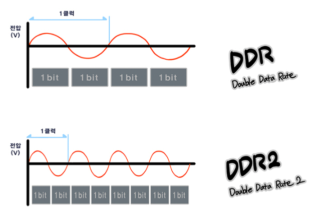

## 반도체의 종류

- 용도에 따라 **메모리 반도체** 와 **시스템 반도체**로 구분

1. 메모리 반도체

    - 데이터를 기억하고 저장하는 역할

    - DRAM, 낸드플래시

    - 기억장치로서 대용량, 고성능(얼마나 빠르게 동작할 수 있는가)가 중요하며, 요즘 휴대용 기기의 사용이 증가하면서 초소/초박형, 저전력(전력 효율) 또한 중요해짐

    - PC, 모바일 기기, 서버, 슈퍼컴퓨터(HPC), 자동차용 메모리, IoT 등 다양한 분야에서 쓰이고 있으며, 빅데이터를 다루게 되면서 수요가 지속 증가하는 추세

    - 미세공정 및 양산능력이 요구됨

    - 소품종 대량 생산

2. 시스템 반도체(Large Scale Integrated Circuit, LSI)

    - 데이터의 연산, 처리(제어, 변환, 가공) 등의 역할

    - AP(Application Processor), CPU, 다양한 센서(이미지, 홍채, 지문 센서), 통신 솔루션(모뎀, RF, SM), 디스플레이 구동칩(Display Driver IC, DDI), 스마트카드 IC(신용카드), 전력관리반도체(Power Management IC, PMIC)

    - 인공지능, 5G 네트워크, 자율주행차 등 다양한 분야에서 사용

    - 처리 능력, 회로 설계 집중 >> 고도의 설계 기술이 요구됨

    - 다품종 소량 생산

 

## 메모리 반도체

- 디지털 신호의 최소 단위인 비트(0, 1)를 저장하는 셀이 있음

- 종류

    1. 휘발성 메모리(Volatile Memory) >> RAM

        - 저장된 자료를 읽거나 쓸 때 순차적이 아니라 임의로(Random) 원하는 데이터 위치에 접근할 수 있는 메모리

        - 속도가 빠름

        - 전원이 차단될 때 정보를 잃어버림

        - 프로그램을 읽고 **임시로 저장하며 중앙처리장치의 연산을 돕는** 역할

        - 게임, 그래픽 작업 등 처리 속도를 높이기 위해서 고성능의 RAM을 사용
        
        - RAM의 종류

            - DRAM

                - D램의 셀은 **1개의 트랜지스터(스위치)** 와 **1개의 커패시터(축전기)**로 구성됨

                - 커패시터의 경우, 전하를 일시적으로 보관(전하의 유무에 따라 0 또는 1의 디지털 정보 저장)할 수 있으나 시간이 지나면서 조금씩 방전되므로 이를 보완하기 위해 **전하를 보충해주는 리프레시(Refresh) 작업이 주기적으로 필요** >> Dynamic RAM

                - 대용량화가 가능

                - CPU의 클럭 주파수에 맞춰 데이터를 읽고 씀

                - 발전 방향

                    1. 집적도 향상을 통한 대용량화

                    2. 대역폭 향상을 통한 동작 속도 가속화(고성능)

                    3. 모바일 시대를 위한 저전력화

                - DDR(Double Data Rate)

                    - DRAM의 속도를 나타냄
                
                    - 빠른 속도의 메모리가 필요하여 한 클럭에 2 비트를 전송하도록 만들어짐

                    - DDR2, DDR3 ... >> 세대가 거듭할수록 주파수 2배

                    > SDR(Single Data Rate)
                    > - DRAM 초기, 한 클럭에 1 비트의 데이터를 전송했음.
                
                    

                - 사용처에 따른 제품
                
                    - 서버, PC : DIMM(Dual Inline Memory Module)

                    - 모바일, 오토모티브 : LPDDR(Low Power Double Data Rate) D램
                    
                    - 그래픽 : GDDR(Graphic Double Rate) D램

                    - 인공지능, 슈퍼컴퓨터 : **HBM(High Bandwidth Memory, 고대역폭 메모리)**

                    > HBM
                    > - 데이터가 이동하는 통로를 늘려 데이터 처리 속도를 획기적으로 올린 메모리로, 인공지능에 활용되는 슈퍼 컴퓨터나 고성능 그래픽 카드와 같이 거대한 정보를 빠른 속도로 다루는데 최적화된 메모리

            - SRAM

                - S램의 셀은 **6개의 트랜지스터**로 구성

                - 리프레시 필요 X, 속도가 빠름. But, 셀 크기가 크고 구조가 복잡하여 비쌈 >> 대용량화 X

                - 빠른 속도가 요구되는 CPU의 자체 메모리로 활용됨 >> CPU의 캐시메모리나 레지스터 등

    2. 비휘발성 메모리(Non-Volatile Memory)
    
        - 전원을 차단해도 정보가 그대로 남아있음

        - ROM(CD-ROM, DVD-ROM)
        
            - 데이터를 쓰려면 다시 제작하거나 특수한 장치가 필요

            - 정보를 다시 쓰고 지울 수 있는 방식에 따라 구분

                - 마스크롬

                    - 반도체 제조 과정에서 데이터를 기록

                    - 사용자가 수정 X

                - P롬(Programmable)

                    - 빈 롬에 특수한 쓰기 장치로 데이터를 한번 쓸 수 있음

                - EP롬(Erasable PROM)

                    - 자외선을 이용해 데이터를 지우고 다시 쓰기 가능

                - EEP롬(Electrically EPROM)

                    - 전기적으로 데이터를 지우고 다시 쓸 수 있음

        - 플래시 메모리
        
            - 전원이 꺼져도 데이터를 보존할 수 있고 손쉽게 데이터를 쓰고 지울 수 있는 메모리(ROM과 RAM의 장점을 모두 지님)

            - **회로의 형태**에 따라 구분
            
                - 낸드 플래시(NAND Flash)
                
                    - 회로가 **직렬**로 연결된 구조

                    - 데이터를 읽을 때, 순차적으로 찾음 >> 비교적 느린 읽기 속도

                    - 데이터를 그룹 단위로 동시에 읽거나 쓰는 구조  >> 빠른 쓰기 속도
                    
                    - 대용량화, 미세화 가능 >> 가격경쟁력 高

                    - 셀에 데이터를 저장하는 방식에 따라 타입 구분

                        - SLC

                            - 한 셀에 1 비트 저장

                            - 속도 빠름, 셀 당 저장되는 데이터 적음 >> 용량 대비 고가

                            - 오류 적음 >> 장기간 높은 신뢰성을 요구하는 저장장치에 사용

                        - MLC

                            - 2 비트 저장

                            - 고성능, 안정성, 내구성이 중요한 환경에선 SLC, MLC가 쓰임

                        - TLC
                        
                            - 3 비트 저장

                        - QLC
                        
                            - 4 비트 저장

                            - **셀 당 하나의 비트를 저장하는 속도가 SLC보다 느림**

                    - 제품

                        - SSD(Solid State Drive) : PC, 서버

                        - SD(Secure Digital) 카드 : 휴대폰 외장메모리, 카메라, 블랙박스

                        - eUFS(embedded Universal Flash Storage) : 모바일 기기의 내장 메모리

                        - V-Nand : 3차원 수직 적층 구조 메모리(반도체 미세화 한계를 극복하기 위해 등장)

                - 노어 플래시(NOR Flash)

                    - 회로가 **병렬**로 연결된 구조

                    - 각각의 데이터 저장소를 컨트롤하는 구조

                    - 소량의 데이터는 빠르게 찾아갈 수 있음. But, 대용량화 X >> 읽기 빠름, 쓰기 비교적 느림

                    - 데이터의 안정성 우수

- 차세대 메모리 반도체

    - 더 싸고, 더 많은 데이터를 저장하고, 전력 효울이 좋고, 성능을 높이는 방향으로 메모리 연구 진행 중

    - SCM(Storage Class Memory)을 목표로 함

        > SCM
        > - 플래시 메모리의 비휘발성 + 대용량 + 빠른 데이터 전송 속도를 구현한 메모리

    1. Z-NAND

        - **저지연**이 특징이며, V-NAND보다 읽기 속도 10배 이상 빠름
        
        - 고성능 대용량 비휘발성인 메모리

        - 차세대 인공지능 서비스용 슈퍼컴퓨터, 빅데이터 분석 등 고용량을 빠른 속도로 처리해야 하는 환경에서 캐시데이터, 로그데이터 처리에 적합한 메모리

    2. M램(Magnetic)

        - 자화 방향에 따라 정보를 저장하는 메모리

        - MTJ(Magnetic Tunnel Junction)라고 하는 셀의 저항 변화에 기반한 메모리

        - D램과 달리 리프레시 동작없이도 데이터 보존 가능

        - 고속, 저전력, 비휘발성 메모리로 현재의 컴퓨터 구조를 획기적으로 변화시킬 수 있는 유니버셜 메모리로 주목받음   >> 기존의 다양한 메모리를 M램 칩 하나로 대체 가능

            > 유니버셜 메모리
            > - DRAM의 빠른 속도, 플래시 메모리의 비휘발성 등의 장점을 하나의 메모리에 갖는 통합형 메모리 반도체

    3. P램(Phase-Change, 상변화)

        - 비결정에서 결정질로 물질의 상 변화에 따라 0, 1을 나타내어 정보를 저장

        - 차세대 스토리지

        - 비휘발성, 노어 플래시 메모리 대비 고속, 저전력 >> 모바일 운영체제 저장용도로 NOR 플래시 대체 가능

            > 비결정
            > - 원자나 분자의 배열이 규칙성이 없는 상태

            > 결정질
            > - 원자나 분자의 배열이 규칙성을 갖는 상태

    4. R램(Resistive RAM, 저항)

        - 물질에 전압을 가할 때 재료의 저항 변화를 이용해 정보를 저장

        - 산화물에 가하는 전압에 의해 전류가 흐르는 통로의 생성 유무에 따라 생기는 저항의 높낮이로 0, 1을 나타냄

        - 차세대 비휘발성 메모리의 한 종류

## 시스템 반도체

- 우리 삶 속에 다양한 전자기기 속에서 데이터의 연산, 제어, 정보처리 등의 역할을 수행

1. 모바일 프로세서

    - 모바일 전자 기기에 탑재되어 두뇌 역할을 하는 시스템 반도체

    - CPU를 비롯한 다른 부가기능을 수행하는 기능 블록들을 SoC 형태로 담음

        - CPU

            - 논리연산이나 명령을 해독하고 데이터 처리 담당

        - **NPU**

            - 사람의 신경망을 모사해서 데이터를 처리하는 기술
            
            - 딥러닝 알고리즘 연산에 최적화된 칩으로 여러 분야에 응용됨

            - 현재, 모바일 프로세서에 탑재되어 사용자 일상 패턴을 분석하여 도움을 주고 있음

            - 정보 처리와 인식이 인간의 두뇌 수준으로 높아지는 **뉴로모픽 프로세서**로 발전시킬 수 있는 미래의 칩으로 여겨짐 >> 자동 번역, 자율 주행 등에 이용될 것

                > 딥러닝 알고리즘
                > - 사람의 사고방식을 기계에 학습시키기 위한 알고리즘
                > - 수천 개 이상의 연산을 동시에 처리해야 해서 대규모 병렬 연산 기술이 필요

        - MODEM

            - 2G로부터 3G, LTE, 5G 등 통신 기능을 담당

        - GPU

            - 그래픽 작업, 처리를 담당

        - ISP(Image Signal Processor)

            - 이미지 센서를 통해 들어오는 데이터를 가공, 전반적인 이미지 프로세싱을 담당

        - Multimedia

            - 사진이나 영상신호를 변환해 스토리지에 저장

            > SoC(System on Chip)
            > - 오디오, 그래픽 등 각종 신호 처리장치, 통신, 메모리 등 여러가지 기능을 가진 반도체 소자들을 하나의 칩으로 만든 기술집약적 반도체
            > - 스마트폰이나 태블릿 PC에 들어가는 핵심 부품으로 고집적, 고성능, 다기능 및 저전력 제품을 요구하는 시장 흐름에 따라 SoC의 가치는 매우 높아지고 있음

    - 애플리케이션 구동, 여러가지 시스템 장치/인터페이스를 컨트롤하는 기능을 모두 포함

            
2. 센서

    - 전자기기에서 센서는 오감과 같은 역할 >> 센서로 수집된 정보를 바탕으로 데이터를 처리하고 상황을 판단

    1. 이미지 센서

        - 디지털 기기의 눈으로, 우리 생활에 가장 대표적으로 많이 적용된 센서

        - 카메라를 통해 들어온 **외부 이미지(빛)를 디지털 신호로 전환**해주는 역할 수행 == 카메라 필름 == 사람의 망막

        - **응용방식**과 **제조공정**에 따라 두가지로 나뉨

            1. CCD(Charge Coupled Device) 이미지 센서

                - 전하결합소자의 약자로 아날로그 제조공정을 사용하는 이미지 센서

                - 전자 형태의 정보를 직접 전송

                - 노이즈 적음 >> 화질 우수

                - 전력 소모 높음

                - 우수한 저조도 감도

                - 추가 IC 필요

                - 높은 생산 원가

            2. **CMOS(Complementary Metal Oxide Semiconductor) 이미지 센서**

                - 상보성 금속 산화막 반도체를 사용해 **신호를 전압형태로 변환**해 전송하는 이미지 센서

                - 일반 반도체 공정인 CMOS 공정을 사용 >> 가격경쟁력 Good

                - 이미지 센서의 주변 회로를 하나의 칩으로 만들 수 있음 >> 소형화, 대량생산 Good

                - 카메라 기능이 탑재된 모바일 기기 시장이 확대됨에 따라 CMOS 이미지 센서가 주목받음

                - 노이즈 제거 기술, 감도 향상 기술 필요
                
                - 소비 전력 낮음

        - Pixel이 화질을 결정하는 만큼 이미지 센서에게 Pixel은 매우 중요
        
        - CMOS 이미지 센서의 픽셀 크기를 줄여 해상도를 높이려고 계속해서 노력함. 
        
            - But, 픽셀의 크기가 1 um 이하가 됨에 따라 픽셀 간의 경계가 모호해지고 옆 픽셀로 빛 or 신호가 넘어가는 문제 발생. 
            
            - So, 픽셀을 절연층으로 완전히 분리하는 ISOCELL(Isolation+Cell) 기술 개발 == 칸막이

            > Pixel
            > - 기기 화면의 이미지를 구성하는 최소 단위

    2. 청각-음향 센서

        - 마이크로폰, 압전소자

    3. 촉각-온도, 압력, 진동 센서

        - 전자 체중계, 지문인식

    4. 후각-가스탐지 센서

        - 스프링클러, 음주측정기

    5. 미각-맛 센서

        - PH센서, 산염기, 바이오센서

3. Power IC

    - 전력을 시스템에 맞게 변환, 제어하는 반도체

    - 전자기기의 사용 전력을 효율적으로 공급, 관리함

4. Display IC

    1. DDI(Display Driver IC)

        - 디지털 영상 신호를 디스플레이에 적합한 아날로그 신호로 변환, 전달하는 디스플레이 구동 반도체

            > 아날로그 값으로 변환한다!?
            > - 디지털 영상 신호를 디스플레이 패널을 구동할 수 있는 RGB 아날로그 값으로 변환

    2. TCON(Timing Controller)

        - DDI에 전송되는 데이터 양 조절, 화질을 개선해주는 반도체

    3. Touch Controller

        - 디스플레이의 터치를 정확하게 감지해 디지털 신호로 변환하고 빠른 응답을 제공

5. 보안 솔루션(Security Solutions)

    - 휴대용 전자기기, 사물인터넷, 네트워크 발달로 보안이 중요해짐

    - 모바일 결제, 교통카드, 뱅킹 등 보안을 기초로 하는 다양한 산업 분야에서 쓰임

    1. 스마트 카드 IC

        - 작은 칩 안에 마이크로 프로세서, 메모리, 운영체제 등을 담아 사용자의 고유 정보, 금융 정보 등을 안정적으로 식별, 암호화 처리, 저장함으로써 다양한 기능을 수행하도록 만든 반도체

        - ex) SIM(Subscriber Identification Module), 뱅킹 IC

    2. NFC(Near Field Communication)

        - 태킹으로 요금을 결제할 수 있는 근거리 무선통신 반도체

    3. eSE(embedded Secure Element)